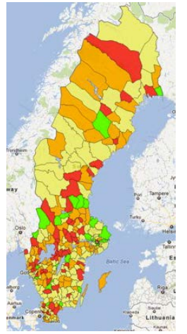

```{r setup, include=FALSE}
knitr::opts_chunk$set(echo = FALSE)
```

```{r brexit, echo = FALSE, include = FALSE}
# install packages
if(!require('dslabs')){install.packages('dslabs')}
if(!require('tidyverse')){install.packages('tidyverse', dependencies = TRUE)}
if(!require('ggrepel')){install.packages('ggrepel')}
if(!require('matrixStats')){install.packages('matrixStats')}
if(!require('survey')){install.packages('survey')}

# load libraries
library(dslabs)
library(tidyverse)
library(ggrepel)
library(matrixStats)
library(survey)
```

```{r eval = TRUE, include = FALSE}
if(!require('sampling')){install.packages('sampling')}

library("sampling"); library("kableExtra")
subsample_df = read.table(file = "data/mymu284.dat", header = T)
data("MU284")
subsample_df = MU284[subsample_df[,1],]
```


## Ratio Estimators

Need to estimate a ratio of totals or, equivalently, a ratio of means:
$$
R = \frac{Y}{X} = \frac{\sum_{i=1}^N Y_i }{\sum_{i=1}^N X_i} =
\frac{N^{-1} \sum_{i=1}^N Y_i }{N^{-1} \sum_{i=1}^N X_i} =
\frac{ \bar Y }{\bar X}
$$

* Mean estimation, where sample size (denominator) is random (varies across samples)
* There is an auxiliary variable X that is highly correlated with main variable of interest $Y$, so that total can be estimated as $\bar Y_{R} = r X$ and mean as $\hat \bar Y_{R} = r \bar X$
* Ratio estimation is goal in and of itself: proportion of household expenses on food, change from previous year’s expenses, etc.

## Taylor series expansion to approximate bias and variance

* Let ${\bf u} = (u_1,\ldots, u_k)^\top \in \mathbb{R}^k$
* Let $g({\bf u}) : \mathbb{R}^k \to \mathbb{R}$ be a smooth function
* Then for ${\bf x} \in \mathbb{R}^k$, we have

$$
\begin{aligned}
g({\bf u}) =& g({\bf x}) + \sum_{i=1}^k (u_i - x_i) \frac{\partial g}{\partial u_i} \mid_{u_i=x_i} \\
&+ \frac{1}{2!} \bigg[ \sum_{i=1}^k (u_i - x_i)^2 \frac{\partial^2 g}{\partial u_i^2} \mid_{u_i=x_i} \\ 
&+ 2 \cdot \sum_{i=1}^{k} \sum_{j=i+1}^k (u_i - x_i) (U_j-x_j) \frac{\partial^2 g}{\partial u_i \partial u_j} \mid_{u_i=x_i, u_j=x_j} \bigg] + \ldots
\end{aligned}
$$

## Bias

The approximate bias of $g(E({\bf u}))$ is given by 
$$
\frac{1}{2} \sum_{i=1}^k V(u_i) \frac{\partial g}{\partial u_i} \mid_{u_i=U_i} + 
\sum_{i=1}^k \sum_{j=i+1}^k C(u_i, u_j) \frac{\partial^2 g}{\partial u_i \partial u_j} \mid_{u_i=x_i,u_j=x_j}
$$
where $E(u_i) = U_i$

## By taylor series

$$
\begin{aligned}
E(g({\bf u})) =& E(g({\bf U}))  + E \left( \sum_{i=1}^k (u_i - U_i) \frac{\partial g}{\partial u_i} \right) \\ 
&+ \frac{1}{2} E \left( \sum_{i=1}^k (u_i - U_i)^2 \frac{\partial^2 g}{\partial u_i^2} \mid_{u_i = U_i} \right) \\
&+ E \left( \sum_{i=1}^k \sum_{j=i+1}^k (u_i - U_i) (u_j-U_j) \frac{\partial^2 g}{\partial u_i \partial u_j} \mid_{u_i = U_i, u_j = U_j} \right) \\ 
=& g({\bf U}) + \frac{1}{2} \sum_{i=1}^k V(u_i) \frac{\partial^2 g}{\partial u_i^2} \mid_{u_i = U_i} \\
&+ \sum_{i=1}^k \sum_{j=i+1} Cov(u_i,u_j) \frac{\partial^2 g}{\partial u_i \partial u_j} \mid_{u_i = U_i, u_j = U_j}
\end{aligned}
$$

## Variance of $g({\bf u})$

We can approximate the variance of $g({\bf u})$ as 
$$
v(g(u)) \approx V(g_l) \text{ for } g_l = \sum_{i=1}^k u_i \frac{\partial g}{\partial u_i} \mid_{u_i = U_i}
$$
Just use the first term of the approximation so that  
$$
\begin{aligned}
V(g({\bf u})) &\approx V \left( g({\bf U}) + \sum_{i=1}^k (u_i - U_i) \frac{\partial g}{\partial u_i} \mid_{u_i=U_i} \right) \\
&= V \left( g({\bf U}) + \sum_{i=1}^k u_i \frac{\partial g}{\partial u_i} \mid_{u_i=U_i} - \sum_{i=1}^k U_i \frac{\partial g}{\partial u_i} \mid_{u_i=U_i} \right) \\
&=V \left(\sum_{i=1}^k u_i \frac{\partial g}{\partial u_i} \mid_{u_i=U_i} \right)
\end{aligned}
$$

## Back to ratio estimation

* In ratio estimation, $u_1 = \bar y$, $u_2 = \bar x$, and $g(u_1, u_2) = \frac{u_1}{u_2} = \frac{\bar y}{\bar x} = r$. 
* Thus, $\frac{\partial r}{\partial \bar y} = \frac{1}{\bar x}$, $\frac{\partial r}{\partial \bar x} = - \frac{\bar y}{\bar x^2}$, $\frac{\partial^2 r}{\partial \bar y^2} = 0$, $\frac{\partial^2 r}{\partial \bar x^2} = \frac{2 \bar y}{\bar x^3}$, and $\frac{\partial^2 r}{\partial \bar x \partial \bar y} = - \frac{1}{\bar x^2}$.
* So

$$
\begin{aligned}
B(r) &= E(r-R) \\
&\approx \frac{1}{2} \left[ V(\bar y) \cdot 0 + V(\bar x) \frac{2 \bar Y}{\bar X^2} \right] - \frac{1}{\bar X^2} C(\bar x, \bar y) \\
&= \frac{1}{\bar X^2} \left[ R V(\bar x) - C(\bar x, \bar y) \right]
\end{aligned}
$$

## Under SRS

* $V(\bar x) = \frac{1-f}{n} S_x^2$
* $C(\bar x, \bar y) = \frac{1-f}{n} S_{xy}$
* So
$$
\begin{aligned}
B(r) &\approx \frac{1}{\bar X^2} \left[ \frac{1-f}{n} RS_x^2 - \frac{1-f}{n} S_{xy} \right] \\
&\approx \frac{1-f}{n \bar X^2} \left[ RS_x^2 - S_{xy} \right] \\
\end{aligned}a
$$
which goes to $0$ as $n \to N$ or $n,N \to \infty$.

## For $V(r)$

We set
$$
g_l = \sum_{i=1}^k u_i \frac{\partial g}{\partial u_i} \mid_{u_i=U_i} = \frac{\bar y}{\bar X} - \frac{\bar x \bar Y}{\bar X^2} = \frac{1}{\bar X} \left[ \bar y - R \bar x\right]
$$
Then we have
$$
V(r) \approx V(g_l) = \frac{1}{\bar X^2} \left[ V(\bar y) + R^2 V(\bar x) - 2 R C(\bar x, \bar y) \right]
$$

## Under SRS

$$
\begin{aligned}
V(r) &\approx \frac{1}{\bar X} \left[ \frac{1-f}{n} S_y^2 + \frac{1-f}{n} R^2 S_x^2 - \frac{2(1-f)}{n} R S_{xy} \right] \\
&= \frac{1-f}{n \bar X^2} \left[ S_y^2 + R^2 S_x^2 - 2 R S_{xy} \right]
\end{aligned}
$$

* Note that $V(r)$ is of order $n^{-1}$ while $[B(r)]^2$ is of order $n^{-2}$, so that the MSE of $r$ will approximate the variance of $r$ as $n,N \to \infty$
* Can estimate by
$$
v(r) = \frac{1-f}{n \bar X^2} \left[ s_y^2 + r^2 s_x^2 - 2 r s_{xy} \right]
$$
if $\bar X$ is known, and 
$$
v(r) = \frac{1-f}{n \bar x^2} \left[ s_y^2 + r^2 s_x^2 - 2 r s_{xy} \right]
$$
otherwise.

## When is first-order approximation reasonable?

* When $\bar x$ and $\bar y$ are bivariate normal, the MSE of $r$ can be approximated by (Cochran, 6.9)
$$
\begin{aligned}
E(r-R)^2 &\approx V(r) \left( 1 + \frac{3 C_x^2}{n} + \frac{n (C_y^2 + C_x^2 - 2 C_{xy})}{6 C_x^2 (\rho C_y^2 + C_x^2 - 2 C_{xy})} \right) \\
&< V(r) \left( 1 + \frac{9 C_x^2}{n} \right)
\end{aligned}
$$
where $C_x^2 = \frac{S_x^2}{\bar X^2}$, $C_y^2 = \frac{S_y^2}{\bar Y^2}$, $C_{xy} = \frac{S_{xy}}{\bar X \bar Y}$.
* Thus $V(r)$ is a good approximation when $C_x^2/n = \left( \frac{S_x/\sqrt{n}}{\bar X} \right)^2 = cv(\bar x)$ is small

## Option A or option B?

* (A) Estimate mean via $\hat \bar Y = r \bar X$ versus (B) Standard mean estimator $\bar y$
* Under SRS, we have
$$
V(\hat \bar Y_{R}) \approx \frac{1-f}{n \bar X^2} \left[ S_y^2  + R^2 S_x^2 - 2 R S_{xy} \right]
$$
* Hence, $V(\bar y ) > V(\hat \bar Y_{R})$ if $2 R S_{xy} - R^2 S_x^2 >0$, i.e., 
$$
S_{xy} > \frac{1}{2} R S_x^2
$$

## Option A or B (ctd)

Writing $R = \frac{\bar Y}{\bar X}$ and $S_{xy} = \rho S_x S_y$ for the population correlation coefficient
$$
\rho = \frac{\sum_{i=1}^N (Y_i - \bar Y) (X_i - \bar X)}{\sqrt{\sum_{i=1}^N (Y_i - \bar Y)^2 \sum_{i=1}^N (X_i - \bar X)^2}}
$$
implies
$$
\rho > \frac{1}{2} \left( \frac{S_x}{\bar X} \right) \cdot  \left( \frac{S_y}{\bar Y} \right)^{-1} 
= \frac{1}{2} \frac{cv(x)}{cv(y)}
$$


## Ratio estimation with stratified sampling

There are two options:
* Obtain stratified estimates of the numerator and denominator separately and combine for the ratio estimator:
$$ 
r_c = \frac{\bar y}{\bar x} = \frac{\sum_h P_h \bar y_h}{\sum_h P_h \bar x_h}
$$
* Obtain separate estimates of the ratio estimator within each stratum and average across the strata
$$ 
r_s = \sum_h P_h r_h = \sum_h P_h \frac{\bar y_h}{\bar x_h}
$$


## Variance calculation for $\bar r_c$

$$
\begin{aligned}
V(r_c ) &= \frac{1}{\bar X^2} \sum_h \frac{(1-f_h) P_h^2}{n_h} \left[ S_{yh}^2 + R^2 S_{xh} - 2 R S_{xyh} \right] \\
&= \frac{1}{\bar X^2} \left[ V(\bar y) + R^2 V(\bar x) - 2 C(\bar y, \bar x) \right]
\end{aligned}
$$
where

* $V(\bar y) = \sum_h (1-f_h) P_h^2 S_{yh}/n_h$
* $V(\bar x)= \sum_h (1-f_h) P_h^2 S_{xh}/n_h$
* $C(\bar y, \bar x)= \sum_h (1-f_h) P_h^2 S_{xyh}/n_h$


## Variance calculation for $\bar r_s$

$$
\begin{aligned}
V(r_s ) &= \sum_h \frac{(1-f_h)P_h^2}{n_h \bar X_h^2} \left[ S_{yh}^2 + R^2 S_{xh} - 2 R S_{xyh} \right] \\
&= \sum_h \frac{P_h^2}{\bar X_h^2} \left[ V(\bar y_h) + R_h^2 V(\bar x_h) - 2 R_h C(\bar y_h, \bar x_h) \right]
\end{aligned}
$$

## Variance comparison pf $V(r_c) - V(r_s)$

Variance of $r_s$ will generally be smaller than variance of $r_c$:
$$
\footnotesize
\begin{aligned}
&\frac{1}{\bar X^2} \sum_h \frac{(1-f_h)}{n_h} \left[ (R^2 - R_h^2) S_{xh}^2 - 2(R- R_h) S_{xyh} \right] \\
=& \frac{1}{\bar X^2} \sum_h \frac{(1-f_h)}{n_h} \left[ (R^2 - 2 R R_h + R_h^2) S_{xh}^2 - 2(R- R_h) \underbrace{S_{xyh}}_{\rho S_{xh}S_{yh}} + 2 R R_h S_{xh}^2 - 2 R_h^2 S_{xh}^2 \right] \\
=& \frac{1}{\bar X^2} \sum_h \frac{(1-f_h)}{n_h} \left[ (R - R_h)^2 S_{xh}^2 - 2(R- R_h) \left[ \rho_h S_{xh} S_{yh} - R_h S_{xh}^2 \right] \right] \\
=& \frac{1}{\bar X^2} \sum_h \frac{(1-f_h)(R-R_h)^2 S_{xh}^2}{n_h} \left[ 1 - 2\frac{\left[ \rho_h S_{yh}/S_{xh} - R_h \right]}{R-R_h} \right]
\end{aligned}
$$
which is $>0$ if
$$
\frac{2 \rho_h S_{yh}}{S_{xh}} > \frac{\bar Y}{\bar X} = R
$$


## Bias?

* Bias of $r_s$ will generally be __larger__ than bias of $r_c$, since will depend on many biases, which may be larger in smaller samples.
* Can bound $\frac{|B(r)|}{\sqrt{V(r)}}$ by $cv(\bar x)$, so that $\frac{|B(r_c)|}{\sqrt{V(r_c)}} \leq cv(\bar x)$
* But $\frac{|B(r)|}{\sqrt{V(r)}}$ is on the order of $cv(\bar x_h) \sqrt{H}$, where $cv(\bar x_h)$ is the mean of the coefficients of variation within each stratum.
* In general larger bias of $r_s$ may be more important than its smaller variance, especially if all biases within strata tend to be in the same direction.
  + $\Rightarrow$ use of $r_c$ in practice.
  
## Example.

MU284: 1985 data from all 284 municipalities in Sweden

```{r, out.width = "80px", fig.align='center'}
library(knitr)
 # place holder
```

## Subset of size 20

```{r, eval = TRUE, echo = FALSE}
kable(subsample_df) %>%
  kable_styling(bootstrap_options = "striped", full_width = F ,font_size = 7)
```

## Estimate proportion of council seats held by Conservatives

```{r, eval = TRUE, echo = TRUE}
bary = mean(subsample_df$CS82)
barx = mean(subsample_df$S82)
ratio = bary/barx
sy2 = var(subsample_df$CS82)
sx2 = var(subsample_df$S82)
sxy = cov(subsample_df$CS82, subsample_df$S82)
n = nrow(subsample_df); N = nrow(MU284)
f = n/N
varr = (1 - f)/ (n * barx^2) * 
  (sy2+ratio^2 * sx2-2*ratio*sxy)
```

## Output

* Our point estimate is $`r round(ratio,3)`$ with an approximate 95\% CI is
$(`r round(ratio - qt(0.975, df = n-1)*sqrt(varr),3)`, `r round(ratio + qt(0.975, df = n-1)*sqrt(varr),3)`)$
  + Used $t$ distribution with $n-1 = `r n - 1`$ degrees of freedom.
* True value is $`r round(mean(MU284$CS82)/mean(MU284$S82),3)`$

## Predict 1985 population using known 1975 population

```{r pred, eval = TRUE, echo = TRUE}
P75total = sum(MU284$P75)
designn<-svydesign(ids=c(1:20),strata=NULL,
                   weights=rep(1,20))
myrat<-svyratio(numerator=~subsample_df$P85,
                denominator=~subsample_df$P75,
                design=designn)
predict(myrat,total=P75total)
```

## Predictions

```{r pred2, eval = TRUE, echo = FALSE}
predMU285 = predict(myrat,total=P75total)
```


So our point estimate is $`r predMU285$total`$ with an approximate 
$$
(`r round(predMU285$total - qt(0.975, n-1)*predMU285$se,0)`, `r round(predMU285$total + qt(0.975, n-1)*predMU285$se,0)`)
$$

* True value is $`r sum(MU284$P85)`$.  
* Why does this work so well? Here $R=r=1$

```{r, out.width = "200px", fig.align='center'}
plot(MU284$P75,MU284$P85)
abline(lm(P85 ~ P75, data=MU284))
```
