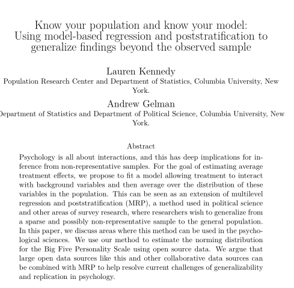

```{r setup, include=FALSE}
knitr::opts_chunk$set(echo = FALSE)
```

## Topic: Cluster sampling with unequal cluster sizes

* Previous work with cluster samples assumed equal cluster sizes:
  + Eases estimation: useful for obtaining intuition about design
and estimation.
* But often impractical, because in real world clusters are rarely so neatly presented, especially in human populations.
* Unequal cluster size complicated estimation.

## Example

* Suppose we have a two-stage sample with $K=10$ clusters and $M_k$ differing between clusters, with $f_1 = 1/2$ and $f_2 = 1/10$:
```{r, out.width = "150px", fig.align='center'}
library(knitr)
include_graphics("./figs/l15_fig1.png") # place holder
```

## Example (ctd)

* Each element has the same probability of selection $f = f_1 \cdot f_2 = 1/20$
* __BUT__ the number of elements sampled can differ over samples.
  + Sample size is now a _random variable_
  + Denominator in mean can no longer be treated as fixed
  + Mean $\bar y = \sum_i y / n$ for $n = \sum_i m_i$ is a _ratio estimator_.
  
## First setting

* Start with sampling pre-specified number of observations $m_i$ from sampled cluster $k$
  + No constraints on $m_i$ except $m_i > 0$
  + SRS WOR at 1st and 2nd stages of sampling
* Goal of estimation 
$$
\bar Y = \frac{\sum_{i=1}^K \sum_{j=1}^{M_i} Y_{ij}}{N} = 
\frac{\sum_{i=1}^K M_i \bar Y_i}{N} = 
\sum_{i=1}^K \frac{M_i}{N} \bar Y_i
$$

## Unbiased estimator of the mean

* Consider SRS of $k$ PSUs from $K$ PSU in the population, and SRS of $m_i$ elements from the population of $M_i$ elements in the $i$th selected PSU
* Consider an estimator of the form 
$$
\bar y_{wc} = \frac{1}{N} \sum_{i=1}^k \sum_{j=1}^{m_i} \frac{y_{ij}}{\pi_{ij}}
$$
* Where $\pi_{ij} = k/K \times m_i / M_i$
$$
V(\bar y_{wc}) = \frac{K^2}{N^2} \left( 1 - \frac{k}{K} \right) \frac{S_{Y_i}^2}{k} + \frac{K}{N^2 k} \sum_{i=1}^K M_i^2 \left( 1 - \frac{m_i}{M_i} \right) \frac{S_i^2}{m_i}
$$

## Estimator of variance

An unbiased estimator of $S_{Y_i}^2$ is given by
$$
s_{Y_i}^2 - \frac{1}{k} \sum_{i=1}^k M_i^2 \left( 1 - \frac{m_i}{M_i} \right) \frac{s_i^2}{m_i}
$$
And so an unbiased estimator of $V(\bar y_{wc})$ is
$$
v(\bar y_{wc}) = \frac{K^2}{N^2} \left( 1 - f_1 \right) \frac{s_{Y_i}^2}{k} + \frac{K}{N^2 k} \sum_{i=1}^k M_i^2 \left( 1 - \frac{m_i}{M_i} \right) \frac{s_i^2}{m_i}
$$

## Issues

$$
v(\bar y_{wc}) = \frac{K^2}{N^2} \left( 1 - f_1 \right) \frac{s_{Y_i}^2}{k} + \frac{K}{N^2 k} \sum_{i=1}^k M_i^2 \left( 1 - \frac{m_i}{M_i} \right) \frac{s_i^2}{m_i}
$$

* First term involves variance of PSU totals, which are a function of __both__ the cluster __means__ $\bar Y_i$ and the cluster __sizes__ $M_i$
* Typically $M_i$ may be highly variable
* Hence an alternative mean estimator with a reduced variance may be preferable.

## Alternative view of the estimator

The unbiased estimator $\bar y_{wc} = \frac{K}{Nk} \sum_{i=1}^k M_i \bar y_i$ can be viewed as estimating the mean PSU sample total by
$$
\frac{1}{k} \sum_{i=1}^k M_i \bar y_i
$$
and then dividing this by the mean PSU size
$$
\frac{1}{N/K} = \frac{1}{\sum_{i=1}^K M_i / K}
$$

## Alternative proposal

* Replace the population mean PSU size with the sample mean PSU size
* Yields the estimator usually used in practice
$$
\bar y_{wcr} = r = \frac{k \sum_{i=1}^k M_i \bar y_i}{k \sum_{i=1}^k M_i} =  \frac{\sum_{i=1}^k M_i \bar y_i}{ \sum_{i=1}^k M_i}
$$
  + Ratio estimator (why?)
  + Takes advantge of correlation between PSU totals and PSU sizes
    + If sampled PSUs happen to be small on average (or vice versa), preferable to use sample mean of PSUs rather than population mean of PSUs.

## Simple setting

If epsem sampling with $f_{1i} \equiv f_1 = k/K$ and $f_{2 ij} \equiv f_2 = m_i / M_i = m/M$, then
$$
\begin{aligned}
\bar y_{wcr} &=  \frac{\sum_{i=1}^k M_i \bar y_i}{ \sum_{i=1}^k M_i} \\
&=  \frac{\sum_{i=1}^k \frac{M_i}{m_i} \sum_{j=1}^{m_i} y_{ij}}{ \sum_{i=1}^k (M_i/m_i) m_i} \\
&=  \frac{\sum_{i=1}^k \sum_{j=1}^{m_i} y_{ij}}{ \sum_{i=1}^k m_i} \\
&=  \frac{\sum_{i=1}^k \sum_{j=1}^{m_i} y_{ij}}{n} \\
&= \bar y
\end{aligned}
$$

## Various sampling plans

Consider three differing sampling plans for unequal size clusters:

* SRS of k clusters from a population of K clusters for first stage, with all elements in selected clusters being chosen.
* SRS of k clusters from a population of K clusters for first stage, with equal fraction $m/M$ elements in selected clusters being chosen.
* SRS of k clusters from a population of K clusters for first stage, with varying fraction chosen in selected clusters.

1. and 2. are epsem designs. All can be viewed as ratio estimators, with variances obtained using results from ratio estimation.

__We will assume negligible first-stage sampling fraction: $\frac{k}{K} \approx 0$ (equivalent to first - stage with-replacement sampling).__

## Epsem One-stage sampling (1)

Here $M_i \bar y_i = \sum_{j=1}^{M_i} y_{ij} = Y_i$, so $\bar y_{wcr} = \frac{\sum_{i=1}^k M_i \bar y_i}{\sum_{i=1}^k M_i} = \frac{\sum_{i=1}^k Y_i}{\sum_{i=1}^k M_i}$.

* Numerator and denominator are SRS samples of PSU totals
* Variance of ratio estimator:
$$
\begin{aligned}
V(\bar y_r) &\approx \frac{1}{k \bar M^2} \left( S_y^2 + \bar Y^2 S_m^2 - 2 \bar Y S_{ym} \right) \\
&= \frac{k}{f^2 M^2} \left( S_y^2 + \bar Y^2 S_m^2 - 2 \bar Y S_{ym} \right) 
\end{aligned}
$$
where
$$
\begin{aligned}
S_y^2 &= \frac{\sum_{i=1}^K (Y_i - Y/K)^2}{K-1}, \quad
S_m^2 = \frac{\sum_{i=1}^K (M_i - M/K)^2}{K-1} \\
S_{ym}^2 &= \frac{\sum{i=1}^K (Y_i - Y/K)(M_i - M/K)}{K-1} \\
\end{aligned}
$$

## Variance estimation

$$
\begin{aligned}
V(\bar y_r) &\approx \frac{1}{k \bar m^2} \left( s_y^2 + \bar y_{wcr}^2 s_m^2 - 2 \bar y_{wcr} s_{ym} \right) \\
&=  \frac{k}{f^2 m^2} \left( s_y^2 + \bar y_{wcr}^2 s_m^2 - 2 \bar y_{wcr} s_{ym} \right)
\end{aligned}
$$
where
$$
\begin{aligned}
s_y^2 &= \frac{\sum_{i=1}^k (y_i - y/k)^2}{k-1}, \quad
s_m^2 = \frac{\sum_{i=1}^k (m_i - m/k)^2}{k-1} \\
s_{ym}^2 &= \frac{\sum{i=1}^k (y_i - y/k)(m_i - m/k)}{k-1} \\
\end{aligned}
$$

## Epsem two-stage sampling (2)

As above,
$$
\begin{aligned}
\bar y_r &= \frac{\sum_{i=1}^k M_i \bar y_i}{\sum_{i=1}^k M_i} 
= \frac{\sum_{i=1}^k (M_i/m_i) \sum_{j=1}^{m_i} y_{ij}}{\sum_{i=1}^k (M_i/m_i) m_i } \\
&= \frac{\sum_{i=1}^k \sum_{j=1}^{m_i} y_{ij}}{\sum_{i=1}^k m_i} 
= \frac{\sum_{i=1}^k y_i}{\sum_{i=1}^k m_i} 
\end{aligned}
$$

* Under this design our mean estimator is a ratio of sums of
sample totals $y_i$ and sample sizes $m_i$ for each PSU. Recall
our general estimator of ratios:
$$
r = \frac{\bar y}{\bar x}
$$

## Variance calculations

$$
\begin{aligned}
V(r) &\approx \frac{1}{\bar X^2} \left[ V(\bar y) + R^2 V(\bar x) - 2 R C(\bar x, \bar y) \right] \\
&= \frac{N^2}{X^2} \left[ \frac{1}{n^2} V(y) + \frac{1}{n^2} R^2 V(x) - \frac{2}{n^2}  R C(x,y) \right] \\
&= \frac{1}{f^2 X^2} \left[ V(y) + R^2 V(x) - 2 R C(x, y) \right] \\
\end{aligned}
$$
where $V(y) \approx k S_y^2$, $V(m) \approx k S_m^2$, $C(m,y) \approx k S^2_{my}$

## Unbiased estimator 

$$
\begin{aligned}
v(\bar y_r) &\approx \frac{k}{f^2 M^2} \left[ s_y^2 + \bar y_r^2 s_m^2 - 2 \bar y_r s_{ym}^2 \right] \\
&= \frac{k}{f^2 M^2 (k-1)} \bigg[ \left( \sum_{i=1}^k y_i^2 - y^2/k \right) + \bar y_r^2 \left( \sum_{i=1} m_i^2 - m^2 / k \right) \\
&- 2 \bar y_r \left( \sum_{i=1}^k y_i m_i - ym/k \right) \bigg] \\
&= \frac{k}{m^2 (k-1)} \left[ \sum_{i=1}^k y_i^2 + \bar y_r^2 \sum_{i=1} m_i^2 - 2 \bar y_r \sum_{i=1}^k y_i m_i \right] \\
\end{aligned}
$$
Writing $e_i = y_i - \bar y_r m_i$, we can simply write
$$
v(\bar y_{wcr} ) = \frac{k}{m^2 (k-1)} \left[ \sum_{i=1}^k e_i^2 \right]
$$

## Is approximation ok?

* Requires Taylor Series approximation to be satisfactory
* Coefficient of variation of m not much more than 10-20\%

## Non-epsem two-stage sampling (3)

In this most general setting, we allow for a general probability of selection $\pi_{ij} = f_{1i} f_{2ij}$, where probabilities of selection can vary by cluster and by elements within a sampled cluster.

$$
\bar y_{wcr} = \frac{\sum_{i=1}^k \sum_{j=1}^{m_i} w_{ij} y_{ij} }{\sum_{i=1}^k \sum_{j=1}^{m_i} w_{ij}} = \frac{\hat Y}{\hat M} = \frac{\hat Y}{\hat N}
$$
where $w_{ij} = \pi_{ij}^{-1}$. Let $y_{ij}^\star = w_{ij} y_{ij}$. Then
$$
\bar y_{wcr} = \frac{\sum_{i=1}^k y_i^\star}{\sum_{i=1}^k w_i}
$$
for $y_i^\star = \sum_{j=1}^{m_i} y_{ij}^\star$ and $w_i = \sum_{j=1}^{m_i} w_{ij}$.

## Variance estimator

Same approach as for the epsem design:
$$
\begin{aligned}
v(\bar y_{wcr}) &\approx \frac{k}{w^2} \left[ s_{y^\star}^2 + \bar y_{wcr}^2 s_w^2 - 2 \bar y_{wcr} s_{y^\star m}^2 \right] \\
&\approx \frac{k}{w^2(k-1)} \left[ \sum_{i=1}^k (y_i^\star)^2 + \bar y_{wcr}^2 \sum_{i=1}^k w_i^2 - 2 \bar y_{wcr} \sum_{i=1}^k y_i^\star w_i \right].
\end{aligned}
$$

## Non-epsem two-stage sampling (3): with fpc

* Suppose that we do __not__ want to ignore the fpc.
* First, let's do a step back to single-stage sampling with different probabilities of selection $\pi_i$
* We have 

$$
\hat Y_w = \sum_{i=1}^n w_i y_i = \sum_{i=1}^N \delta_i w_i Y_i,
$$
is unbiased for the population total $Y$.

* Thus $\hat{\bar{Y}} = N^{-1} \hat Y$ is unbiased for the population mean $\bar Y$
  + __Horvitz-Thompson estimator__

## Non-epsem two-stage sampling (3): with fpc

$$\small
\begin{aligned}
V(\hat Y_w) &= V\left( \sum_{i=1}^N \delta_i w_i Y_i \right) \\
&= \sum_{i=1}^N V(\delta_i) w_i^2 Y_i^2 + \sum_{i=1, i \neq j}^N \sum_{j=1}^N C(\delta_i, \delta_j) w_i w_j Y_i Y_j  \\
C(\delta_i, \delta_j) &= E(\delta_i \delta_j) - E(\delta_i) E(\delta_j) = \pi_{ij} - \pi_i \pi_j
\end{aligned}
$$
So 
$$\small
V(\hat Y_w) = \sum_{i=1}^N (1-\pi_i) w_i Y_i^2 + \sum_{i=1, i \neq j}^N \sum_{j=1}^N (\pi_{ij} - \pi_i \pi_j) w_i w_j Y_i Y_j 
$$
with estimator
$$\small
\begin{aligned}
v(\hat Y_w) &= \sum_{i=1}^n (1-\pi_i) w_i^2 y_i^2 + \sum_{i=1, i \neq j}^N \sum_{j=1}^N (\pi_{ij} - \pi_i \pi_j) w_i w_j w_{ij} y_i y_j \\
&= \sum_{i=1}^n \frac{1-\pi_i}{\pi_i^2} y_i^2 + \sum_{i=1, i \neq j}^N \sum_{j=1}^N \frac{\pi_{ij} - \pi_i \pi_j}{\pi_i \pi_j \pi_{ij}} y_i y_j \\
\end{aligned}
$$

## HT variance

$$\small
V( \hat{\bar{Y}} ) = \frac{\left[ \sum_{i=1}^N (1-\pi_i) w_i Y_i^2 + \sum_{i=1, i \neq j}^N \sum_{j=1}^N (\pi_{ij} - \pi_i \pi_j) w_i w_j Y_i Y_j  \right]}{N^2}
$$
and
$$
v( \hat{\bar{Y}} ) = \frac{\left[ \sum_{i=1}^n \frac{1-\pi_i}{\pi_i^2} y_i^2 + \sum_{i=1, i \neq j}^N \sum_{j=1}^N \frac{\pi_{ij} - \pi_i \pi_j}{\pi_i \pi_j \pi_{ij}} y_i y_j  \right]}{N^2}
$$

* Note that computation of this variance requires not only the probability of selection $\pi_i$ for all sampled elements, but also the __joint probabilities of selection__ for all pairs of sampled elements $\pi_{ij}$

## General (weighted) estimator of a two-stage design

$$
\tilde y = \sum_{i=1}^k w_{is} \hat Y_i = \sum_{i=1}^K w_{is}^\prime \hat Y_i
$$
where $w_{is}$ is a weight that may depend on other PSUs in the sample (hence the subscript $s$), and
$w_{is}^\prime = w_{is} 1[i \in s]$.

* If $\tilde y$ is unbiased for $Y$, $E (w_{is}^\prime) = 1$
* If $\tilde y$ is unbiased for $\bar Y$, $E (w_{is}^\prime) = 1/N$

## Single-stage sample (all elements in the sampled cluster sampled)

$$
V( \tilde y_1) = \sum_{i=1}^K V(w_{is}^\prime) Y_i^2 + \sum_{i=1,i \neq j}^K \sum_{j=1}^K C(w_{is}^\prime, w_{js}^\prime) Y_i Y_j
$$
An unbiased estimator is
$$
v( \tilde y_1) = \sum_{i=1}^k a_{is} Y_i^2 + \sum_{i=1,i \neq j}^k \sum_{j=1}^k b_{ijs} Y_i Y_j
= \sum_{i=1}^K a_{is}^\prime Y_i^2 + \sum_{i=1,i \neq j}^K \sum_{j=1}^k b_{ijs}^\prime Y_i Y_j
$$
where

* $a_{is}^\prime = 0$ unless PSU $i$ is selected
* $b_{ijs}^\prime = 0$ unless both PSUs $i$ and $j$ are selected
* $E[a_{is}^\prime] = V(w_{is}^\prime)$
* $E[b_{ijs}^\prime] = C(w_{is}^\prime, w_{js}^\prime)$ 

## Two-stage design

$$
V(\tilde y) = V(E(\tilde y \mid i \in s)) + E(V(\tilde y \mid i \in s))
$$
where
$$
\begin{aligned}
V(E(\tilde y \mid i \in s)) &= V( \tilde y_1) \\
E(V(\tilde y \mid i \in s)) &= E \left( \sum_{i=1}^K (w_{is}^\prime)^2 V( \hat Y_i \mid i \in s) \right)  \\
&= \sum_{i=1}^K \left[ V(w_{is}^\prime) + E(w_{is}^\prime) \right] V( \hat Y_i \mid i \in s)
\end{aligned}
$$

## Two-stage design

$$
V(\tilde y) = \tilde V(y_1) + \sum_{i=1}^K V(w_{is}^\prime) V( \hat Y_i \mid i \in s) + \sum_{i=1}^K E( w_{is}^\prime)^2 V(\hat Y_i \mid i \in s)
$$

* If $\tilde y$ estimates $Y$, $E(w_{is}^\prime) = 1$, and
$$
V(\tilde y) = \tilde V(y_1) + \sum_{i=1}^K V(w_{is}^\prime) V( \hat Y_i \mid i \in s) + \sum_{i=1}^K  V(\hat Y_i \mid i \in s)
$$

* If $\tilde y$ estimates $\bar Y$, $E(w_{is}^\prime) = 1/N$, and
$$
V(\tilde y) = \tilde V(y_1) + \sum_{i=1}^K V(w_{is}^\prime) V( \hat Y_i \mid i \in s) + N^{-2} \sum_{i=1}^K  V(\hat Y_i \mid i \in s)
$$

## Unbiased estimators of $V(\tilde y)$

Start with $v(\tilde y_1)$, replacing unknowns $Y_i$ with their (unbiased) sample estimates $\hat Y_i$:
$$
v^\star (\tilde y) =  \sum_{i=1}^k a_{is} \hat Y_i^2 + \sum_{i=1,i \neq j}^k \sum_{j=1}^k b_{ijs} \hat Y_i \hat Y_j = \sum_{i=1}^K a_{is}^\prime \hat Y_i^2 + \sum_{i=1,i \neq j}^K \sum_{j=1}^k b_{ijs}^\prime \hat Y_i \hat Y_j
$$

## Unbiased estimators of $V(\tilde y)$

Now
$$
\begin{aligned}
E( \hat Y_i^2 \mid i \in s) &= V( \hat Y_i \mid i \in s ) + E( \hat Y_i \mid i \in s )^2 =
V( \hat Y_i \mid i \in s ) + \hat Y_i^2 \\ 
E( \hat Y_i \hat Y_j \mid i, j \in s) &= Y_i Y_j 
\end{aligned}
$$
and
$$
\begin{aligned}
E(v^\star ( \tilde y) \mid i \in s) &= \sum_{i=1}^K a_{is}^\prime Y_i^2 + \sum_{i=1, i \neq j}^K b_{ijs}^\prime Y_i Y_j + \sum_{i=1}^K a_{is}^\prime V(Y_i \mid i \in s) \\
&= v(\tilde y_1) + \sum_{i=1}^K a_{is}^\prime V(Y_i \mid i \in s)
\end{aligned}
$$
Thus
$$ 
E[v^\star (\tilde y) ] = V(\tilde y_1) + \sum_{i=1}^K V(w_{is}^\prime) V(Y_i \mid i \in s)
$$
and $v^\star (\tilde y)$ is an unbiased estimator of the first two terms of $V(\tilde y)$.

## The third term

* When estimating $Y$, the third term in $V(\tilde y)$ is $\sum_{i=1}^K V(\hat Y_i \mid i \in s)$
* Since $\sum_{i=1}^k w_{is} \hat Y_{i}$ is unbiased for $Y$, then $\sum_{i=1}^k w_{is} v(\hat Y_i \mid i \in s)$ is an unbiased estimator of $\sum_{i=1}^K V(\hat Y_i \mid i \in s)$
* Similarly, when estimating $\bar Y$, an unbiased estimator $\sum_{i=1}^k w_{is} \hat Y_i$ for $\bar Y$ will yield an unbiased estimator $N^{-1} \sum_{i=1}^k w_{is} v(\hat Y_i \mid i \in s)$ of $N^{-2} \sum_{i=1}^K V(\hat Y_i \mid i \in s)$

## Unbiased estimator of $V(\tilde y)$

$$
\begin{aligned}
v(\tilde y ) &= v^\star (\tilde y) + \sum_{i=1}^k w_{is} v(\hat Y_i \mid i \in s) \\
&= \sum_{i=1}^k a_{is} \hat Y_i^2 + \sum_{i=1, i \neq j}^k \sum_{j=1}^k b_{ijs} \hat Y_i \hat Y_j + \sum_{i=1}^k w_{is} v(\hat Y_i \mid i \in s)
\end{aligned}
$$
when $\tilde y$ estimates $Y$, and 
$$
\begin{aligned}
v(\tilde y ) &= v^\star (\tilde y) + N^{-1} \sum_{i=1}^k w_{is} v(\hat Y_i \mid i \in s) \\
&= \sum_{i=1}^k a_{is} \hat Y_i^2 + \sum_{i=1, i \neq j}^k \sum_{j=1}^k b_{ijs} \hat Y_i \hat Y_j + N^{-1} \sum_{i=1}^k w_{is} v(\hat Y_i \mid i \in s)
\end{aligned}
$$
and $\tilde y$ estimates $\bar Y$

## General procedure:

* Obtain an unbiased estimator of $V(\tilde y_1)$ under single-stage sampling, say $v^\star (\tilde y)$
* Substitute $\hat Y_{i}$ for $Y_i$ in $v^\star (\tilde y)$
* Add $\sum_{i=1}^k w_{is} v(\hat Y_i \mid i \in s)$ if estimating a total or $N^{-1} \sum_{i=1}^k w_{is} v(\hat Y_i \mid i \in s)$ if estimating a mean

## Example

* 2-stage sample of equal size PSUs, SRS at both stages
$$
\bar y = \frac{1}{k} \sum_{i=1}^k \bar y_i = \frac{1}{kM} \sum_{i=1}^k \hat Y_i, \hat Y_i = M \bar y_i
$$
* For single stage cluster sampling
$$
\begin{aligned}
V^\star ( \bar y) &= \left( 1 - \frac{k}{K} \right) \frac{S_1^2}{k}, \quad S_1^2 = \frac{1}{K-1} \sum_{i=1}^K ( \bar Y_i - \bar Y)^2 \\
v^\star (\bar y) &= \left( 1 - \frac{k}{K} \right) \frac{s_1^2}{k}, \quad s_1^2 = \frac{1}{k-1} \sum_{i=1}^k ( \bar Y_i - \bar y )^2
\end{aligned}
$$
* Replace $\bar Y_i$ by $\bar y_i$:
$$
v^\star (\bar y) = \left( 1 - \frac{k}{K} \right) \frac{s_1^2}{k}, \quad s_1^2 = \frac{1}{k-1} \sum_{i=1}^k ( \bar y_i - \bar y )^2
$$

## Example: step (C)

* Add $N^{-1} \sum_{i=1}^k w_{is} v( \hat Y_i \mid i \in s)$
* Here $w_is \equiv (kM)^{-1}$ and $v( \hat Y_i \mid i \in s) = M^2 \left( 1 - \frac{m}{M} \right) \frac{S_i^2}{m}$
* So 
$$
\begin{aligned}
N^{-1} \sum_{i=1}^k w_{is} v( \hat Y_i \mid i \in s) &= N^{-1} \sum_{i=1}^k \frac{1}{kM} M^2  \left( 1 - \frac{m}{M} \right) \frac{s_i^2}{m} \\
&= (KM)^{-1} \sum_{i=1}^k \frac{1}{kM} M^2  \left( 1 - \frac{m}{M} \right) \frac{s_i^2}{m} \\
&= \frac{1}{K} \left( 1 - \frac{m}{M} \right) \frac{s_2^2}{m} \\
&= \frac{k}{K} \left( 1 - \frac{m}{M} \right) \frac{s_2^2}{n}
\end{aligned}
$$
* THus
$$
v(\bar y) = \left( 1- \frac{k}{K} \right) \frac{s_1^2}{k} + \frac{k}{K} \left( 1 - \frac{m}{M} \right) \frac{s_2^2}{n}
$$

## JITT: Diary

* Read the following survey.
```{r, out.width = "150px", fig.align='center'}
library(knitr)
 # place holder
```
  + Compare this approach to the poststratification discussed in class
