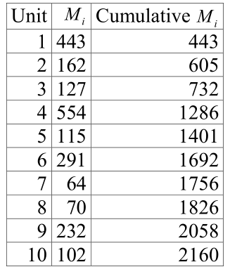

```{r setup, include=FALSE}
knitr::opts_chunk$set(echo = FALSE)
```

## Moving to online

* Virtual meetings for remainder of semester
* Final may be held virtually
* Midterm: solutions posted
  + Rather than curve, will give (optional) revised version 
  + Can make up some missed points (TBD)
* This week:
  + Diary due today
  + JITT due Wed
* Today:
  + Finish unequal cluster sampling
  + No Case study (will try and post at some point)
  + Probability proportion to size (PPS) sampling designs 


## Topic: Cluster sampling with unequal cluster sizes

* Suppose we have a two-stage sample with $K=10$ clusters and $M_k$ differing between clusters, with $f_1 = 1/2$ and $f_2 = 1/10$:
```{r, out.width = "150px", fig.align='center'}
library(knitr)
include_graphics("./figs/l15_fig1.png") # place holder
```

## General (weighted) estimator of a two-stage design

$$
\tilde y = \sum_{i=1}^k w_{is} \hat Y_i = \sum_{i=1}^K w_{is}^\prime \hat Y_i
$$
where $w_{is}$ is a weight that may depend on other PSUs in the sample (hence the subscript $s$), and
$w_{is}^\prime = w_{is} 1[i \in s]$.

* If $\tilde y$ is unbiased for $Y$, $E (w_{is}^\prime) = 1$
* If $\tilde y$ is unbiased for $\bar Y$, $E (w_{is}^\prime) = 1/N$

## Single-stage sample (all elements in the sampled cluster sampled)

$$
V( \tilde y_1) = \sum_{i=1}^K V(w_{is}^\prime) Y_i^2 + \sum_{i=1,i \neq j}^K \sum_{j=1}^K C(w_{is}^\prime, w_{js}^\prime) Y_i Y_j
$$
An unbiased estimator is
$$
v( \tilde y_1) = \sum_{i=1}^k a_{is} Y_i^2 + \sum_{i=1,i \neq j}^k \sum_{j=1}^k b_{ijs} Y_i Y_j
= \sum_{i=1}^K a_{is}^\prime Y_i^2 + \sum_{i=1,i \neq j}^K \sum_{j=1}^k b_{ijs}^\prime Y_i Y_j
$$
where

* $a_{is}^\prime = 0$ unless PSU $i$ is selected
* $b_{ijs}^\prime = 0$ unless both PSUs $i$ and $j$ are selected
* $E[a_{is}^\prime] = V(w_{is}^\prime)$
* $E[b_{ijs}^\prime] = C(w_{is}^\prime, w_{js}^\prime)$ 

## Two-stage design

$$
V(\tilde y) = V(E(\tilde y \mid i \in s)) + E(V(\tilde y \mid i \in s))
$$
where
$$
\begin{aligned}
V(E(\tilde y \mid i \in s)) &= V( \tilde y_1) \\
E(V(\tilde y \mid i \in s)) &= E \left( \sum_{i=1}^K (w_{is}^\prime)^2 V( \hat Y_i \mid i \in s) \right)  \\
&= \sum_{i=1}^K \left[ V(w_{is}^\prime) + E(w_{is}^\prime)^2 \right] V( \hat Y_i \mid i \in s)
\end{aligned}
$$

## Two-stage design

$$
V(\tilde y) = \tilde V(y_1) + \sum_{i=1}^K V(w_{is}^\prime) V( \hat Y_i \mid i \in s) + \sum_{i=1}^K E( w_{is}^\prime)^2 V(\hat Y_i \mid i \in s)
$$

* If $\tilde y$ estimates $Y$, $E(w_{is}^\prime) = 1$, and
$$
V(\tilde y) = \tilde V(y_1) + \sum_{i=1}^K V(w_{is}^\prime) V( \hat Y_i \mid i \in s) + \sum_{i=1}^K  V(\hat Y_i \mid i \in s)
$$

* If $\tilde y$ estimates $\bar Y$, $E(w_{is}^\prime) = 1/N$, and
$$
V(\tilde y) = \tilde V(y_1) + \sum_{i=1}^K V(w_{is}^\prime) V( \hat Y_i \mid i \in s) + N^{-2} \sum_{i=1}^K  V(\hat Y_i \mid i \in s)
$$

## Unbiased estimators of $V(\tilde y)$

Start with $v(\tilde y_1)$, replacing unknowns $Y_i$ with their (unbiased) sample estimates $\hat Y_i$:
$$
v^\star (\tilde y) =  \sum_{i=1}^k a_{is} \hat Y_i^2 + \sum_{i=1,i \neq j}^k \sum_{j=1}^k b_{ijs} \hat Y_i \hat Y_j = \sum_{i=1}^K a_{is}^\prime \hat Y_i^2 + \sum_{i=1,i \neq j}^K \sum_{j=1}^k b_{ijs}^\prime \hat Y_i \hat Y_j
$$

## Unbiased estimators of $V(\tilde y)$

Now
$$
\begin{aligned}
E( \hat Y_i^2 \mid i \in s) &= V( \hat Y_i \mid i \in s ) + E( \hat Y_i \mid i \in s )^2 =
V( \hat Y_i \mid i \in s ) + \hat Y_i^2 \\ 
E( \hat Y_i \hat Y_j \mid i, j \in s) &= Y_i Y_j 
\end{aligned}
$$
and
$$
\begin{aligned}
E(v^\star ( \tilde y) \mid i \in s) &= \sum_{i=1}^K a_{is}^\prime Y_i^2 + \sum_{i=1, i \neq j}^K b_{ijs}^\prime Y_i Y_j + \sum_{i=1}^K a_{is}^\prime V(Y_i \mid i \in s) \\
&= v(\tilde y_1) + \sum_{i=1}^K a_{is}^\prime V(Y_i \mid i \in s)
\end{aligned}
$$
Thus
$$ 
E[v^\star (\tilde y) ] = V(\tilde y_1) + \sum_{i=1}^K V(w_{is}^\prime) V(Y_i \mid i \in s)
$$
and $v^\star (\tilde y)$ is an unbiased estimator of the first two terms of $V(\tilde y)$.

## The third term

* When estimating $Y$, the third term in $V(\tilde y)$ is $\sum_{i=1}^K V(\hat Y_i \mid i \in s)$
* Since $\sum_{i=1}^k w_{is} \hat Y_{i}$ is unbiased for $Y$, then $\sum_{i=1}^k w_{is} v(\hat Y_i \mid i \in s)$ is an unbiased estimator of $\sum_{i=1}^K V(\hat Y_i \mid i \in s)$
* Similarly, when estimating $\bar Y$, an unbiased estimator $\sum_{i=1}^k w_{is} \hat Y_i$ for $\bar Y$ will yield an unbiased estimator $N^{-1} \sum_{i=1}^k w_{is} v(\hat Y_i \mid i \in s)$ of $N^{-2} \sum_{i=1}^K V(\hat Y_i \mid i \in s)$

## Unbiased estimator of $V(\tilde y)$

$$
\begin{aligned}
v(\tilde y ) &= v^\star (\tilde y) + \sum_{i=1}^k w_{is} v(\hat Y_i \mid i \in s) \\
&= \sum_{i=1}^k a_{is} \hat Y_i^2 + \sum_{i=1, i \neq j}^k \sum_{j=1}^k b_{ijs} \hat Y_i \hat Y_j + \sum_{i=1}^k w_{is} v(\hat Y_i \mid i \in s)
\end{aligned}
$$
when $\tilde y$ estimates $Y$, and 
$$
\begin{aligned}
v(\tilde y ) &= v^\star (\tilde y) + N^{-1} \sum_{i=1}^k w_{is} v(\hat Y_i \mid i \in s) \\
&= \sum_{i=1}^k a_{is} \hat Y_i^2 + \sum_{i=1, i \neq j}^k \sum_{j=1}^k b_{ijs} \hat Y_i \hat Y_j + N^{-1} \sum_{i=1}^k w_{is} v(\hat Y_i \mid i \in s)
\end{aligned}
$$
and $\tilde y$ estimates $\bar Y$

## General procedure:

* Obtain an unbiased estimator of $V(\tilde y_1)$ under single-stage sampling, say $v^\star (\tilde y)$
* Substitute $\hat Y_{i}$ for $Y_i$ in $v^\star (\tilde y)$
* Add $\sum_{i=1}^k w_{is} v(\hat Y_i \mid i \in s)$ if estimating a total or $N^{-1} \sum_{i=1}^k w_{is} v(\hat Y_i \mid i \in s)$ if estimating a mean

## Example

* 2-stage sample of equal size PSUs, SRS at both stages
$$
\bar y = \frac{1}{k} \sum_{i=1}^k \bar y_i = \frac{1}{kM} \sum_{i=1}^k \hat Y_i, \hat Y_i = M \bar y_i
$$
* For single stage cluster sampling
$$
\begin{aligned}
V^\star ( \bar y) &= \left( 1 - \frac{k}{K} \right) \frac{S_1^2}{k}, \quad S_1^2 = \frac{1}{K-1} \sum_{i=1}^K ( \bar Y_i - \bar Y)^2 \\
v^\star (\bar y) &= \left( 1 - \frac{k}{K} \right) \frac{s_1^2}{k}, \quad s_1^2 = \frac{1}{k-1} \sum_{i=1}^k ( \bar Y_i - \bar y )^2
\end{aligned}
$$
* Replace $\bar Y_i$ by $\bar y_i$:
$$
v^\star (\bar y) = \left( 1 - \frac{k}{K} \right) \frac{s_1^2}{k}, \quad s_1^2 = \frac{1}{k-1} \sum_{i=1}^k ( \bar y_i - \bar y )^2
$$

## Example: step (C)

* Add $N^{-1} \sum_{i=1}^k w_{is} v( \hat Y_i \mid i \in s)$
* Here $w_{is} \equiv (kM)^{-1}$ and $v( \hat Y_i \mid i \in s) = M^2 \left( 1 - \frac{m}{M} \right) \frac{S_i^2}{m}$
* So 
$$
\begin{aligned}
N^{-1} \sum_{i=1}^k w_{is} v( \hat Y_i \mid i \in s) &= N^{-1} \sum_{i=1}^k \frac{1}{kM} M^2  \left( 1 - \frac{m}{M} \right) \frac{s_i^2}{m} \\
&= (KM)^{-1} \sum_{i=1}^k \frac{1}{kM} M^2  \left( 1 - \frac{m}{M} \right) \frac{s_i^2}{m} \\
&= \frac{1}{K} \left( 1 - \frac{m}{M} \right) \frac{s_2^2}{m} \\
&= \frac{k}{K} \left( 1 - \frac{m}{M} \right) \frac{s_2^2}{n}
\end{aligned}
$$
* Thus
$$
v(\bar y) = \left( 1- \frac{k}{K} \right) \frac{s_1^2}{k} + \frac{k}{K} \left( 1 - \frac{m}{M} \right) \frac{s_2^2}{n}
$$

## New content: (Two-stage) Probability Proportional to Size (PPS) sampling

For clusters with number of observations, sample with probability $\frac{kM_i}{M_0}$, $N = M_0 = \sum_{i=1}^K M_i$

* Equalize workload (send equal numbers of interviewers to each samples geographic region)
* Avoid large clusters dominating the analysis
  + Important when clusters ``double'' as unit of analysis $\rightarrow$ equal cluster sizes will provide more efficient analysis
* When combined with a second stage of sampling, can be used to create epsem design

## PPS design

* Select with first stage $\frac{kM_i}{M_0}$
* Select with second stage probability $\frac{m}{M_i}$
* Design is epsem for fixed sample size $n$:
$$
P(I_{ij} = 1) = \pi_{ij} = \pi_i \pi_{j \mid i \in s} 
= \frac{kM_i}{M_0} \times \frac{m}{M_i} = \frac{k m}{M_0} 
= \frac{n}{N} = \pi
$$
for all $i,j$.

## Ways to implements

* With replacement
* Systematic sampling without replacement
  + Both approaches require cumulating the size of the clusters

## Example:

Population of $2,160$ employees in $10$ units:

```{r, out.width = "150px", fig.align='center'}
library(knitr)
 # place holder
```

## PPS sampling with first-stage replacement

* Select a random number $R_1$ from $1$ through $N$.
* Find cluster with cumulative sum exceeding $R_i$
* Sample $m$ units from cluster
* Repeat steps until $k$ clusters have been sampled
  + If cluster is sampled $b > 1$ times, sample a total of $bm$ units from cluster
  
## Employee example: say $k=2$, $m=18$, $n=36$

* $R_1 = 702$: sample unit 3, sample 18 of 127 employees
* $R_2 = 1744$: sample unit 7, sample 18 of 64 employees

## PP sampling with first-stage systematic sampling

1. Select a random start $R$ between $1$ and $N/k$
2. Find first cluster with cumulative sume exceeding $R$
3. Sample $m$ units from first cluster
4. Find second cluster with cumulative sum exceeding $R + N/k$
5. Sample $m$ units from second cluster
6. Repeat steps 4 and 5, finding the $i$ cluster with cumulative sum exceeding $R + (i-1) (N/k)$

## Employee example: $k=2$, $m=18$, $n=36$

1. $N/k = 1080$
2. $R = 804$: sample unit $4$, sample $18$ of $554$ employees
3. $R + N/k = 1884$: sample unit $9$, sample $18$ of $232$ employees.

## Point and variance estimation for two-stage PPS sampling

Since epsem design, unweighted sample mean $\bar y$ is unbiased for the population mean:

$$
\begin{aligned}
E( \bar y_{pps} ) &= E ( E( \bar y \mid i \in s) ) \\
&= E ( E( k^{-1} \sum_{i=1}^k \mid i \in s) ) = E \left( k^{-1} \sum_{i=1}^k Y_i \right) \\
&= k^{-1} \sum_{i=1}^K E(\delta_i) \bar Y_i \\
&= k^{-1} \sum_{i=1}^K \frac{k M_i}{M} \bar Y_i \\
&= N^{-1} \sum_{i=1}^K M_i \bar Y_i  = \bar Y
\end{aligned}
$$

## Point and variance esitmation for two-stage PPS sampling

$$ 
\begin{aligned}
V(\bar y_{pps} ) &= \frac{\sigma_1^2}{k} + \frac{\sigma_2^2}{km} = \frac{\sigma_1^2}{k} + \frac{\sigma_2^2}{n}
\end{aligned}
$$
where
$$
\sigma_1^2 = \frac{1}{N} \sum_{i=1}^K M_i \left( \bar Y_i - \bar Y \right)^2
$$
and
$$
\begin{aligned}
\sigma_2^2 &= \frac{1}{N} \sum_{i=1}^K M_i \sigma_i^2 \\
\sigma_i^2 &= \frac{1}{M_i} \sum_{i=1}^K (Y_{ij} - \bar Y_i )^2
\end{aligned}
$$
To prove this, we use Law of Total Variance:
$$
V(\bar y_{pps}) = E \left( V \left( \bar y_{pps} \mid i \in s \right) \right) + V\left( E \left( \bar y_{pps} \mid i \in s \right) \right)
$$

## Term 1

$$
V \left( \bar y_{pps} \mid i \in s \right) =
V \left( \frac{1}{k} \sum_{i=1}^k \bar y_i \mid i \in s \right) =
\frac{1}{k^2} \sum_{i=1}^k V( \bar y_i ) =
\frac{1}{k^2} \sum_{i=1}^k \frac{\sigma_i^2}{m}
$$
so
$$
\begin{aligned}
E \left( V \left( \bar y_{pps} \mid i \in s \right) \right) &= E \left( \frac{1}{k^2} \sum_{i=1}^k \frac{\sigma_i^2}{m} \right) \\
&= E \left( \frac{1}{k^2} \sum_{i=1}^K \delta_i \frac{\sigma_i^2}{m} \right) \\
&= \frac{1}{k^2} \sum_{i=1}^K \frac{k M_i}{N} \frac{\sigma_i^2}{m} \\
&= \frac{1}{n N} \sum_{i=1}^K M_i \sigma_i^2 = \frac{\sigma_2^2}{n}
\end{aligned}
$$

## Term 2

$$
E \left( \bar y_{pps} \mid i \in s \right) = \frac{1}{k} \sum_{i=1}^k \bar Y_i
$$

* Since $k$ is fixed, under repeated sampling $\delta_i$ is multinomial with probability $M_i / N$ in each block

$$
\begin{aligned}
V \left( \frac{1}{k} \sum_{i=1}^k \bar Y_i \right) &=
\frac{1}{k^2} V \left( \sum_{i=1}^k \bar Y_i \right) 
= \frac{1}{k^2} V \left( \sum_{i=1}^K \delta_i \bar Y_i \right) \\
&= \frac{1}{k^2} \left[ \sum_{i=1}^K V \left( \delta_i \bar Y_i \right) \right]
\end{aligned}
$$

## Term 2 (ctd)

$$
\begin{aligned}
V \left( \sum_{i=1}^K \delta_i \bar Y_i \right) &= \sum_{i=1}^k V \left( \delta_i \right) \bar Y_i^2 + \sum_{i=1}^K \sum_{j\neq i, j=1}^K C(\delta_i, \delta_j) \bar Y_i \bar Y_j \\
&= k \left[ \sum_{i=1}^K \pi_i (1-\pi_i) \bar Y_i^2 - \sum_{i=1}^K \sum_{j\neq i, j=1}^K \pi_i \pi_j \bar Y_i \bar Y_j \right] \\
&= k \left[ \sum_{i=1}^K \pi_i \bar Y_i^2 - \sum_{i=1}^K \sum_{j=1}^K \pi_i \pi_j \bar Y_i \bar Y_j \right] \\
&= k \left[ \sum_{i=1}^K \pi_i \bar Y_i^2 - \left( \sum_{i=1}^K \pi_i \bar Y_i \right)^2 \right] \\
&= k \left[ \sum_{i=1}^K \pi_i \left( \bar Y_i - \bar Y \right)^2 \right] \\
\end{aligned}
$$

## Combining

$$
\begin{aligned}
V( E ( \bar y_{pps} \mid i \in s )) &= 
\frac{1}{k^2} \left[ k \sum_{i=1}^K \frac{M_i}{N} (\bar Y_i - \bar Y)^2 \right] \\
&= \frac{1}{k} \left[ \sum_{i=1}^K \frac{M_i}{N} (\bar Y_i - \bar Y)^2 \right]
= \frac{\sigma_1^2}{k}
\end{aligned}
$$

## Variance estimator for $2$-stage PPS

$$
V(\bar y_{pps}) = V \left( \frac{1}{k} \sum_{i=1}^k \bar y_i \right) = \frac{V(\bar y_i )}{k}
$$
where $V(\bar y_i)$ is the marginal (not conditional) variance of $\bar y_i$.

Estimator of the variance is given by
$$
v(\bar y_i) = \frac{1}{k} \times \frac{\sum_{i=1}^k (\bar y_i - \bar y)^2}{k-1}
$$

## JITT: Diary

* Read the following survey.
```{r, out.width = "150px", fig.align='center'}
library(knitr)
include_graphics("./figs/l16_jitt.png") # place holder
```
  + Compare this approach to the poststratification discussed in class
