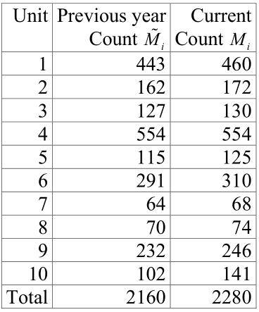
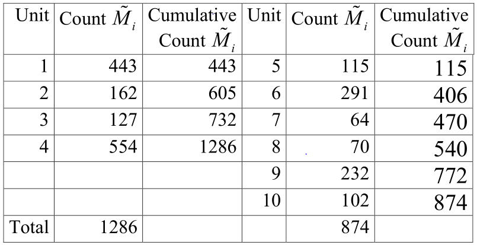

```{r setup, include=FALSE}
knitr::opts_chunk$set(echo = FALSE)
```

## Moving to online

* Getting a camera for next week.  Will improve these lectures (fingers crossed)
* HW due on Monday
* Today:
  + Probability proportion to size (PPS) sampling designs
  + Probability proportion to size (PPS) sampling designs 
  + Issues in PPS/PPeS sampling 
  + Simulation study

## (Two-stage) Probability Proportional to Size (PPS) sampling

For clusters with number of observations, sample with probability $\frac{kM_i}{M_0}$, $N = M_0 = \sum_{i=1}^K M_i$

* Equalize workload (send equal numbers of interviewers to each samples geographic region)
* Avoid large clusters dominating the analysis
  + Important when clusters ``double'' as unit of analysis $\rightarrow$ equal cluster sizes will provide more efficient analysis
* When combined with a second stage of sampling, can be used to create epsem design

## PPS design

* Select with first stage $\frac{kM_i}{M_0}$
* Select with second stage probability $\frac{m}{M_i}$
* Design is epsem for fixed sample size $n$:
$$
P(I_{ij} = 1) = \pi_{ij} = \pi_i \pi_{j \mid i \in s} 
= \frac{kM_i}{M_0} \times \frac{m}{M_i} = \frac{k m}{M_0} 
= \frac{n}{N} = \pi
$$
for all $i,j$.

## Ways to implements

* With replacement
* Systematic sampling without replacement
  + Both approaches require cumulating the size of the clusters

## Example:

Population of $2,160$ employees in $10$ units:

```{r, out.width = "150px", fig.align='center'}
library(knitr)
include_graphics("./figs/l17_fig1.png") # place holder
```

## PPS sampling with first-stage replacement

* Select a random number $R_1$ from $1$ through $N$.
* Find cluster with cumulative sum exceeding $R_i$
* Sample $m$ units from cluster
* Repeat steps until $k$ clusters have been sampled
  + If cluster is sampled $b > 1$ times, sample a total of $bm$ units from cluster
  
## Employee example: say $k=2$, $m=18$, $n=36$

* $R_1 = 702$: sample unit 3, sample 18 of 127 employees
* $R_2 = 1744$: sample unit 7, sample 18 of 64 employees

## PP sampling with first-stage systematic sampling

1. Select a random start $R$ between $1$ and $N/k$
2. Find first cluster with cumulative sume exceeding $R$
3. Sample $m$ units from first cluster
4. Find second cluster with cumulative sum exceeding $R + N/k$
5. Sample $m$ units from second cluster
6. Repeat steps 4 and 5, finding the $i$ cluster with cumulative sum exceeding $R + (i-1) (N/k)$

## Employee example: $k=2$, $m=18$, $n=36$

1. $N/k = 1080$
2. $R = 804$: sample unit $4$, sample $18$ of $554$ employees
3. $R + N/k = 1884$: sample unit $9$, sample $18$ of $232$ employees.

## Point and variance estimation for two-stage PPS sampling

Since epsem design, unweighted sample mean $\bar y$ is unbiased for the population mean:

$$
\begin{aligned}
E( \bar y_{pps} ) &= E ( E( \bar y \mid i \in s) ) \\
&= E ( E( k^{-1} \sum_{i=1}^k \mid i \in s) ) = E \left( k^{-1} \sum_{i=1}^k Y_i \right) \\
&= k^{-1} \sum_{i=1}^K E(\delta_i) \bar Y_i \\
&= k^{-1} \sum_{i=1}^K \frac{k M_i}{M} \bar Y_i \\
&= N^{-1} \sum_{i=1}^K M_i \bar Y_i  = \bar Y
\end{aligned}
$$

## Point and variance esitmation for two-stage PPS sampling

$$ 
\begin{aligned}
V(\bar y_{pps} ) &= \frac{\sigma_1^2}{k} + \frac{\sigma_2^2}{km} = \frac{\sigma_1^2}{k} + \frac{\sigma_2^2}{n}
\end{aligned}
$$
where
$$
\sigma_1^2 = \frac{1}{N} \sum_{i=1}^K M_i \left( \bar Y_i - \bar Y \right)^2
$$
and
$$
\begin{aligned}
\sigma_2^2 &= \frac{1}{N} \sum_{i=1}^K M_i \sigma_i^2 \\
\sigma_i^2 &= \frac{1}{M_i} \sum_{i=1}^K (Y_{ij} - \bar Y_i )^2
\end{aligned}
$$
To prove this, we use Law of Total Variance:
$$
V(\bar y_{pps}) = E \left( V \left( \bar y_{pps} \mid i \in s \right) \right) + V\left( E \left( \bar y_{pps} \mid i \in s \right) \right)
$$

## Variance estimator for $2$-stage PPS

$$
V(\bar y_{pps}) = V \left( \frac{1}{k} \sum_{i=1}^k \bar y_i \right) = \frac{V(\bar y_i )}{k}
$$
where $V(\bar y_i)$ is the marginal (not conditional) variance of $\bar y_i$.

Estimator of the variance is given by
$$
v(\bar y_i) = \frac{1}{k} \times \frac{\sum_{i=1}^k (\bar y_i - \bar y)^2}{k-1}
$$

## Probability Proportional to Estimated Size (PPeS) sampling

* In many practical cases, true cluster sizes $M_i$ are not available
  + An approximation may be available instead $\tilde M_i$
* In employee example, the current employment counts might not be available, but the past year employment counts are
* Here we assume:
  + $\tilde M_i$ available at sampling, __but__
  + $M_i$ not available until analysis

## Example

```{r, out.width = "150px", fig.align='center'}
library(knitr)
 # place holder
```

## Sampling probability

* Assume second stage sampling with constant sample size 
* Joint sampling probability
$$
\pi_{ij} = \frac{k \tilde M_i}{N} \times \frac{m}{M_i} = \frac{n \tilde M_i}{N M_i} = w_{ij}^{-1}
$$

* Weights must now be used to obtain unbiased estimators of means and totals:
$$
\bar y_{ppes} = \frac{\sum_{i=1}^k \sum_{j=1}^m w_{ij} y_{ij} }{\sum_{i=1}^k \sum_{j=1}^m w_{ij}} = 
\frac{\sum_{i=1}^k \frac{M_i}{\tilde M_i} \sum_{j=1}^m y_{ij} }{\sum_{i=1}^k \frac{M_i}{\tilde M_i}  \cdot m} =
\frac{\sum_{i=1}^k w_i \bar y_i}{\sum_{i=1}^k w_i}
$$
where $w_i = \frac{M_i}{\tilde M_i}$.

## Ratio estimator

* Denominator is now a random variable, so we return to ratio estimator to obtain variance
* $w = \sum_{i=1}^k w_i$; $y_w = \sum_{i=1}^k w_i \bar y_i$
* Sampling with replacement at first stage

$$
v(\bar y_{ppes} ) \approx \frac{1}{w^2} \left[ v(y_w) + \bar y_{ppes}^2 v(w) - 2 \bar y_{ppes} c(y_w, w) \right]
$$

* Sampling without replacement at first stage

$$
v(\bar y_{ppes} ) \approx \frac{1-k/K}{w^2} \left[ v(y_w) + \bar y_{ppes}^2 v(w) - 2 \bar y_{ppes} c(y_w, w) \right]
$$

## Ratio estimator

* Use usual estimators of variance
  $$
  \begin{aligned}
  v(y_w) &= \frac{k}{k-1} \sum_{i=1}^k (w_i \bar y_i - y_w / k )^2 \\
  v(w) &= \frac{k}{k-1} \sum_{i=1}^k (w_i - w / k )^2 \\
  c(y_w, w) &= \frac{k}{k-1} \sum_{i=1}^k (w_i -w_k) (\bar y_i - y_w / k )
  \end{aligned}
  $$

## Simple case

* If $\tilde M_i = M_i$, then 
  + $w_i \equiv 1$
  + $v(w) = 0)$
  + $c(y_w, w) = 0$
* So
$$
\begin{aligned}
v(\bar y_{ppes}) 
&\approx \frac{k}{k^2} \left[ \frac{1}{k-1} \sum_{i=1}^k (\bar y_i - y_w / k)^2 \right] \\
&= \frac{1}{k (k-1)} \sum_{i=1}^k (\bar y_i - y_w / k)^2 \\
&= \frac{1}{k (k-1)} \sum_{i=1}^k (\bar y_i - \bar y)^2 = v(\bar y_{pps})
\end{aligned}
$$
since $y_w / k = \sum_{i=1}^k \bar y_i / k = \sum_{i=1}^k \sum_{j=1}^k y_{ij} / km = \bar y$

## Stratified PPS/PPeS

* When we stratify before conducting PPS, we often must adjust the sampling rates, since the strata population sizes typically don’t precisely match those needed for the stratification.
* Go back to employer example: assume a paired selection design for $H=2$ strata
  + So $k=4$ and $m = 18$ gives a sample size $72$ 
  + Overall sampling fraction of $f = 72/2160 = 1/30$.
* Assume two strata are given by units $1--4$ and $5--10$

## Example

```{r, out.width = "200px", fig.align='center'}
library(knitr)
 # place holder
```

## Sampling fractions

* In first stratum:
$$
f_1 = \frac{2 M_i}{\sum_{i=1}^4 M_i } \times \frac{18}{M_i} = \frac{36}{1286} = \frac{0.84}{30} \neq \frac{1}{30}
$$
* In first stratum:
$$
f_1 = \frac{2 M_i}{\sum_{i=1}^4 M_i } \times \frac{18}{M_i} = \frac{36}{1286} = \frac{0.84}{30} \neq \frac{1}{30}
$$
* Vary second stage sampling fractions by strat so that $f_1 = f_2$:
$$
f_h = \frac{2M_i}{\sum_{i=1}^4 M_i } \times \frac{m_h}{M_i} = f 
\Rightarrow m_h = \frac{f \sum_{i \in h} M_i }{2}
$$

## Employee example:

$$
m_1 = \frac{1286}{60} = 21.41; 
\quad \text{and} \quad
m_2 = \frac{876}{60} = 14.57.
$$

* Can approximate stratified epsem design by sampling 21 from each of the 1st strata clusters and 15 from each of the second sample clusters.
  + Improved approximation: sample 22 from one of first stratum clusters and 21 from other, and 14 from one of second stratum clusters and 15 from other.

## Employee example 

Consider sampling with replacement in 1st stage
* $R_{11} = 832$, $R_{12} = 945$: 
  + Sample 43 = (21+22) elements from unit 4
* $R_{21} = 155$, $R_{22} = 709$: 
  + sample 14 elements from unit 6 and 15 elements from unit 9
  
## Point estimation for stratified PPS/PPeS

For PPeS, use stratified ratio estimator:
$$
\bar y_{ppes} = \frac{\sum_{h=1}^H \sum_{i=1}^{k_h} w_{hi} \bar y_{hi}}{\sum_{h=1}^H \sum_{i=1}^{k_h} w_{hi}}
$$
where now the $w_{hi}$ are weighted to account for both the stratification and the unequal probability of selection induces by errors in the measure of size: 
$$
w_{hi} = \frac{k K_h M_i}{k_h K \tilde M_i}
$$

## If PPS

Then 
$$
w_{hi} \equiv w_h = \frac{k K_h}{k_h K}
$$
and
$$
\begin{aligned}
\sum_{h=1}^H \sum_{i=1}^{k_h} w_{hi} 
&= \sum_{h=1}^H k_h \times \frac{k K_h}{k_h K} \\
&= k \sum_{h=1}^H \frac{K_h}{K} = k \\
\end{aligned}
$$
implying
$$
\bar y_{pps}= \frac{k\sum_{h=1}^H \frac{K_h}{K} \frac{1}{k_h} \sum_{j=1}^{k_h} \bar y_{hi}}{k} = \sum_{h=1}^H \frac{K_h}{K} \bar y_h
$$

## Variance estimation for stratified PPS/PPeS

$$
\begin{aligned}
v( \bar y_{ppes} ) &\approx \frac{1}{w^2} \sum_{h=1}^H \left[ v( y_{wh}) + \bar y^2_{ppes} v ( w_h ) - 2 \bar y_{ppes} c(y_{wh}, w_h ) \right] \\
w_h &= \sum_{i=1}^{k_h} w_{hi}, \quad \text{ and } \quad
y_{wh} = \sum_{i=1}^{k_h} w_{hi} \bar y_{hi} \\
v(y_{wh}) &= \frac{k_h}{k_h-1} \sum_{i=1}^{k_h} (w_{hi} \bar y_{hi} - y_{wh} / k )^2 \\
  v(w_h) &= \frac{k_h}{k_h-1} \sum_{i=1}^{k_h} (w_{hi} - w_h / k )^2 \\
  c(y_{wh}, w_h) &= \frac{k_h}{k_h-1} \sum_{i=1}^{k_h} (w_{hi} - w_h / k) ( w_{hi} \bar y_{hi} - y_{wh} / k )
\end{aligned}
$$

## Variance under PPS