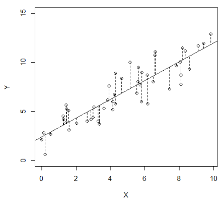

```{r setup, include=FALSE}
knitr::opts_chunk$set(echo = FALSE)
library(knitr)
library(survey)
library(pps)
```

## This week

* Attempt to use camera
  + If not good, then will get a tablet to assist in 
* JITT:
  + Rederive results from recent paper over next week
  + Nonprobability sampling (e.g., online) versus SRS
* Today and tomorrow:
  + General methods for variance estimation 

## General methods for variance estimation

* We’ve been focused on estimation of means and totals because in some settings these are the main foci of interest.

* It is also a convenient way to discuss some of the key issues of design, since point and variance estimation can be obtained, at least approximately, in closed form.
  + Increasing efficiency through stratification
    + Optimal allocation
  + Within-cluster correlation: roh, design effects
  + Ratio and regression estimation as introduction to calibration.
  
## General methods for variance estimation

However, for “analytic” statistics (e.g., regression parameters), combined with complex designs that incorporate stratification, clustering, and weighting simultaneously, methods have been developed that work, at least approximately, for both general statistics and general designs.

* Taylor series approximation
  + Relies on result obtained for estimation of means and totals.
* Replication methods
  + Balance repeated replication
  + Jackknife
  + Bootstrap
  
## Taylor series approximation (review)

* We can obtain linear approximation to a function $g({\bf u})$ as

$$
g({\bf u}) \approx g({\bf x}) + \sum_{i=1}^k (u_i - x_i) \frac{\partial g}{\partial u_i}  \mid_{{\bf u}={\bf x}}
$$

* So if ${\bf u}$ is set of sample statistics and ${\bf x}$ is the population mean, then $g({\bf x})$ and $\sum_{i=1}^k x_i \frac{\partial g}{\partial u_i} \mid_{{\bf u}={\bf x}}$ are constants, so

$$
V( g({\bf u})) \approx V \left( \sum_{i=1}^k u_i \frac{\partial g}{\partial u_i} \mid_{{\bf u} = {\bf U}} \right) 
$$

## Example: Linear regression

Consider linear regression model for a population
$$
Y_i = \beta_0 + \beta_1 X_i + \epsilon_i, \quad i=1,\ldots,N
$$
where $\beta_0$ and $\beta_1$ are fixed but unknown quantities and $\epsilon_i$

* The estimators 
$$
\begin{aligned}
\hat \beta_0 &= B_0 = \bar Y - B_1 \bar X \\
\end{aligned}
$$
can be viewed as minimizers of the least-squares estimator:
$$
\arg \min_{\beta_0, \beta_1} \sum_{i=1}^N \left( Y_i - (\beta_0 + \beta_1 X_i) \right)^2
$$

## Example: Linear regression

```{r, out.width = "200px", fig.align='center'}
 # place holder
```

## Alternative view: Linear regression

We can view $B_0$ and $B_1$ as maximum likelihood estimators of a superpopulation model where the population consists of $N$ draws from this superpopulation, where $\epsilon_i \sim^{iid} N(0,\sigma^2)$

$$
\begin{aligned}
\arg \max_{\beta_0, \beta_1, \sigma^2} &\sum_{i=1}^N l_i (\beta_0, \beta_1, \sigma^2) \\
l_i (\beta_0, \beta_1, \sigma^2) &= - \log \sigma - \frac{(Y_i - (\beta_0 +\beta_1 X_i))^2}{2 \sigma^2}
\end{aligned}
$$
Either way, note that $B_0$ and $B_1$ are __population quantities__ that are the target of inference in the survey data sample

## Sample estimator: Linear regression

Our sample estimator of $B_1$ is then given by
$$
b_1 = \frac{N u_1 - u_2 u_3}{N u_4 - (u_2)^2}
$$
where 
$$
\begin{aligned}
E[u_1] &= \sum_{i=1}^N X_i Y_i; \quad E[u_2] = \sum_{i=1}^N X_i \\
E[u_3] &= \sum_{i=1}^N Y_i; \quad E[u_4] = \sum_{i=1}^N X_i^2.
\end{aligned}
$$

* E.g., $u_1 = \frac{1}{f} \sum_{i=1}^n X_i Y_i$ is an unbiased estimator of $\sum_{i=1}^N X_i Y_i$

##  Taylor series approximation

So the taylor series aprpoximation is given by
$$
\begin{aligned}
V(b_1) &= V \left( \sum_{i=1}^4 u_i \frac{\partial b_1}{\partial u_i} \mid_{{\bf u} = {\bf U}}  \right)  \\
&= \sum_{i=1}^4 \sum_{j=1}^4 \left( \frac{\partial b_1}{\partial u_i} \mid_{{\bf u} = {\bf U}}  \right) \left( \frac{\partial b_1}{\partial u_j} \mid_{{\bf u} = {\bf U}}  \right) C(u_i, u_j) \\
\frac{\partial b_1}{\partial u_1} \mid_{{\bf u} = {\bf U}} &= \frac{N}{N U_4 - U_2^2}; \quad
\frac{\partial b_1}{\partial u_2} \mid_{{\bf u} = {\bf U}} = \frac{2N U_1 U_2 - U_2^2 U_3 - N U_3 U_4}{(N U_4 - U_2^2)^2}; \\
\frac{\partial b_1}{\partial u_3} \mid_{{\bf u} = {\bf U}} &= \frac{- U_2}{N U_4 - U_2^2}; \quad
\frac{\partial b_1}{\partial u_4} \mid_{{\bf u} = {\bf U}} = \frac{-N (N U_1 - U_2 U_3 )}{(N U_4 - U_2^2)^2}; \\
\end{aligned}
$$

## What about $C(u_i, u_j)$?

* Can compute variances and covariances of $u_1, \ldots, u_4$ using methods developed in class
* Example

$$
\begin{aligned}
C(u_1, u_2) &= C \left( \frac{1}{f} \sum_{i=1}^N  I_i X_i Y_i, \frac{1}{f} \sum_{i=1}^N I_i Y_i \right) \\
&= \frac{1}{f^2} \sum_{i=1}^N  \sum_{j=1}^N C(I_i, I_j)  X_i X_j Y_i \\
&= \frac{1}{f^2} \left[ f(1-f) \sum_{i=1}^N  X_i^2 Y_i - \frac{f(1-f)}{N-1} \sum_{i=1}^N \sum_{j\neq i} (X_i Y_i) \cdot X_j\right] \\
\end{aligned}
$$

* And similarly use our estimators of $u_1,\ldots, u_4$ to replace $U_1, \ldots U_4$ in 
$\frac{\partial b_1}{\partial u_i} \mid_{{\bf u} = {\bf U}}$

## This is pretty messy
* Gets worse if we have a multivariate regression model, say $Y_i = \beta_0 + \beta_1 X_{i1} + \beta_2 X_{i2} + \epsilon_i$
  + Now we have $u_5 = \sum_{i=1}^N X_{i2} Y_i$, $u_6 = \sum_{i=1}^N X_{i2}$, $u_7 = \sum_{i=1}^N X_{i2}^2$, and $u_8 = \sum_{i=1}^N X_{i1} X_{i2}$
  + This is a lot of terms!!

## Alternative approach:

* Use the concept of pseudo maximum likelihood estimator
* If we had data on the entire population, we could solve

$$
\begin{aligned}
\left( \begin{array}{c} \frac{\partial}{\partial \beta_0} \sum_{i=1}^N l_i (\beta_0, \beta_1, \sigma^2) \\ \frac{\partial}{\partial \beta_1} \sum_{i=1}^N l_i (\beta_0, \beta_1, \sigma^2) \end{array} \right) 
&= 
\left( \begin{array}{c} -\frac{1}{\sigma^2} \sum_{i=1}^N (Y_i - (\beta_0 + \beta_1 X_i)) \\ -\frac{1}{\sigma^2} \sum_{i=1}^N X_i (Y_i - (\beta_0 + \beta_1 X_i)) \end{array} \right)  \\
&=\left( \begin{array}{c} 0 \\ 0 \end{array} \right)
\end{aligned}
$$

* Simplifies to

$$
 \sum_{i=1}^N (Y_i - (\beta_0 + \beta_1 X_i)) \left( \begin{array}{c} 1 \\ X_i \end{array} \right) = 
\left( \begin{array}{c} 0 \\ 0 \end{array} \right)
$$

## Score equation

* This is the __score equation__ and is often denoted $U(\beta)$ using matrix notation
* Using matrix notation for general regression $E ( Y_i) = X_i^\top \beta$, we have

$$
\frac{\partial}{\partial \beta} \sum_{i=1}^N l_i (\beta, \sigma^2) = U(\beta) = -\frac{1}{\sigma^2} X^\top (Y - X \beta)
$$

* Solving for $\beta$ yields

$$
X^\top Y = X^\top X \hat \beta \Rightarrow \hat \beta = B = ( X^\top X)^{-1} X^\top Y
$$


## Unbiased estimator of the population score equation

* This is just a population total; thus general unbiased estimator of the population score equation is given by

$$
\frac{\partial}{\partial \beta } \sum_{i=1}^n w_i l_i (\beta, \sigma^2) = U_{w} (\beta) =
- \frac{1}{\sigma^2} X_n^\top W_n ( Y_n - X_n \beta)
$$

* For SRS, $w_i = \frac{1}{f} \Rightarrow$ 
* In general $w_i = \pi_i^{-1}$ and so will be different from simple LS

## Solving weighted LS

* Solving $U_w ( b_w) = 0$ yields

$$
X^\top W Y = X^\top W X b_w \Rightarrow b_w = (X^\top W X)^{-1} X^\top W Y
$$

* Sometimes terms the __pseudo-maximum likelihood estimator__ (PMLE)
  + Note that since these weights are used into a sum-to-zero equation, they can be multiplied by any constant – hence epsem designs can be standardized to $w_i \equiv 1$
  + Standard regression software can be used to obtain point estimates of $B$
  + Many packages can handle weighting as well
* Key benefit for us: we can get a variance estimator of $b_w$ that does not require grinding out all of the $p + \frac{(p+1)(p+2)}{2}$ derivatives for a $p$-dimensional regression model

## Step 1: Taylor series

* Using vector notation, our Taylor Series approximation for $V( g( {\bf u}))$ is given by

$$
V( g( {\bf u})) = \left( \frac{\partial g}{\partial {\bf u}} \mid_{{\bf u} = {\bf U}} \right)^\top V( {\bf u}) \left( \frac{\partial g}{\partial {\bf u}} \mid_{{\bf u} = {\bf U}} \right)
$$

* Multivariate form of the delta method

## Recall

* Function $F$ and inverse $F^{-1}$ then 

$$
\begin{aligned} 
\frac{\partial}{\partial x} F^{-1} (F(x)) &= \frac{\partial}{\partial x} x \\
\frac{\partial F^{-1}}{\partial x} (F(x)) \cdot \frac{\partial F}{\partial x} (x) &= 1 \\
\frac{\partial F^{-1}}{\partial x} (F(x))  &= \left[ \frac{\partial F}{\partial x} (x) \right]^{-1} \\
\frac{\partial F^{-1}}{\partial x} (x)  &= \left[ \frac{\partial F}{\partial x} (F^{-1}(x)) \right]^{-1} \\
\end{aligned}
$$

## Combining yields

$$
b_w = U_w^{-1} ( U_w (b_w)) \Rightarrow U_{w}^{-1} \equiv g \text{ and } U_w (b_w) \equiv u
$$
then
$$
\begin{aligned}
V(b_w) &= V(U_w^{-1} ( U_w (b_w))) \\
&= \left( \frac{\partial g}{\partial {\bf u}} \mid_{{\bf u} = {\bf U}} \right)^\top V( {\bf u}) \left( \frac{\partial g}{\partial {\bf u}} \mid_{{\bf u} = {\bf U}} \right) \\
&= \left( \frac{\partial U_w^{-1}}{\partial {\bf U_w (b_w)}} \mid_{{\bf 0} = {\bf U_w(b_w)}} \right)^\top V( U_w (b_w)) \left( \frac{\partial U_w^{-1}}{\partial {\bf U_w (b_w)}} \mid_{{\bf 0} = {\bf U_w(b_w)}} \right) \\
&= \left( \frac{\partial U_w}{\partial {\bf \beta}} \mid_{{\bf \beta} = {\bf b_w}} \right)^{-1} V( U_w (b_w)) \left( \frac{\partial U_w}{\partial {\bf \beta}} \mid_{{\bf \beta} = {\bf b_w}} \right)^{-1} \\
&= \sigma^{4} (X^\prime W X)^{-1} V( U_w (b_w)) (X^\prime W X)^{-1}
\end{aligned}
$$

## Sandwich estimator

* __Sandwich estimator__: 
  + Bread: Inverse of the derivative of score equation evaluated at $b_w$
  + Meat: variance of the score equation evaluated at $b_w$
* Estimator of $V(b_w)$ now requires an estimator of $v(U_w(b_w))$
+ But we know how to estimate population total for all of the sample designs we have discussed.

## Estimator $v(U_w (b_w))$

We can simplify further by noticing
$$
U_w (b_w) = -\sigma^{-2} \sum_{i=1}^n z_i, \quad z_i = w_i e_i x_i, e_i = y_i - x_i^\top b_w
$$
Then, for a general stratified, clustered design with arbitrary weights,
$$
v(U_w (b_w)) = \sigma^{-4} \sum_{i=1}^h \frac{k_i}{k_i-1} \sum_{j=1}^{k_i} (z_{ij} - \bar z_i) (z_{ij} - \bar z_i)^\top
$$
where $h$ is the stratum, $k_i$ is the number of PSUs in the $i$th stratum, $z_{ij} = \sum_{l=1}^{r_{ij}} z_{ijl}$, and $\bar z_i = \frac{1}{k_i} \sum_{j=1}^{k_i} z_{ij}$. Thus
$$
(X^\prime W X)^{-1} \left( \sum_{i=1}^h \frac{k_i}{k_i-1} \sum_{j=1}^{k_i} (z_{ij} - \bar z_i) (z_{ij} - \bar z_i)^\top \right) (X^\prime W X)^{-1}
$$


## JITT: ``A fundamental identity in statistics'' - X.L. Meng

* Consider $\bar y_n = \frac{1}{n} \sum_{i=1}^n y_i = \frac{\sum_{i=1}^N I_j Y_j}{\sum_{j=1}^N I_j }$
* For any set of numbers $\{ Y_1, \ldots, Y_N \}$. let $J$ be a random index defined on $\{1,\ldots, N\}$. For example, if $J$ is uniformly distributed then $E_J ( Y_J ) = \sum_{j=1}^N Y_j / N$
if $J$ is uniformly distributed.
* Use this to show $\bar y_n - \bar Y = \frac{\text{Cov}_J (I_J, Y_J)}{E_J (I_J)}$
* Let $\rho_{I,Y} = \text{Corr}_{J} (I_J, Y_J)$, then show 
$$
\bar y_n - \bar Y = \rho_{I,Y} \times \sqrt{\frac{1-f}{f}} \times \sigma_{Y}
$$
where $f = n/N = E_J [I_J]$, $\sigma_Y = \sqrt{V_J (Y_j)}$
* What do these 3 factors represent?
  
## JITT: applied to SRS

* Let $\text{MSE}_{{\bf I}} ( \bar y_n) = E_{{\bf I}} \left[ (\bar y_n - \bar Y)^2 \right]$ 
where $E_{{\bf I}}$ denotes the expectation with respect to any chosen distribution of ${\bf I}$ but conditioning on sample size $\sum_{j=1}^N I_j = n$.
* Show (explain why) above implies

$$
\text{MSE}_{{\bf I}} ( \bar y_n) = E_{{\bf I}} \left[ \rho_{I,Y}^2 \right] \times \left( \frac{1-f}{f} \right) \times \sigma_{Y}^2
$$

* Under SRS, we had

$$
V_{SRS} ( \bar y_n )  = \frac{1-f}{n} S^2, \quad 
\text{with} \quad
S^2 = \frac{N}{N-1} \sigma_Y^2 = \frac{1}{N-1} \sum_{j=1}^N (Y_j - \bar Y)^2
$$

* Show this implies 

$$
E_{SRS} \left[ \rho_{I,Y}^2 \right] = \frac{1}{N-1}
$$

## JITT:  For Monday's Diary

* What's the implicit assumption in the following from the NYT:
  + _As we reach more people, our poll will become more stable and the margin of sampling error will shrink_

```{r, out.width = "200px", fig.align='center'}
include_graphics("./figs/l19_fig2.png") # place holder
```
