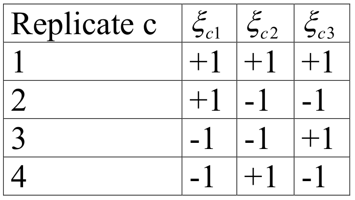

```{r setup, include=FALSE}
knitr::opts_chunk$set(echo = FALSE)
library(knitr)
library(survey)
library(pps)
```

## JITT: ``A fundamental identity in statistics'' - X.L. Meng

$$
\begin{aligned}
\bar y_n - \bar Y &= \frac{\text{E}_J (I_J \cdot Y_J)}{E_J (I_J)} - E_J (Y_J) \\
&= \frac{\text{E}_J (I_J \cdot Y_J) - E_J (Y_J) E_J (I_J)}{E_J (I_J)} \\
&= \frac{\text{Cov}_J (I_J, Y_J)}{E_J (I_J)} \\
&= \frac{\text{Cov}_J (I_J, Y_J)}{\sqrt{ V_J (I_J) V_J(Y_J)}} \frac{\sqrt{ V_J (I_J)}}{E_J (I_J)} \sqrt{V_J(Y_J)} \\
&= \rho_{I, Y} \times \sqrt{ \frac{1-f}{f} } \times \sigma_Y \\
\end{aligned}
$$

## What do these factors represent

$$
\underbrace{\rho_{I, Y}}_{\text{Data Quality}} \times \underbrace{\sqrt{ \frac{1-f}{f} }}_{\text{Data Quantity}}\times \underbrace{\sigma_Y}_{\text{Problem Difficulty}}
$$

* _Data quantity_ : how much of the population have we observed
* _Problem difficulty_: If $Y$ is a constant across population then $\sigma_Y = 0$ and the problem is super simple.  The overall variation in the population tells you how much data is needed 
* _Data quality_: Most challenging to assess yet most critical!
  + Measures sign and degree of selection bias caused by the selection mechanism 
  + Absence of selection bias (e.g., probabilistic sampling) then $\rho_{I, Y} \approx 0$
  + If larger values of $Y$ have higher/lower chances to be recorded, then $\bar y_n$ overestimates/underestimates $\bar Y$. Sign and degree of $\rho_{I,Y}$ measure direction and magnitude of these effects respectively.

## Applied to SRS


$$
\text{MSE}_{{\bf I}} ( \bar y_n) = E_{{\bf I}} \left[ \rho_{I,Y}^2 \right] \times \left( \frac{1-f}{f} \right) \times \sigma_{G}^2
$$

* Under SRS, we had

$$
V_{SRS} ( \bar y_n )  = \frac{1-f}{n} \frac{N}{N-1} \sigma_Y^2 = \frac{1}{N - 1} \frac{1-f}{f} \sigma_Y^2
$$

* For SRS, since there's no bias, we have MSE is the variance and so

$$
E_{SRS} \left[ \rho_{I,Y}^2 \right] = \frac{1}{N-1}
$$

## JITT:  For Monday's Diary

* What's the implicit assumption in the following from the NYT:
  + _As we reach more people, our poll will become more stable and the margin of sampling error will shrink_

```{r, out.width = "200px", fig.align='center'}
include_graphics("./figs/l19_fig2.png") # place holder
```


## Replication methods for variance estimation

An alternative to linearization is replication or resampling: elements of the sample are dropped, a new estimator is computed using the remaining elements of the sample, and the resulting estimates resulting from repeated applications of this process are used to compute a variance estimator.

This approach is an extension of variance estimation under interpenetrated subsamples. In this setting, a sample is drawn and randomly divided into $K$ subsamples reflecting the original sample design. The resulting $K$ estimators $\hat \theta_k$ can then be viewed as an SRS from all possible samples under the design the mean $\hat \theta = K^{-1} \sum_{k=1}^K \hat \theta_k$ and estimated variance $v(\hat \theta) = K^{-1} (K-1)^{-1} \sum_{k=1}^K (\hat \theta_k - \hat \theta )^2$

## Balanced repeasted replication (BRR)

* In practice actually creating interpenetrated samples can be practically onerous, especially if stratification and clustering is involved. Hence the practical methods we will discuss do not rely on actual interpenetrated sample.
* BRR is a method that assumes 2 PSUs per stratum (paired selection model).
* In practice this might not be the case, so approximations are made by collapsing/combining strata
  + Ultimate cluster sampling (ignore lower levels of clustering)
  + With-replacement approximations
  + Creating of Sampling Error Computation Units (SECUs)

## Example: National Health and Nutrition Examination Survey I (1971-1974)

* Divide the US into 1900 PSUs (counties, groups of counties), combined into 65 strata:
  + 15 strata selected with certainty
  + 50 PSUs sampled from each of the non-certainty strata
  + Problem: have one PSU per stratum
  + For the certainty strata, 1213 second-stage neighborhoods were selected: these are collapsed 20 SECUs, 2 per 10 (new) strata
  + For the non-certainty strata, they are paired to create 50 SECUs in 25 (new) strata
* 1263 PSUs in 65 strata combined and collapsed to 35 strata with 2 SECUs each.

## Paired selection design

* Consider estimating a total $Y$ in a paired selection design
* Assume we have appropriate sample selection probabilities/weights so that $y_h = y_{h1} + y_{h2}$ is an unbiased estimator of the populatoin total $Y_h$ in the $h$th stratum,

$$
E(y) = E \left( \sum_{h=1}^H ( y_{h1} + y_{h2} ) \right) = Y
$$

* Drawing one PSU per stratum $\alpha^\prime$ at random to form a half-sample
* Letting the remaining PSUs $\alpha^{\prime \prime}$ to form the other half-sample, yields

$$
E ( y^\prime ) = 2 E \left( \sum_{h=1}^H y_{h \alpha^\prime} \right) = E ( y^{\prime \prime} ) = 2 E \left( \sum_{h=1}^H y_{h \alpha^{\prime \prime}} \right) = Y
$$

##  Alternative view

This can be viewed as case of interpenetrated subsamples with $K=2$:

$$
\begin{aligned}
v(y) &= \frac{ \sum_{k=1}^2 (y_k - y)^2}{2 \times 1} \\
&= \frac{ (y^\prime - y)^2 + (y^{\prime \prime} - y)^2}{2} \\
&= (y^\prime - y)^2 = ( y^{\prime \prime} - y)^2
\end{aligned}
$$

## Alternative view

* This is a very unstable estimator, as it only has a single degree of freedom based on that random split between SECUs within each stratum.
* So let's consider this estimator as a function of the underlying strata.

$$ 
\begin{aligned}
( y^\prime - y )^2 &= \left( 2 \sum_{h=1}^H y_{h \alpha^\prime} - \sum_{h=1}^H (y_{h \alpha^\prime} + y_{h \alpha^{\prime \prime}}) \right)^2 = \left( \sum_{h=1}^H (y_{h \alpha^\prime} - y_{h \alpha^{\prime \prime}}) \right)^2\\
&=  \sum_{h=1}^H (y_{h \alpha^\prime} - y_{h \alpha^{\prime \prime}})^2 + 2 \sum_{h=k+1}^H \sum_{k=1}^H  (y_{h \alpha^\prime} - y_{h \alpha^{\prime \prime}})(y_{k \alpha^\prime} - y_{k \alpha^{\prime \prime}}) \\
&=  \sum_{h=1}^H (y_{h1} - y_{h2})^2 + 2 \sum_{h=k+1}^H \sum_{k=1}^H \xi_h \xi_k (y_{h1} - y_{h2})(y_{k1} - y_{k2}) \\
\end{aligned}
$$

## Alternative view

* So let's consider this estimator as a function of the underlying strata.

$$ 
\begin{aligned}
( y^\prime - y )^2 &= \sum_{h=1}^H (y_{h1} - y_{h2})^2 + 2 \sum_{h=k+1}^H \sum_{k=1}^H \xi_h \xi_k (y_{h1} - y_{h2})(y_{k1} - y_{k2}) \\
&= \sum_{h=1}^H d_h^2 + 2 \sum_{h=k+1}^H \sum_{k=1}^H \xi_h \xi_k d_h d_k
\end{aligned}
$$
where $\xi_h = 1$ if $\alpha^\prime = 1$ and $\xi_h = -1$ if $\alpha^{\prime} = 2$ in stratum $h$, and $y_{(h1)} - y_{(h2)} = d_h$.

## Alternative view

* Conditional on the sampled clustering in each stratum, $\xi_h$ can be considered as a binary variable with probability $0.5$ of taking on $1$ and $0.5$ of taking on $-1$
  + So $E (\xi_h \mid i \in s) = 0.5 - 0.5 = 0$
* Since sampling across strata are independent,

$$
\begin{aligned}
E \left[ \left( y^\prime - y \right)^2 \right ] &= E \left( \sum_{h=1}^H d_h^2 \right) + 2 E \left( \sum_{h=k+1}^H \sum_{k=1}^H \xi_h \xi_k d_h d_k \right) \\
&= V(y) + 2 E \left[ E \left[ \sum_{h=k+1}^H \sum_{k=1}^H \xi_h \xi_k d_h d_k \mid i \in s \right] \right] \\
&= V(y) + 2 E \left[ \sum_{h=k+1}^H \sum_{k=1}^H  E \left[ \xi_h \xi_k \mid i \in s \right] d_h d_k  \right]  \\
&= V(y) + 2 E \left[ \sum_{h=k+1}^H \sum_{k=1}^H  \underbrace{E \left[ \xi_h \mid i \in s \right]}_{=0} \times \underbrace{E \left[ \xi_k \mid i \in s \right]}_{=0} d_h d_k  \right]  \\
&= V(y)
\end{aligned}
$$

## More precise estimator

Thus we can obtain a more precise variance estimator by repeating the process of forming half-samples $C$ times, and averaging over the differences between the half-sample estimator $y^\prime_k$ and the full sample estimator $y$:

$$
v_c (y) = \frac{\sum_{c=1}^C ( y^\prime_c - y )^2}{C}
$$

## Half-samples without replacement:

For a specific set of draws of half-samples without replacement,

$$
\begin{aligned}
v_c (y) &= C^{-1} \sum_{c=1}^C \left[ \sum_{h=1}^H d_h^2 + 2 \sum_{h=k+1}^H \sum_{k=1}^H \xi_{ch} \xi_{ck} d_h d_k \right] \\
&= \sum_{h=1}^H d_h^2 + 2 \sum_{h=k+1}^H \sum_{k=1}^H \left( \sum_{c=1}^C \frac{\xi_{ch} \xi_{ck}}{C} \right) d_h d_k
\end{aligned}
$$

* Now $\sum_{c=1}^C \frac{\xi_{ch} \xi_{ck}}{C} \to 0$ as $C$ gets large, and when $C = 2^H$ (maximum value), $\sum_{c=1}^C \xi_{ch} \xi_{ck} = 0$
* However, it is possible to choose samples in a balanced manner to achieve $\sum_{c=1}^C \xi_{ch} \xi_{ck} = 0$ for smaller values of $C$

## Example: 3 strata and 4 replicate samples

```{r, out.width = "200px", fig.align='center'}
 # place holder
```

Can verify that cross-products cancel so that
$$
(2 (y_{11} + y_{21} + y_{31}) - y)^2 + \cdots (2 (y_{12} + y_{21} + y_{32}) - y)^2 / 4
$$
yields $v(y) = \sum_{h=1}^H (y_{h1} - y_{h2})^2$

## Hadamard matrices

* A feature of this matrix is that columns are __orthogonal__: $\sum_c \xi_{ch} \xi_{ck} = 0$ for all $h,k$
* Matrices are called _Hadamard_ matrices, and methods available to generate $C \times C$ matrices of this form for multiples of $4$
  + For a 2-SECU design with $H$ strata, use a Hadamard matrix such that $\min (C: C \geq H), \text{mod} (C,4) = 0)$
  + Drop extra columns (remainder will still be orthogonal)
  + For example, if there are 70 strata, use a $72 \times 72$ Hadamard matrix, dropping columns 71 and 72 for the analysis.

## Other option

* Of course, we could just compute $v(y)$ directly
* The value of the replication methods is that we compute the variance for a __general statistic__ using this method
* Typically this is done using replication weights
* Going back to our simple example, we will generate $4$ replication weights $w_{ic}$, $c=1,\ldots,4$ from the sampling weights $w_i$:
  + $w_{i1} = 2 w_i \cdot 1[ \text{SECU}_i = 1]$
  + $w_{i2} = 2 w_i \cdot 1[ \text{SECU}_i = 1, h_i = 1 \text{ or } \text{SECU}_i = 2, h_i=2,3]$
  + $w_{i3} = 2 w_i \cdot 1[ \text{SECU}_i = 1, h_i = 3 \text{ or } \text{SECU}_i = 2, h_i=1,2]$
  + $w_{i4} = 2 w_i \cdot 1[ \text{SECU}_i = 1, h_i = 2 \text{ or } \text{SECU}_i = 2, h_i=1,3]$

## Other option (ctd) 

We then compute a weighted estimator of our statistic $\hat \theta_c$ (e.g., a regression parameter) using the replication weight $w_c$, and esitmate the variance as

$$
v(\hat \theta)_{BRR} = \frac{\sum_{c=1}^C (\hat \theta_c - \hat \theta)^2}{C}
$$

If $\theta$ is a vector, the variance-covariance can be obtained as

$$
v(\hat \theta)_{BRR} = \frac{\sum_{c=1}^C (\hat \theta_c - \hat \theta) (\hat \theta_c - \hat \theta)}{C} 
$$

## Linear vs non-linear 

Theory requires linear statistic $\bar \theta$ (e.g, mean, total) for exact results. But approximate results hold for non-linear statistics (e.g., regression parameters, variance components), and simulation studies generally show good behavior for non-linear statistics.

## Jackknife repeated replication (JRR)

This is another replication method that is more flexible than the BRR methods in that it does not assume a 2 SECU-stratum design.

In the general setting with varying numbers of PSUs $k_h$ per stratum,

$$
v_{JRR} (\hat \theta) = \sum_{h=1}^H \frac{k_h - 1}{k_h} \sum_{i=1}^{k_h} \left( \hat \theta_{(hi)} - \hat \theta \right)^2
$$
where $\hat \theta_{(hi)}$ is obtained dropping the $i$th PSU within the $h$th stratum, weighting up the remaining observations in the $h$th stratum by $k_h / (k_h - 1)$, and recomputing the estimate of $\theta$.

## JRR

Jackknife estimators of variance can be obtained for any of the general forms of sample design, by either letting $H=1$ in the absence of stratification, or by treating each observation as a PSU in the absence of clustering.

Thus for a clustered design without stratification
$$
v_{JRR} (\hat \theta) = \frac{k-1}{k} \sum_{i=1}^k \left( \hat \theta_{(i)} - \hat \theta \right)^2
$$
where $\hat \theta_{(i)}$ is obtained dropping the $i$th PSU and weighting up the remaining observations $k/(k-1)$

## JRR for stratified design

For a stratified design with independent observations
$$
v_{JRR} (\hat \theta) = \sum_{h=1}^H \frac{n_h - 1}{n_h} \sum_{i=1}^{n_h} \left( \hat \theta_{(hi)} - \hat \theta \right)^2
$$
where $\hat \theta_{(hi)}$ is obtained dropping the $i$th observation within the $h$th stratum and weighting up the remaining observations in the $h$th stratum by $n_h / (n_h - 1)$

## JRR for SRS design

For an SRS design
$$
v_{JRR} (\hat \theta) = \frac{n-1}{n} \sum_{i=1}^n \left( \hat \theta_{(i)} - \hat \theta \right)^2
$$
where $\hat \theta_{(i)}$ is obtained dropping the $i$th observation and weighting up the remaining observations in the $h$th stratum by $n/(n-1)$

## Illustration

For illustration, consider $\theta = Y$, the population total, and a stratified cluster design with $k_h$ PSUs in the $h$th stratum, $h=1,\ldots, H$.  Then

$$
\begin{aligned}
\hat \theta_{(hi)} &= \sum_{l=1, l \neq h}^H y_l + \frac{k_h}{k_h-1} \sum_{j=1, j\neq i}^{k_h} y_{hj} \\
\hat \theta_{(hi)} - \hat \theta &= \frac{k_h}{k_h-1} \sum_{j=1, j\neq i}^{k_h} (y_{hj} - y_h) \\
&= \left( \sum_{j=1,j\neq i}^{k_h} y_{hj} - y_h \sum \right) + \frac{1}{k_h-1} \sum_{j=1,j\neq i}^{k_h} y_{hj} \\
&= \frac{1}{k_h-1} \sum_{j=1,j\neq i}^{k_h} y_{hj} - y_{hi} = \frac{y_h}{k_h-1} - y_{hi} \left[ 1+ \frac{1}{k_h-1} \right].
\end{aligned}
$$

## Illustration (ctd)


$$
\begin{aligned}
\hat \theta_{(hi)}
&= \frac{1}{k_h-1} \sum_{j=1,j\neq i}^{k_h} y_{hj} - y_{hi} = \frac{y_h}{k_h-1} - y_{hi} \left[ 1+ \frac{1}{k_h-1} \right] \\
&= \frac{k_h}{k_h-1} \left[ y_h / k_h - y_{hi} \right].
\end{aligned}
$$

and thus
$$
\left( \hat \theta_{(hi)} - \hat \theta \right)^2 = \left[ \frac{k_h}{k_h-1} \right]^2 \left[ y_h / k_h - y_{hi} \right]^2
$$

## Maximizing precision

Conditioning on the sampled PSUs,
$$
\left( \hat \theta_{(hi)} - \hat \theta \right)^2 = \left[ \frac{k_h}{k_h-1} \right]^2 \frac{1}{k_h} \sum_{i=1}^{k_h} \left[ y_{hi} - y_h/k_h \right]^2 = \frac{k_h}{k_h-1} s_{yh}^2
$$

If we form $C_h$ replicates from stratum $h$, 
$$
E \left( \frac{k_h-1}{C_h} \sum_{c=1}^{C_h} \left( \hat \theta_{(hc)} - \hat \theta \right)^2 \right) = k_h s_{yh}^2 
$$

We can maximize precision by using the maximum number of replicates $k_h$:
$$
E \left( \frac{k_h-1}{C_h} \sum_{i=1}^{k_h} \left( \hat \theta_{(hi)} - \hat \theta \right)^2 \right) = k_h s_{yh}^2 
$$

## JRR

Summing over the strata
$$
E \left( \sum_{h=1}^H \frac{k_h-1}{k_h} \sum_{i=1}^{k_h} \left( \hat \theta_{(hi)} - \hat \theta \right)^2 \right) = \sum_{h=1}^{H} k_h s_{yh}^2 = v(y)
$$

As with BRR, JRR requires linear statistics for this exact result to hold. Simulation studies using non-linear statistics show reasonably reliable behavior (better in larger samples).

## JITT: Derivation continued