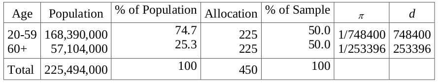
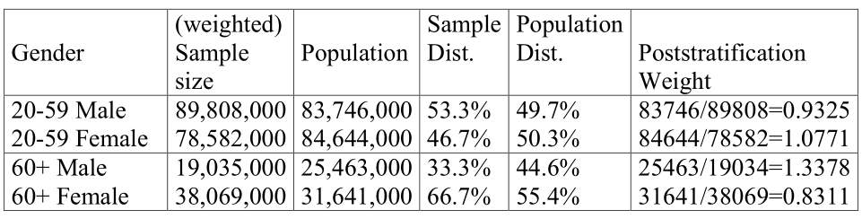
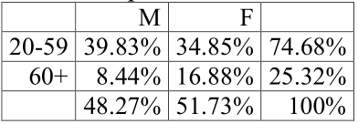
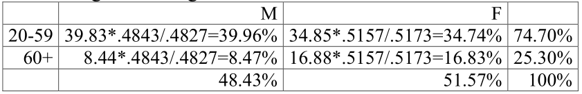
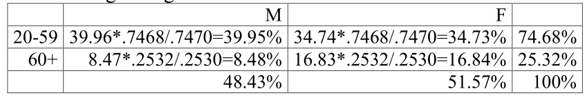
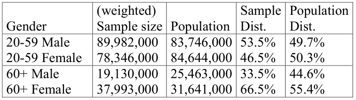
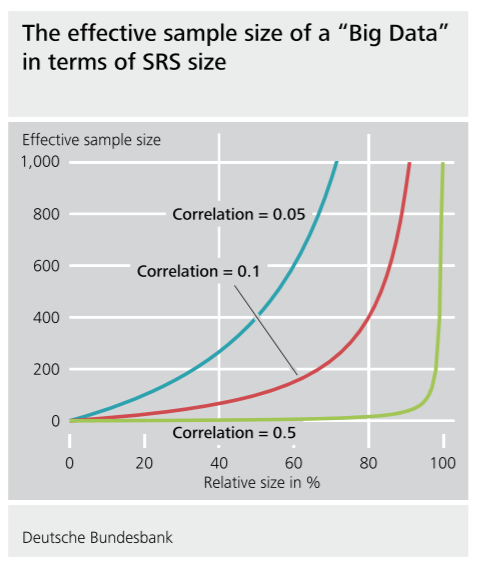

```{r setup, include=FALSE}
knitr::opts_chunk$set(echo = FALSE)
library(knitr)
library(survey)
library(pps)
```
## Calibration

1. Poststratification

2.  Raking

3.  Generalized regression estimation

## Poststratification

* There may be information available about a population that either cannot be accessed in the sampling frame (but is obtainable from the sampled unit), or may be known in the frame but set aside as less important than other variables that will be used for stratification. 
* We discussed poststratification previously in the context of SRS sampling. In more general setting, the poststratified estimator replaces the unweighted poststratum mean with the weighted postratum mean:
$$
\bar y_{ps} = \sum_{h=1}^H P_h \bar y_h = N^{-1} \sum_{h=1}^H N_h \bar y_h
$$
for
$$
\bar y_{h} = \frac{\sum_{i=1}^{k_h} \sum_{j=1}^{m_i} d_{hij} y_{hij}}{\sum_{i=1}^{k_h} \sum_{j=1}^{m_i} d_{hij}}
$$
where $d_{hij} = \pi_{hij}^{-1}$, $P(I_{ijk} = 1) = \pi_{hij}$ (``design weight'')

## Poststratification 

* Typically this is implemented by adjusting the design weights.
* Consider the following population and sample distributions:

```{r, out.width = "300px", fig.align='center'}
 # place holder
```

## Poststratification

Suppose that after design weighting, the sample gender distribution does not agree with known population totals:

```{r, out.width = "300px", fig.align='center'}
 # place holder
```

The final weight is then computed as the product of the design and poststratification weight:

$$
w_i = \left \{ \begin{array}{c c} 0.9325 \times d_i & \text{ if male } < 60  \\
1.0771 \times d_i & \text{ if female } < 60 \\
1.3378 \times d_i & \text{ if male } \geq 60 \\
0.8311 \times d_i & \text{ if female } \geq 60 \\
\end{array} \right .
$$

## Raking

* Poststratification assumes that all of the population counts (or equivalently their distributions) for the cells in the stratification
are known.
* There is an alternative technique for doing poststratification when full cross-classification information is not available for
the population for one or more of the poststratifying variables:
  + raking ratio estimation.
  
## Raking

* Suppose, for example, that we know only that in the population the proportion male is $0.4843$, without knowing the gender distribution by age.
* Can we develop age-gender population weights, not knowing the age-gender distribution of the population?
* Iterative proportional fitting is used to obtain the joint distribution from the marginal distributions:
  + Adjust the weight factors for gender so that the weighted sample matches the population distribution of first cross-classification term (post-stratify on margins of gender).
  + Repeat step for age. Generally, this will disturb the representativeness of gender.
  + Repeat previous steps until weight factors remain unchanged at each iteration.
  
## Raking (example)

Initial sample distribution
```{r, out.width = "100px", fig.align='center'}
 # place holder
```

Calibrate gender margins
```{r, out.width = "200px", fig.align='center'}
 # place holder
```

Calibrate age margins
```{r, out.width = "200px", fig.align='center'}
 # place holder
```

## Weights are then given by

$$
w_i = \left \{ \begin{array}{c c} 39.95/39.83 = 1.002 \times d_i & \text{ if male } < 60  \\
34.73/34.85 = 0.997 \times d_i & \text{ if female } < 60 \\
8.48/8.44 = 1.005 \times d_i & \text{ if male } \geq 60 \\
16.84/16.88 = 0.998 \times d_i & \text{ if female } \geq 60 \\
\end{array} \right .
$$

Note that, in addition to being trivial, the raking weights do not adjust back to the true population values (remember than in this
toy example we are assuming we don’t know them)

```{r, out.width = "200px", fig.align='center'}
 # place holder
```

## Raking

* The marginal distributions in the (weighted) sample now match the marginal distributions in the population.
* But raking is equivalent to an ANOVA main effects-only model that assumes independence between age and gender:
  + Fails to capture the fact that the gender distribution is much more heavily female in the older age stratum.
* Can be extended to higher dimension models (e.g., age-gender-education marginal, etc.)

## Generalized regression (GREG) estimation

* Poststratification and raking have been drawn together in a general framework known as calibration estimation (Deville and Sarndal 1992). 
* The idea is to recalibrate the survey weights $d_i$ to new values $w_i$ where
  + $w_i$ satisfy $\sum_i w_i x_i = X$, 
  + $X$ is a vector of known population totals for auxiliary variables,
  + $x_i$ subject to minimizing a distance criterion between the $w_i$ and $d_i$ given by $D(d_i, w_i)$
  
## GREG estimation

* The minimizing distance criterion

$$
D(d_i, w_i) = \frac{1}{2} \sum_{i\in s} (w_i - d_i)^2 / d_i
$$
yields the generalized regression estimator or GREG weights.

* This estimator generalizes poststratification to create weights that match population totals of continuous variables, as well as
cell counts of categorical variables. 
* The resulting GREG weights are given by

$$
w_{i, GREG} = d_i \left( 1 + (X - \hat X)^{\top}  T^{-1} x_i\right)
$$
where $T = \sum_{i \in s} d_i x_i x_i^\top$ and $\hat X = \sum_{i \in s} d_i x_i$

## GREG estimation

Rewrite

$$
\frac{\left( w_i - d_i \right)^2}{d_i} = d_i \left( \frac{w_i}{d_i} - 1 \right)^2
$$

Then using Lagrange multipliers, we need to minimize $D(d_i, w_i)$ with respect to $w_i$ under the constraint that $\sum_{i \in s} w_i x_i = X$:

$$
\frac{\partial}{\partial w_i} \frac{1}{2} \sum_{i \in s} \left[ d_i \left( \frac{w_i}{d_i} - 1 \right)^2 + \lambda \left( \sum_{i \in s} w_i x_i  - X \right) \right] = \frac{w_i}{d_i} - 1 + x_i^\top \lambda
$$

* Setting to $0$ and solving for $w_i$ yields $w_i = d_i ( 1 - x_i^\top \lambda )$

## Lagrange (ctd)

* Solving for $\lambda$

$$
\begin{aligned}
X &= \sum_{i \in s} d_i ( 1 - x_i^\top \lambda ) x_i \\
\hat X - X &= \lambda \sum_{i \in s} d_i x_i^\top  x_i \\
\lambda &= T^{-1} (\hat X - X).
\end{aligned}
$$

which implies

$$
w_i = d_i \left( 1 - x_i^\top T^{-1} \left( \hat X - X \right) \right)
$$

## Categorical setting

* If there are $p$ categorical control variables each of dimension $I_k$, $X$ is given by $I_{1} \times \ldots \times I_p$ cell counts from a complete contingency table, and $w_{i, GREG}$ are simply the poststratification weights discussed above.
* Minimizing

$$
D(d, w) = \sum_{i} \left[ w_i \log ( w_i / d_i ) - w_i + d_i \right ]
$$
yields a generalized raking estimator.

* Other distance criteria are possible as well.

## Packages for calibration

* SAS does not provide code for calibration (although macros are available to download).
* The R package survey does have functions for poststratification, raking, and GREG.

## Example:

* Example: Partners for Child Passenger Safety
* Have population information on geographic distribution (state residence), drivability of vehicle, and the sum of the age of the
children.

## Example: code

```{r partners1, eval = TRUE, echo = TRUE}
library(survey)

partners<-read.table(file="data/partners_calib.dat")

crash_id<-partners[,1]
inj<-partners[,2]
state<-partners[,3]
tow<-partners[,4]
age<-partners[,5]
wt<-partners[,6]

mydata<-list(crash_id,inj,state,tow,age,wt)

designn<-svydesign(id=~crash_id,data=mydata,
                   variables=inj~1,weights=~wt)
```

## Example: ctd

```{r partners3, eval = TRUE, echo = FALSE}
bp1<-c(15440.667, 112484.667,   2487.000,   3501.333,  78955.667,  27444.333,  26161.667, 
34205.333,  26208.000,   8393.333,   3384.667,  32510.000,  42701.333,  46879.333, 
27787.000,   9817.333) 
bp2<-c(13625,100645,2596,4854,77967,24257,32003,33317,20233,27212,4483,39749,35056,43001,27446,11918)
barplot1<-rep(0,32)
barplot1[c(0:15)*2+1]<-bp1
barplot1[c(1:16)*2]<-bp2

names1<-c("AZ","CA","DC","DE","IL","IN","MD","MI","NC","NJ","NV","NY","OH","PA","VA","WV")
names2<-rep(" ",16)
names<-rep(0,32)
names[c(0:15)*2+1]<-names1
names[c(1:16)*2]<-names2
```

```{r partners4, eval = TRUE, echo = FALSE}
barplot(barplot1,col=rep(c(2:3),16),space=c(0,0,rep(c(1,0),15)),names.arg=names,cex.names=.75,
ylab="Number of Children")
legend(x=30,y=80000,legend=c("Population","Sample"),fill=c(2,3))
mtext("State of Residence",side=3)
```

## Plots:

```{r partners6, eval = TRUE, echo = FALSE}
tw1<-c(343058.3, 155303.3)
tw2<-c(339007,159354)
barplot2<-rep(0,4)
barplot2[c(0:1)*2+1]<-tw1
barplot2[c(1:2)*2]<-tw2

townames<-c("Drivable"," ","Towaway"," ")

barplot(barplot2,col=rep(c(2:3),2),space=c(0,0,1,0),names.arg=townames,cex.names=1,
ylab="Number of Children")
legend(x=3,y=250000,legend=c("Population","Sample"),fill=c(2,3))
mtext("Drivability",side=3)
```

## Example: code

```{r partners2, eval = TRUE, echo = TRUE}
statetot<-data.frame(state=c(1:16),Freq=c(13625,100645,
2596,4854,77967,24257,32003,33317,
20233,27212,4483,39749,35056,43001,27446,11918))
dpost<-postStratify(designn,~state,statetot)
svymean(~inj,designn)
coef(svymean(~inj,designn))
SE(svymean(~inj,designn))
```

## Poststratification

```{r ps, eval = TRUE, echo = TRUE}
dpost<-postStratify(designn,~state,statetot)
svymean(~inj,dpost)
coef(svymean(~inj,dpost))
SE(svymean(~inj,dpost))
```

## Raking

```{r rking, eval = TRUE, echo = TRUE}
towtot<-data.frame(tow=c(0,1),Freq=c(339007,159354))
drake<-rake(designn,list(~state,~tow),list(statetot,towtot))
coef(svymean(~inj,drake))
SE(svymean(~inj,drake))
```

## Generalized regression

Categorical variables must go in as character variables

```{r greg, eval = TRUE, echo = TRUE}
towchar<-NULL
for(i in 1:length(inj)){
if(tow[i]==0) towchar<-c(towchar,"D")
if(tow[i]==1) towchar<-c(towchar,"N")
}
```

## Generalized regression

```{r greg2, eval = TRUE, echo = TRUE}
statechar<-NULL
for(i in 1:length(inj)){
if(state[i]==1) statechar<-c(statechar,"AZ")
if(state[i]==2) statechar<-c(statechar,"CA")
if(state[i]==3) statechar<-c(statechar,"DC")
if(state[i]==4) statechar<-c(statechar,"DE")
if(state[i]==5) statechar<-c(statechar,"IL")
if(state[i]==6) statechar<-c(statechar,"IN")
if(state[i]==7) statechar<-c(statechar,"MD")
if(state[i]==8) statechar<-c(statechar,"MI")
if(state[i]==9) statechar<-c(statechar,"NC")
if(state[i]==10) statechar<-c(statechar,"NJ")
if(state[i]==11) statechar<-c(statechar,"NV")
if(state[i]==12) statechar<-c(statechar,"NY")
if(state[i]==13) statechar<-c(statechar,"OH")
if(state[i]==14) statechar<-c(statechar,"PA")
if(state[i]==15) statechar<-c(statechar,"VA")
if(state[i]==16) statechar<-c(statechar,"WV")
}
```

## Calibration

Calibration total for categorical variables of the form varnameCHAR:

```{r calib, echo = TRUE, eval = TRUE}
pop.totals<-c(`(Intercept)`=498361.7,towcharN=159354,
statecharCA=100645,statecharDC=2596,statecharDE=4854,
statecharIL=77967,statecharIN=24257,statecharMD=32003,
statecharMI=33317,statecharNC=20233,statecharNJ=27212,
statecharNV=4483,statecharNY=39749,statecharOH=35056,
statecharPA=43001,statecharVA=27446,statecharWV=11918,
age=3819637)
```

* Include intercept (sum of weights)
* Leave out a reference category (towaways, Arizona) to maintain identifiability.

## Calibration

Calibration total for categorical variables of the form varnameCHAR:

```{r calib2, echo = TRUE, eval = TRUE}
dgreg<-calibrate(designn, ~towchar+statechar+age, 
                 pop.totals)
coef(svymean(~inj,dgreg))
SE(svymean(~inj,dgreg))
```

<!-- ## Big data paradox: example -->

<!-- * Consider the case of estimating voting preference during the 2016 US presidential election -->
<!-- * Imagine a researcher has access to self-reported voting preference from 1\% of US eligible voter population, whose size is $N \approx 231,557,000$ -->
<!-- * Let $\hat p$ be the sample average from the $n \approx 2,315,570$ observations.  -->
<!-- * Suppose that the uninformed researcher adopts a normal approximation to form a confidence interval for the corresponding population p based on the usual Z-score: -->

<!-- $$ \small -->
<!-- Z_n = \frac{\hat p - p}{\sqrt{\hat p (1-\hat p) / n }} \sim N(0,1) -->
<!-- $$ -->


<!-- ## Big data paradox: example -->

<!-- * Suppose that the uninformed researcher adopts a normal approximation to form a confidence interval for the corresponding population p based on the usual Z-score: -->

<!-- $$ \small -->
<!-- Z_n = \frac{\hat p - p}{\sqrt{\hat p (1-\hat p) / n }} = \frac{\sqrt{n} \sqrt{D_O} \rho_{I,Y}}{ -->
<!-- \sqrt{1 - D_O \rho_{I,Y}^2 - \sqrt{D_O} \times \rho_{I,Y} \times \left( \sqrt{\frac{p}{1-p}} - \sqrt{\frac{1-p}{p}} \right)}} -->
<!-- $$ -->

<!-- * The uninformed researcher would compare $Z_n$ to the $N(0, 1)$ -->
<!-- * ISSUE: the mean of $Z_n$ is far away from 0.  -->
<!-- * Consider the case $p = 1/2$ and $\rho_{I,Y} = 0.005$ then -->

<!-- $$ -->
<!-- Z_n = \sqrt{2,315,570} \sqrt{\frac{99 \times 0.005^2}{1 - 99 \times 0.005^2}} = 75.80 -->
<!-- $$ -->

<!-- * __Big Data Paradox__: The bigger the data, the surer we fool ourselves -->


<!-- ## Announcements: -->

<!-- * JITT 9 is posted -->
<!-- * HW 4 solutions posted later today -->
<!-- * I will have HW grades to you by end of week -->
<!-- * HW 5: Column labels posted -->
<!-- * Grading policy -->

<!-- ```{r, out.width = "300px", fig.align='center'} -->
<!--  # place holder -->
<!-- ``` -->
<!-- * TODAY: Calibration + Big Data paradox discussion  -->

<!-- ## A butterfly effect: The return of the long-forgotten monster -->

<!-- * We know that $D_U = \sigma_Y^2 = \frac{N-1}{N} S_Y^2$; setting -->

<!-- $$ -->
<!-- \begin{aligned} -->
<!-- D_I \times D_O \times \frac{N-1}{N} S_Y^2 &= \frac{1-f}{n_{eff}} S_Y^2 \\ -->
<!-- \frac{1}{n_{eff}^\star} &= \left( \frac{1}{n_{eff}} - \frac{1}{N} \right) \left(\frac{N}{N-1} \right) \\ -->
<!-- \frac{1}{n_{eff}^\star} \left[ 1-\frac{1}{N} + \frac{n_{eff}^\star}{N} \right] &= \frac{1}{n_{eff}} \\ -->
<!-- n_{eff}^\star \left[ 1-\frac{1}{N} + \frac{n_{eff}^\star}{N} \right]^{-1} &= n_{eff} \\ -->
<!-- \frac{n_{eff}^\star}{1 + (n_{eff}^\star -1) N^{-1}} &= n_{eff} \\ -->
<!-- \end{aligned} -->
<!-- $$ -->

<!-- ## JITT: Part 2 -->

<!-- * Then under $n_{eff}^\star \geq 1$ show that -->

<!-- $$ -->
<!-- n_{eff} \leq n_{eff}^\star = \frac{f}{1-f} \times \frac{1}{D_I} = \frac{n}{1-f} \times \frac{1}{N D_I} -->
<!-- $$ -->

<!-- * $D_I = E_{I} [ \rho_{I,Y}^2 ] \geq E_I [\rho_{I,Y}]^2 = 0.05^2 = 1/400$.  Then $D_I^{-1} \leq 400$ which implies -->

<!-- $$ -->
<!-- n_{eff} \leq 400 \times \frac{f}{1-f} -->
<!-- $$ -->

<!-- * If we observed half of the population, then $f = 1/2$ and $n_{eff} \leq 400$. -->

<!-- ## Big data effective sample size -->

<!-- ```{r, out.width = "300px", fig.align='center'} -->
<!--  # place holder -->
<!-- ``` -->
