```{r setup, include=FALSE}
knitr::opts_chunk$set(echo = FALSE)
library(knitr)
library(survey)
library(pps)
```

## Non-sampling error

* Our design and inference discussion thus far has considered
sampling as the only source of uncertainty in our survey
statistics
* However, in the real world, there are other sources of error that can arise:
  + Validity/Measurement error
  + Processing errors
  + Frame Errors
  + Non-response Bias
* Together with sampling errors, these errors are collectively
referred to as __Total Sampling Error (TSE)__.

## Total sampling error

```{r, out.width = "300px", fig.align='center'}
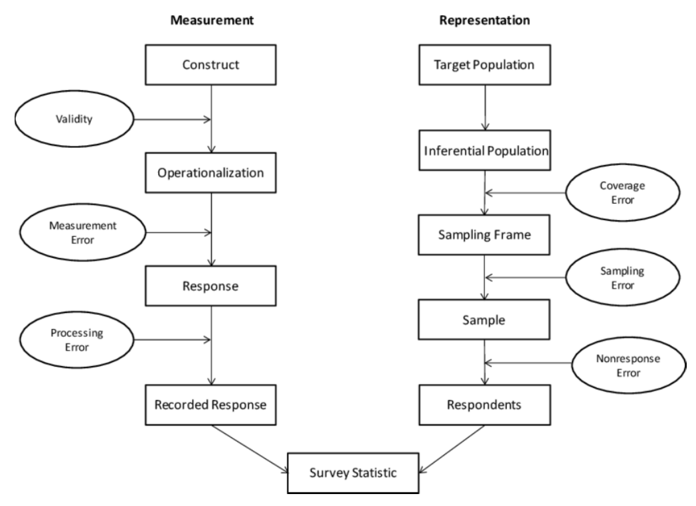 # place holder
```

## Types of Non-response

* Unit: no data are collected for a sampled element
  + Refusal; no contact (no one at home); unsuitable for interview (physical limitations; language barrier).
* Item: a particular data element is missing
  + Refusal, “don’t know”, respondent/interviewer error

## Non-response bias

Assume SRS for notational simplicity

* __Deterministic__: assume that the population can be divided into
two groups, respondents with mean $\bar Y_{R}$ and non-respondents with mean $\bar Y_M$.
  + Then $B(\bar y_r) = (1-R)(\bar Y_R - \bar Y_M)$
  + $R$: proportion of respondents in the population
* __Stochastic__: assume that each element of the population has a probability of response $P_i$
  + Then $B(\bar y_r) \approx \frac{1}{\bar P} C(Y,P)$
  + $C(Y,P) = \frac{1}{N} \sum_{i=1}^N (Y_i - \bar Y) (P_i - \bar P)$
  + $\bar P = \frac{1}{N} \sum_{i=1}^N P_i$

## Non-response bias
 
* Deterministic is a special case of the stochastic where 
  + $P_i = 0$ for non-responders and $P_i = 1$ for responders
  + $\bar r = n^{-1} \sum_{i=1}^n r_i$ is an unbiased estimator for $R$ or $\bar P$.
* As $\bar Y_{R} \to \bar Y_M$ or $R \to 1$ , $B(\bar y_r)$ under deterministic approach
* As $\bar Y_{R} \to \bar Y_M$ or $R \to 1$ , $C(Y,P) \to 0$ and thus $B(\bar y_r) \to 0$ under stochastic approach
* Only $R$ and $\bar Y_R$ can be estimated from observed data

## Deterministic approach

Divide population into $H$ classes with $W_h = N_h/N$

$$
\begin{aligned}
\bar Y &= \sum_h W_h \bar Y_h = \sum_h W_h ( R_h \cdot \bar Y_{Rh} + (1-R_h) \bar Y_{Mh} ) \\
&= \sum_h W_h ( R_h \cdot \bar Y_{Rh} + (1-R_h) \bar Y_{Mh} ) \\
&= \sum_h W_h \bar Y_{Rh} - \sum_h W_h (1-R_h) \bar Y_{Rh} + \sum_h W_h (1-R_h) \bar Y_{Mh} \\
&= \sum_h W_h \bar Y_{Rh} - \sum_h W_h (1-R_h) (\bar Y_{Rh} - \bar Y_{Mh}) \\
\end{aligned}
$$

## Deterministic approach

$$
\begin{aligned}
B(\bar y_{R}) &= \bar Y_R - \bar Y \\
&= R^{-1} \sum_{h} R_h W_h \bar Y_{Rh} - \bigg[ \sum_h W_h \bar Y_{Rh} \\
&\quad- \sum_h W_h (1-R_h) (\bar Y_{Rh} - \bar Y_{Mh})  \bigg]  \\
&= \sum_h W_h \bar Y_{Rh} \left( \frac{R_h}{R} -1 \right) + \sum_h W_h (1-R_h) (\bar Y_{Rh} - \bar Y_{Mh}) \\
&= \underbrace{\sum_h W_h \bar Y_{Rh} \left( \frac{R_h - R}{R} \right)}_{=A} + \underbrace{\sum_h W_h (1-R_h) (\bar Y_{Rh} - \bar Y_{Mh})}_{=B}
\end{aligned}
$$

## Deterministic approach

* Term $A$ can be estimated form observed data
  + Difference between adjusted and unadjusted means, adjusted by response rates in H subgroups
* Term $B$ can __not__ be estimated from observed data
  + Might be reasonable to expect, however, that within-subgroup differences are smaller than between-subgroup differences, so that $B < (1-R)(\bar Y_{R} - \bar Y_{M})$
  + Suppose $H$ is based on gender. If men are less likely to respond than women and there are systematic difference due to gender, then$| \bar Y_{R} - \bar Y_M | > 0$; but within genders response is approximately random, then $\bar Y_{Rh} - \bar Y_{Mh} \approx 0$ for $h=1,2$

## Missingness Mechanisms

* __Missing completely at random (MCAR)__: Missingness is completely independent of the data.
  + All of the sampling designs we have discussed (``missingness'' corresponds to the non-sampled elements); other investigator-induced missingness.
  + Random breakdown of measuring system.
  + Other mechanism that is effectively independent of all of the data being measured
* __Missing at Random (MAR)__: Missingness is random conditional on a (known) set of observed covariates.
  + Random within observed demographic subgroups.
  + Corresponds to A in the expression for non-response bias
* __Missing Not at Random (NMAR)__: Missingness depends on the data even
after conditioned on observed covariates.
  + Corresponds to B in the expression for non-response bias
  
## Adjusting for Non-response Bias

* Divide the sample into classes with different response rates, with the classes also related to the survey variables.
* Compensate for non-response using weights to adjust the sample distribution across classes.
  + __Poststratification__: requires population distribution across the classes to be known.
  + __Non-response weighting__: resembles two-stage weighting; only the class to which each non-respondent belongs need
to be known.

## Adjusting for non-response bias

* Both can be used at the same time.
* Use information about the PSU or strata to which the sampled elements belong to determine non-response weights.
* Use information about the population to calibrate to known population totals using the non-response weighted distribtution.
* Can be placed _on top of_ the original sampling weights; will assume SRS in notes to simplify notation.

## Poststratification

* Implementation is identical to what we discussed previously: use weights to make weighted distributions match known distributions in the population.
* Previously, however, we were removing non-differential sampling errors
* Here the goal is to remove systematic biases due to non-response.

## Poststratification: Review

* We have the proportions of the population $W_h = N_h / N$ in each of the poststrata $h=1,\ldots, H$ from an __outside source__

$$
\begin{aligned}
\bar y_P &= \sum_{h=1}^H W_h \bar y_{Rh} = \frac{\sum_{h=1}^H N_h \bar y_{R h}}{N} \\
&= \frac{\sum_{h=1}^H \sum_{i=1}^{r_h} \frac{N_h y_{R h i}}{r_h}}{\sum_h N_h} \\
&= \frac{\sum_{h=1}^H \sum_{i=1}^{r_h} \left( \frac{r}{N} \right) \frac{N_h y_{R h i}}{r_h}}{\sum_h \left( \frac{r}{N} \right) N_h} \\
&= \frac{\sum_{h=1}^H \sum_{i=1}^{r_h} w_{hi} y_{R h i}}{\sum_h \sum_i w_{hi}} \\
\end{aligned}
$$
where 
$$w_{hi} = \left( \frac{r N_h}{N r_h} \right) = (N_h / N) / (r_h / r).$$

## How does PS help with non-response bias?

Returning to expression for non-response bias:

$$ 
B(\bar y_{R}) = \bar Y_R - \bar Y 
= \underbrace{\sum_h W_h \bar Y_{Rh} \left( \frac{R_h - R}{R} \right)}_{=A} + \underbrace{\sum_h W_h (1-R_h) (\bar Y_{Rh} - \bar Y_{Mh})}_{=B}
$$

* Poststratification removes bias induced by A (missing at random mechanism)
* Bias induced by B (not missing at random) can remain.
* Can use raking instead of poststratification if only marginal distributions in the population are available.
* Can use GREG if continuous measures are to be used.

## Non-response weighting

* In the absence of population information, we can create weights based on the sample distribution:

$$
\bar y_s = \sum_h w_h \bar y_{Rh}, \quad w_h = n_h/n
$$

* Weights $w_h$ are for the total sample (non-respondents and respondents)
* Requires that the strata be formed on covariates available in the sampling frame.

## Non-response weighting

Note that $\bar y_s$ is just the weighted mean of $\bar y_r$, with weights equal to the inverse of the response rate in each stratum,
$w_{hi} \equiv n_h / r_h$:

$$
\begin{aligned}
\bar y_s &= \sum_{h=1}^H \left( \frac{n_h}{n} \right) \bar y_{Rh} = \frac{\sum_{h=1}^H \left( \frac{n_h}{r_h} \right) \sum_{i=1}^{r_h} y_{Rhi}}{\sum_h n_h} \\
&= \frac{\sum_{h=1}^H \left( \frac{n_h}{r_h} \right) \sum_{i=1}^{r_h} y_{Rhi}}{\sum_h \sum_{i=1}^{r_h} \frac{n_h}{r_h}} \\
&= \frac{\sum_{h=1}^H \sum_{i=1}^{r_h} w_{hi} y_{Rhi}}{\sum_h \sum_{i=1}^{r_h} w_{hi} } \\
\end{aligned}
$$

## Response propensity weighting

Suppose that the set of variables $(X_{1i}, \ldots, X_{pi})$ is high dimensional, so that the cell sizes are very small, or that they contain continuous covariates, precluding the formation of strata

Use logistic regression to estimate the response propensity; let $R_i = 1$ if $Y_i$ is observed and $0$ if $Y_i$ is missing. Then

$$
\log \left( \frac{P(R_i = 1 \mid X_i)}{1- P(R_i = 1 \mid X_i)} \right) = \beta_0 + \beta_1 X_{1i} + \ldots + \beta_p X_{pi}
$$

## Response propensity weighting

* Each observation with $Y_i$ is observed is then given the non-response weight
$$
w_i = \frac{1}{\hat P(R_i = 1 \mid X_i)} = \frac{1 + \exp(X_i^\top \hat \beta)}{\exp(X_i^\top \hat \beta)}
$$

* Can yield very large weights for outlier values of $X_i$
  + Can collapse into strata by, e.g., deciles of response propensity, and use average weights.
  
## Variables to use for non-response adjustment

* Demographic measures (age/race/sex) are often available in Census data for poststratification of general population surveys.
* In general, use variables that are predictive both of Y and of
the propensity to respond.
  + Results in bias and variance reduction
  + Using variables that are not predictive of the response propensity does not reduce bias
  + Using variables that are not predictive of the outcome but are predictive of non-response does not reduce bias but can increase variance.
    - __Worse off than just using unadjusted mean.__
    
## Example: 

Suppose our respondents have the following age x gender distribution:

```{r, out.width = "150px", fig.align='center'}
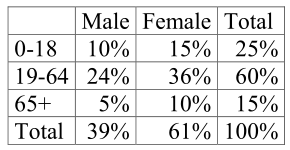 # place holder
```

While the census provides:

```{r, out.width = "150px", fig.align='center'}
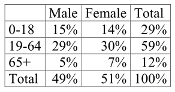 # place holder
```

## Poststratification weights:

```{r, out.width = "250px", fig.align='center'}
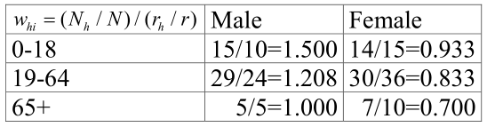 # place holder
```

All people in the same cell receive the same poststratification weight

## Example: continued

Suppose we only know the marginal age and sex distributions in the population:

```{r, out.width = "200px", fig.align='center'}
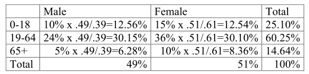 # place holder
```

```{r, out.width = "200px", fig.align='center'}
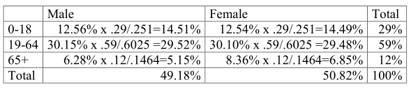 # place holder
```

## Ex: Adjustment for non-response: non-response cells

Suppose that, instead of poststrata, we had the following tables of observed cell counts and a table from the sampled elements, regardless of response:

```{r, out.width = "200px", fig.align='center'}
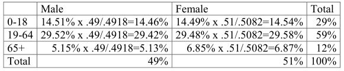 # place holder
```

```{r, out.width = "200px", fig.align='center'}
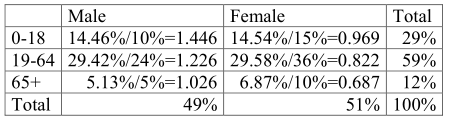 # place holder
```

## Ex: Adjustment for non-response: non-response cells

```{r, out.width = "200px", fig.align='center'}
include_graphics("./figs/l23_fig9.png") # place holder
```

```{r, out.width = "200px", fig.align='center'}
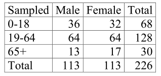 # place holder
```

## Ex: Adjustment for non-response


```{r, out.width = "150px", fig.align='center'}
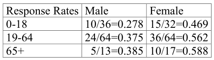 # place holder
```

```{r, out.width = "150px", fig.align='center'}
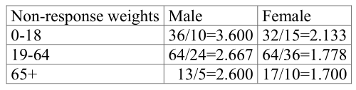 # place holder
```

## Ex: Adjustment for non-response: logistic regression

Fit a model of the form
$$
\begin{aligned}
\text{logit} \left( P (R_i = 1) \right) =& \beta_0 + \beta_1 I(\text{gender}_i = \text{male}) \\
&+ \beta_2 \cdot I(\text{age}_i = \text{18-64}) + \beta_3 I(\text{age}_i = \text{65+})
\end{aligned}
$$
with $\hat \beta = (-0.2165, -0.6404, 0.2752, 0.4934)$.


```{r, out.width = "150px", fig.align='center'}
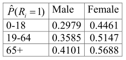 # place holder
```

```{r, out.width = "150px", fig.align='center'}
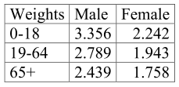 # place holder
```

## Example: continued

Suppose that our outcome of interest is current smoking behavior, and we observe the following positive replies among out 100 respondents:

```{r, out.width = "150px", fig.align='center'}
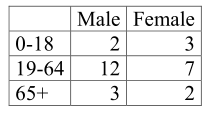 # place holder
```

$$
\begin{aligned}
\bar y &= 0.2900; \quad \bar y_p = 0.3053 \\
\bar y_{\text{rake}} &= 0.3069; \quad \bar y_s = 0.3064 \\
\bar y_{\text{logistic}} &= 0.3051
\end{aligned}
$$


<!-- ## JITT: Weight, weight, don't tell me -->

<!-- * Let $W_j \geq 0$ be weight we use for $Y_j$ and $\tilde I_j = I_j \cdot W_j$ -->
<!-- * Then the weighted sample average is -->

<!-- $$ -->
<!-- \tilde y_n = \frac{\sum_{j=1}^N I_j W_j Y_j}{\sum_{j=1}^N I_j W_j} -->
<!-- $$ -->

<!-- * Show that -->

<!-- $$ -->
<!-- \tilde y_n - \bar Y = \rho_{\tilde I, Y} \times \sqrt{\frac{1 - f + CV(W)^2}{f}} \times \sigma_Y -->
<!-- $$ -->
<!-- where $CV(W)$ is the coefficient of variation (std/mean) of $W_J$ given $I_J = 1$ -->

<!-- * Compare this to the original formula.  What is the negative impact of weighting?  Where could it help? -->

