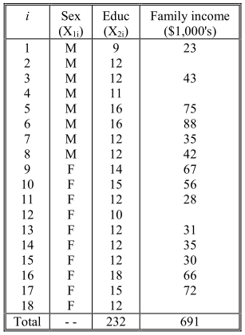
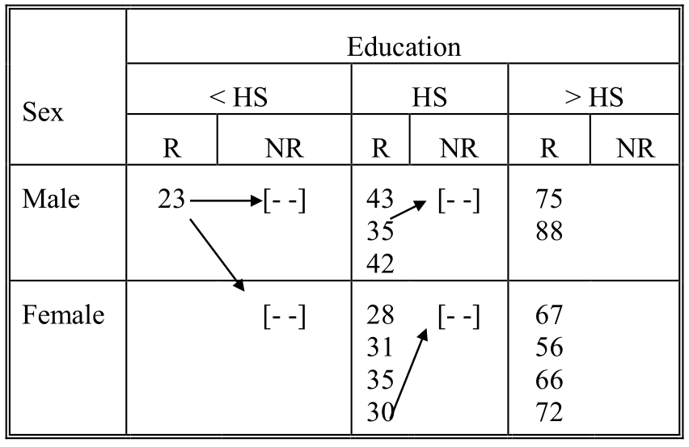
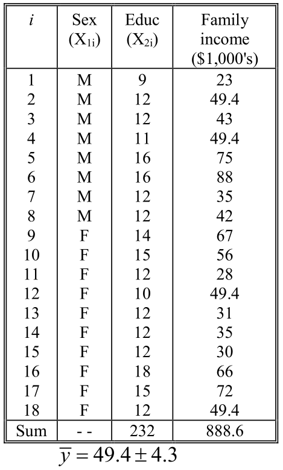
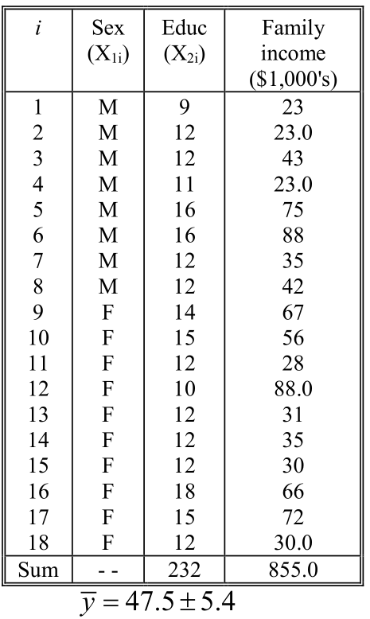
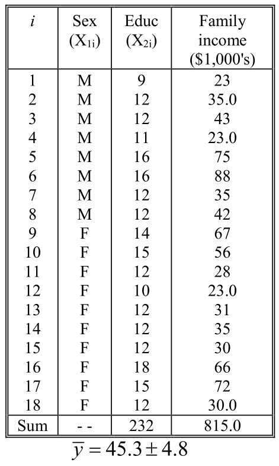
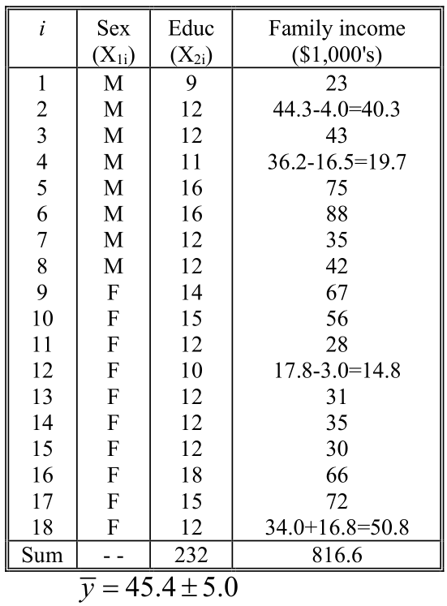
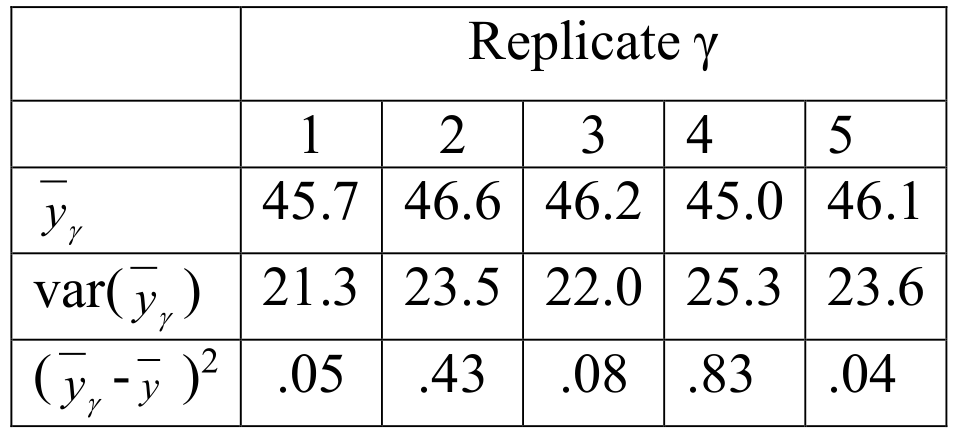
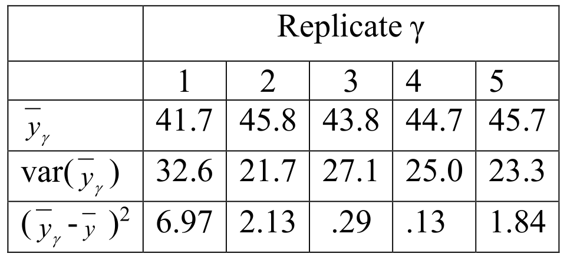

```{r setup, include=FALSE}
knitr::opts_chunk$set(echo = FALSE)
library(knitr)
library(survey)
library(pps)
```

## Announcements:

* HW 5: Solutions posted today
* JITT due today
* TODAY: Example (redo!) + Imputation + Big Data paradox discussion (Diary assignment)
* Diary due on Monday (extension if doing midterm redo)
* Monday: FINAL Big data example + Respondent Driven Sampling
* Wednesday: Generalizability and self-selection

## MIDTERM point system

* I have all midterms that were not picked up.
* I will post a midterm-2 in Canvas on Friday.
* Send me request for screenshots 
* Submission: 
  + Send me image of your midterm solution
  + For any subcomponent you got points off, send me detailed revision of ENTIRE answer to that subcomponent __using midterm-2__
  + If incorrect answer from prior parts, please use correct answers and cite midterm solutions
  + Max point recovery per component = 1/2 points loss
  + Any error in the new solution = max 2/3 points recover
  + Two errors in new solution = max 1/3 points recover
  + Three errors in new solution = max 0 points recover
  + This is per subcomponent
* Due by midnight on Monday.  
  + 1 day late submission = max recover 1/4 points
  + After that no points can be recovered
  

## Example: 

Suppose our respondents have the following age x gender distribution:

```{r, out.width = "150px", fig.align='center'}
include_graphics("./figs/l23_fig2.png") # place holder
```

While the census provides:

```{r, out.width = "150px", fig.align='center'}
include_graphics("./figs/l23_fig3.png") # place holder
```

## Poststratification weights:

```{r, out.width = "250px", fig.align='center'}
include_graphics("./figs/l23_fig4.png") # place holder
```

All people in the same cell receive the same poststratification weight

## Example: continued

Suppose we only know the marginal age and sex distributions in the population:

```{r, out.width = "200px", fig.align='center'}
include_graphics("./figs/l23_fig5.png") # place holder
```

```{r, out.width = "200px", fig.align='center'}
include_graphics("./figs/l23_fig6.png") # place holder
```

## Ex: Raking procedure

```{r, out.width = "200px", fig.align='center'}
include_graphics("./figs/l23_fig7.png") # place holder
```

Raking weights are then given by: 
```{r, out.width = "200px", fig.align='center'}
include_graphics("./figs/l23_fig8.png") # place holder
```

## Ex: Adjustment for non-response: non-response cells

Suppose that, instead of poststrata, we had the following
tables of observed cell counts and a table from the sampled
elements, regardless of response:

```{r, out.width = "150px", fig.align='center'}
include_graphics("./figs/l23_fig9.png") # place holder
```

```{r, out.width = "150px", fig.align='center'}
include_graphics("./figs/l23_fig10.png") # place holder
```

## Adjustment for non-response: non-response cells

```{r, out.width = "150px", fig.align='center'}
include_graphics("./figs/l23_fig11.png") # place holder
```

```{r, out.width = "150px", fig.align='center'}
include_graphics("./figs/l23_fig12.png") # place holder
```

## Ex: Adjustment for non-response: logistic regression

Fir a model of the form
$$
\begin{aligned}
\text{logit} \left( P (R_i = 1) \right) =& \beta_0 + \beta_1 I(\text{gender}_i = \text{male}) \\
&+ \beta_2 \cdot I(\text{age}_i = \text{18-64}) + \beta_3 I(\text{age}_i = \text{65+})
\end{aligned}
$$
with $\hat \beta = (-0.2165, -0.6404, 0.2752, 0.4934)$.

```{r, out.width = "100px", fig.align='center'}
include_graphics("./figs/l23_fig13.png") # place holder
```

```{r, out.width = "100px", fig.align='center'}
include_graphics("./figs/l23_fig14.png") # place holder
```

## Example: continued

Suppose that our outcome of interest is current smoking behavior, and we observe the following positive replies among out 100 respondents:

```{r, out.width = "100px", fig.align='center'}
include_graphics("./figs/l23_fig15.png") # place holder
```

$$
\begin{aligned}
\bar y &= 0.2900; \quad \bar y_p = 0.3053 \\
\bar y_{\text{rake}} &= 0.3069; \quad \bar y_s = 0.3064 \\
\bar y_{\text{logistic}} &= 3051
\end{aligned}
$$

## Imputation 

* Imputation assigns values to replace missing items.
* Typically assumes MAR, although sensitivity analyses may be conducted under NMAR models (impute based on prefabricated parameters in the model).
  + Mean imputation
  + Hot-deck imputation
  + Regression imputation
  + Multiple imputation
  
## Imputation:

* Advantages of imputation:
  + Eases analyst’s task.
  + Analyses are consistent since no cases need to be deleted.
  + Simplifies presentation of survey results (e.g., no columns and rows needed to display missing data counts).
  + Retain all available data, possibly obtaining more precise estimates of parameters in multivariate models. 
* Disadvantages of imputation:
  + Some forms distort distributions (mean, variance) of items receiving imputation,
and attentuate associations.
  + Single imputation leads to underestimation of variance because imputed values are treated as valid by standard statistical software.
  + Difficult to “sell” to analysts.
      - Prefer not to use deliberately fabricated data . . . but which is better? 
      - “Fabricating” under complete case analysis (MCAR), or fabricating under carefully developed model?
      
## Example: $n=18$

Suppose that the sample was selected with equal probabilities, and gender and education are known for every sample element. There are $n = 14$ respondents who provided family income values.

```{r, out.width = "125px", fig.align='center'}
 # place holder
```

## Mean imputation 

* An overall mean imputation would replace the missing values with the mean for respondents on the item.
  + It is equivalent to ignoring the missing values (or complete case analysis) since the overall mean value imputation substitutes the overall mean among respondents for the missing values.  
  + Thus, above, $y_2 = y_4 = y_{12} = y_{18} = 49.4$.
* This type of imputation distorts the distribution, producing a "spike" at the overall mean.
* Ignores information about observed covariates (gender, education) that might help to predict the missing value.
* Often, with small amounts of missing data, the median or the mode (especially for categorical data) will be substituted instead.


## Hot deck imputatoin

* Stochastic techniques provide imputed values with better properties than deterministic ones.
* The simplest stochastic techniques is random imputation: 
  + substitute the value obtained from a randomly selected respondent to the item.
  + This is equivalent to assigning the overall mean with a random residual selected from the empirical distribution of residuals.
* Sequential “hot deck” accomplishes this by imputing based on the “last” observed values in an ordered data set.


## Sequential hot deck

```{r, out.width = "150px", fig.align='center'}
include_graphics("./figs/l24_fig2.png") # place holder
```

## Sequential hot deck

* Sorting by observed covariates allows values from similar
covariates to be imputed.
* Several problems arise with this technique: multiple donations,
sort boundaries (e.g., changing from male to female), and weak
within group correlations.
* But simple and easy to do, it requires no distributional
assumptions, and it can be applied to a vector of correlated
items for a single sort

## Hierarchical Hot Deck (Flexible Match)

* In this technique, respondents and nonrespondents are grouped into a large number of classes based on many potential "sort" variables. Select a donor at random within each class, collapsing class boundaries as necessary to achieve a match.

```{r, out.width = "150px", fig.align='center'}
 # place holder
```

## Regression imputation

* Estimate a model among respondents of the form $y_i = x_i^\top \beta + \epsilon_i$.
* Here $\hat \beta = -62.97$; $\hat \beta_1 = 10.28$; $\hat \beta_2 = 8.08$
  + Substituting values of the $x_{ij}$ for each of the four nonrespondents, we obtain predicted values of $y_4 = 36.2, y_2 = 44.3, y_{12} = 17.8, y_{18} = 34.0$
* We can add a random residual to these four imputed values by
  + selecting a random value from the normal distribution with the same mean and standard deviation as predicted values, or
  + selecting a respondent at random and computing the deviation of their observed from the predicted value (residuals).
* The choice of respondent can be made with or without replacement, with precision considerations favoring without replacement selection.

## Regression imputation

* The regression imputation technique can be extended to multivariate models to handle multiple dependent variables simultaneously, and to mixtures of continuous and dummy predictors.

* Of course, as with all of these predictive models, the predictor variables must be nonmissing for all cases.

## Mean imputation

```{r, out.width = "125px", fig.align='center'}
 # place holder
```

## Sequential hot deck imputation

```{r, out.width = "125px", fig.align='center'}
 # place holder
```

## Hierarchical Hot Deck imputation

```{r, out.width = "125px", fig.align='center'}
 # place holder
```

## Regression Imputation (adding a random observed residual)

```{r, out.width = "125px", fig.align='center'}
 # place holder
```

## Multiple imputation

* Mean and regression imputation without adding error terms treats the unknown values as true $\rightarrow$ variance estimates too small.
* Hot deck and regression imputation with error procedures introduce additional variance into the imputation estimates, which partially corrects for the underestimate of variance. 
  + But treating the imputed values as simply deterministic ones and estimating precision through standard statistical software yields variance estimates that are still too small, especially if there
was a substantial level of item nonresponse for the item.
* Multiple imputation: impute multiple times and allow the uncertainty to be better estimated.

## Multiple imputation

* Multiple imputation is a technique used to draw repeated samples from the posterior distribution to provide a means to estimate the additional contribution to variance due to imputation.
* Impute multiply, say $m$ times, for each missing value. (Small values - $m=5$ -- usually work well)
* Compute an estimate of interest $\bar y_{\gamma}$ for each imputed dataset, and compute

$$
T = \frac{1}{m} \sum_{\gamma} T_{\gamma}
$$

## Multiple imputation

* The variance of $T$ is estimated by 

$$
\begin{aligned}
\text{var} (T) &= U + \left( \frac{m+1}{m} \right) B \\
&= \frac{1}{m} \sum_{\gamma} \text{var} (T_{\gamma}) + \left( \frac{m+1}{m} \right) \left( \frac{1}{m-1} \right) \sum_{\gamma} \left( T_\gamma - T \right)^2
\end{aligned}
$$
which is the sum of within replicate variance and between replicate variance

* The distribution of T is approximated by a t-statistic with degrees of freedom given by

$$ 
df = (m-1) \left( 1 + \frac{m U}{(m+1) B} \right)^2
$$

## Multiple imputation

* Improper Multiple Imputation: ignore uncertainty in model estimates
* Proper Multiple Imputation: add uncertainty in model estimates
* In the income example, proper imputation would require
  + imputing the income data using an improper imputation step (obtain an initial estimate of $\beta$ and $\sigma^2$ using, for example, complete case linear regression)
  + Call initial estimates $\beta^{(0)}$ and $(\sigma^2)_{(0)]}$
  + Rerun linear regression using both observed data and imputed data from above and get new estimates of $\beta$:

## Multiple imputation (ctd)

1. $\hat \beta = (X^\prime X)^{-1} X^\prime y^{comp}$ where $y^{comp}$ is a vector that included both the observed and imputed data.
2. Generate a new estimate a new estimate by drawing a random $N(0, (\sigma^2)^{(0)} (X^\prime X)^{-1} )$ and adding it to $\hat \beta$
3. Generate a new estimate of $\sigma^2$, $(\sigma^2)^{(1)}$, by dividing residual sum of squares using new estimate of $\beta$, 
$$
RSS = (y^{comp} - X \beta^{(1)})^\prime (y^{comp} - X \beta^{(1)})
$$
by a random chi-square variable with $n-p-1=n-3$ d.f.

4. Using new values repeat the improper imputation step from 1. Estimate value of missing using $X \beta^{(1)}$ and add random error $N(0, (\sigma^2)^{(1)} (X^\prime X)$
5. Repeat steps 2-4 a number of times (e.g., 20) and take results from 20th repetition as __first__ multiple imputation.  Repeat again with the 40th repeition as __second__ multiple imputation....

## Example

In the example data set, the regression imputation was made five times with random residuals selected from the normal distribution with empirical mean and standard deviation from the respondent values (improper imputation).

```{r, out.width = "125px", fig.align='center'}
 # place holder
```

$$
\footnotesize
\begin{aligned}
\bar y &= \frac{45.7 + 46.6 + 46.2 + 45.0+ 46.1}{5} = 45.9 \\
se(\bar y) &= \sqrt{\frac{21.3 + 23.5 + 22.0 + 25.3 + 23.6}{5} + \frac{6}{5} \times \frac{.05 + .43 + .08 + .83 + .04}{4}} \\
&= \sqrt{23.14+0.43} = 4.85
\end{aligned}
$$

## Example

Now multiply impute using proper imputation:

```{r, out.width = "125px", fig.align='center'}
 # place holder
```

$$
\footnotesize
\begin{aligned}
\bar y &= \frac{41.7 45.8 43.8 44.7 45.7}{5} = 44.3 \\
se(\bar y) &= \sqrt{\frac{32.6 + 21.7 + 27.1 + 25.0 + 23.3}{5} + \frac{6}{5} \times \frac{6.97 + 2.13 + 0.29 + 0.13 + 1.84}{4}} \\
&= \sqrt{25.94+3.41} = 5.42
\end{aligned}
$$

## Imputation

Statistics other than the mean can be considered: multiple imputation is a general method for reducing bias due to missingness while properly accounting for the added variance due to uncertainty.

## Sequential regression methods

* The imputation methods we have discussed so far assume a only a single variable needs to be imputed: outcome $y$ and auxiliary variables $(x_1, \ldots, x_p)$
* But often there may be multiple variables with missing data.
o In the 1990 National Health Interview Survey, 0.6% of private health insurance coverage was missing, as was 11.1% of Social Security income, 29.8% of wage and salary income, and 52.5% of earnings from savings accounts.
* We could impute $(y_1, \ldots, y_p)$ one at a time
  + This will attenuate associations (covariances). That is, in models that have one of the ys as an outcome and one of more of the other ys as predictors, the estimates of regression coefficients associated with the ys will be biased toward zero.
* Methods devised to perform multivariate imputation: multiple imputation to the rescue!

## Basic method

1. Obtain initial imputation of $y= (y_1, \ldots, y_p)$, say $y^{(0)} = (y_1^{(0)}, \ldots, y_p^{(0)})$
2. Obtain an imputed value of $y_1^{(1)}$ by regressing $y_1$ on $(y_{2}^{(0)},\ldots, y_p^{(0)}, x_1, \ldots, x_q)$
3. Next, obtain $y_2^{(1)}$ by regressing $y_2$ on $(y_1^{(1)}, y_3^{(0)}, \ldots, y_p^{(0)}, x_1, \ldots, x_q)$
4. Repeat 3 until one has $y_1^{(1)}$
5. Cycle through 2 and 4 until one has $m$ imputed datasets

## Example

This method also allows the components of y to be of different parametric forms, for example, continuous and categorical variable.

Let’s work through an example where $p=2$: $y_1$ continuous and normally distributed (e.g., log of household income), and $y_2$ is binary (home ownership), and we have $q=3$ fully observed covariates (eg., age, gender, education)

## Example

1. Fit linear regression $y_1$ on $X$ to obtain $y_1^{(0)}$
2. Fit logistic regression of $y_2$ on $X$ to obtain initial imputation $y_2^{(0)}$
3. Fit linear model of $y_1$ on $X$ and $y_2^{(0)}$ (call this design matrix $Z_1$)
  - $\hat \beta = (Z_1^\top Z_1)^\top Z_1^\top y_1^{comp}$
  - $\beta^{(1)} = \hat \beta + N(0, (\sigma^2)^{(0)} (Z_1^\top Z_1 )^{-1}$
4. Generate $(\sigma^2)^{(1)}$ using RSS and dividing by $n-5$

## Example (ctd)

5. Use $\beta^{(1)}$ and $(\sigma^2)^{(1)}$ to impute new values of $y_1$ by drawing $y_{i1} \sim N( Z_{i1}^\top \beta^{(1)}, (\sigma^2)^{(1)})$ for all observations $i$ with misisng values
6. Fit logistic regression model of $y_2$ on $Z_2$ where $Z_2$ consists of $X$ and $y_1^{(1)}$
7. Use $\alpha^{(1)}$ to draw new imputation $y_{i2}^{(1)}$
8. Repeat and store every 20th iteration 
  

## JITT: Weight, weight, don't tell me

$$
\begin{aligned}
\bar y_n - \bar Y &= \frac{\text{E}_J (I_J \cdot W_J \cdot Y_J)}{E_J (I_J W_J)} - E_J (Y_J) \\
&= \frac{\text{Cov}_J (\tilde I_J W_J, Y_J)}{E_J (\tilde I_J)} \\
&= \frac{\text{Cov}_J (\tilde I_J, Y_J)}{\sqrt{ V_J (\tilde I_J) V_J(Y_J)}} \frac{\sqrt{ V_J (\tilde I_J)}}{E_J (\tilde I_J)} \sqrt{V_J(Y_J)} \\
&= \rho_{\tilde I, Y} \times \sqrt{ \frac{1-f}{f} } \times \sigma_Y \\
\end{aligned}
$$

## JITT: Weight, weight, don't tell me

* So the design effect is

$$
(N-1) E_I [  \rho_{\tilde I, Y}^2 ] \left( 1 + (1-f)^{-1} E_{I} (CV (W)^2) \right)
$$
* The final term is $\geq 1$
* Hope is to offset by reduction in $E_I[\rho^2_{\tilde I, Y} ]$
* Rare to see produce be level of $N^{-1}$

## Which do you trust?  

* “Which one should I trust more: a 1%
survey with 60% response rate or a self-reported administrative dataset covering 80% of the population?”
* Let $r$ be the response rate. If $f_s = n_s/N$ is the survey fraction, then
$$
D_O = (1-r f_s)/(r f_s)
$$

* The $n_{eff}^{BIG}$ is larger than $n_{eff}$ iff
$$
D_I^{BIG} D_O^{BIG} < D_I D_O
$$

* Let $O$ be $D_O / D_O^{BIG}$; write this in terms of $r$, $f_s$, and $f$
* Using approximation $D_I \approx \rho^2_{I,Y}$ show that above inequality holds when $| \rho_{I,Y}^{BIG} | \leq \sqrt{O} | \rho_{I,Y} |$
* Compute $O$ for the question.

## Selection bias

* If selection bias caused by nonresponse mechanism is not nearly as severe as in the Big Data set, then we need to have a reasonable sense of the magnitude of $\rho_{I,Y}$ 
* US eligible population = $231,557,000$
* Under SRS, $| \rho_{I,Y}^{(SRS)} | \approx \sqrt{2/\pi} (N-1)^{-1/2} = 5.2 \times 10^{-5}$
* Suppose non-response increases data defect correlation by factor of $5 \to \rho_{I,Y} \approx 2.6 \times 10^{-4}$
* What is $\sqrt{O} \times \rho_{I,Y}$?
* Does this seem large?
* What about if big data was on 50\% of the population?  Is the answer paradoxical to you?