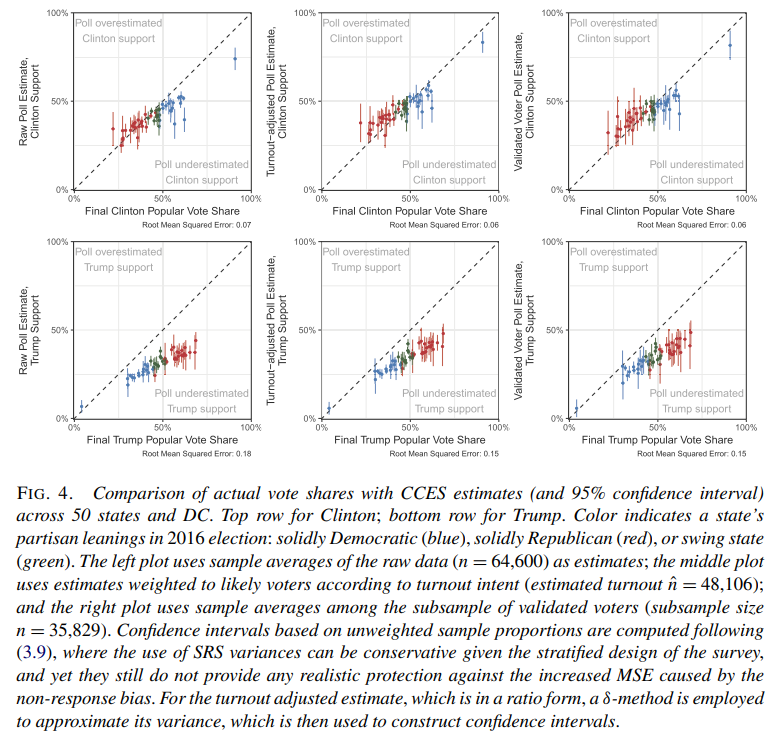
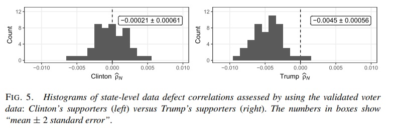
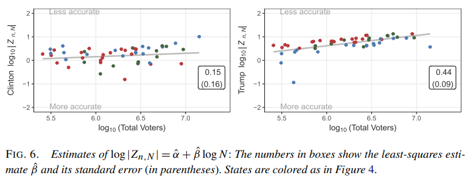
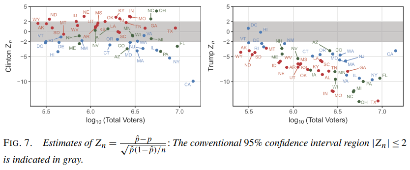

```{r setup, include=FALSE}
knitr::opts_chunk$set(echo = FALSE)
library(knitr)
library(survey)
library(pps)
library(expm)
```

## Announcements:

* HW 6: Due next Monday 
* Midterm:  make-up is due by midnight tonight
* Final diary due today (extension possible)
* Final JITT due Wednesday
* TODAY: FINAL Big data example + Respondent Driven Sampling
* Wednesday: Generalizability and self-selection

## JITT: Weight, weight, don't tell me

$$
\begin{aligned}
\bar y_n - \bar Y &= \frac{\text{E}_J (I_J \cdot W_J \cdot Y_J)}{E_J (I_J W_J)} - E_J (Y_J) \\
&= \frac{\text{Cov}_J (I_J W_J, Y_J)}{E_J (\tilde I_J)} \\
&= \frac{\text{Cov}_J (\tilde I_J, Y_J)}{\sqrt{ V_J (\tilde I_J) V_J(Y_J)}} \frac{\sqrt{ V_J (\tilde I_J)}}{E_J (\tilde I_J)} \sqrt{V_J(Y_J)} \\
&= \rho_{\tilde I, Y} \times \frac{\sqrt{ V_J (\tilde I_J)}}{E_J (\tilde I_J)} \times \sigma_Y \\
\end{aligned}
$$

## JITT: Continued

$$
\begin{aligned}
E_J (I_J W_J) &= P(I_J = 1) E_J [W_J \mid I_J = 1] = f \times E_J [W_J \mid I_J = 1] \\
V_J(I_J W_J) &= E[ I_J W_J^2] - E[I_J W_J]^2 \\
&= f \cdot \left( E [W_J^2 \mid I_J = 1] - f E[W_J \mid I_J = 1 ]^2 \right) \\
&= f \cdot \left( E [W_J^2 \mid I_J = 1] \pm E[W_J \mid I_j = 1]^2 - f E[W_J \mid I_J = 1 ]^2 \right) \\
&= f \cdot \left( V (W_J \mid I_J = 1) + E[W_J \mid I_J = 1]^2 (1-f) \right)
\end{aligned}
$$

Taking ratio:
$$
\sqrt{\frac{f \cdot \left( V (W_J \mid I_J = 1) + E[W_J \mid I_J = 1]^2 (1-f) \right)}{f^2 E_J [W_J \mid I_J = 1]^2}} = \sqrt{\frac{1 - f + CV(W)^2}{f}}
$$

## Which do you trust?  

* “Which one should I trust more: a 1%
survey with 60% response rate or a self-reported administrative dataset covering 80% of the population?”
* Let $r$ be the response rate. If $f_s = n_s/N$ is the survey fraction, then
$$
D_O = (1-r f_s)/(r f_s)
$$

* The $n_{eff}^{BIG}$ is larger than $n_{eff}$ iff
$$
D_I^{BIG} D_O^{BIG} < D_I D_O
$$

* Let $O$ be $D_O / D_O^{BIG}$; write this in terms of $r$, $f_s$, and $f$
* Using approximation $D_I \approx \rho^2_{I,Y}$ show that above inequality holds when $| \rho_{I,Y}^{BIG} | \leq \sqrt{O} | \rho_{I,Y} |$
* $O$ for the question: $f_s = 0.01$, $r = 0.6$, and $f =0.8$ so $\sqrt{O} \approx 26$

## Selection bias

* If selection bias caused by nonresponse mechanism is not nearly as severe as in the Big Data set, then we need to have a reasonable sense of the magnitude of $\rho_{I,Y}$ 
* US eligible population = $231,557,000$
* Under SRS, $| \rho_{I,Y}^{(SRS)} | \approx \sqrt{2/\pi} (N-1)^{-1/2} = 5.2 \times 10^{-5}$
* Suppose non-response increases data defect correlation by factor of $5 \to \rho_{I,Y} \approx 2.6 \times 10^{-4}$
* $\sqrt{O} \times \rho_{I,Y} = 0.0068$?

## Binary data example

Let $\tilde B = \bar y_n - \bar Y$, then 

$$
\rho_{\tilde I, Y} = \frac{\tilde B}{\sigma_Y\sqrt{(1-f+CV^2_W)/f}}
$$

## Binary data example

```{r, out.width = "200px", fig.align='center'}
 # place holder
```

## Binary data example

```{r, out.width = "300px", fig.align='center'}
 # place holder
```

## Binary data example

```{r, out.width = "300px", fig.align='center'}
 # place holder
```

## Binary data example

```{r, out.width = "300px", fig.align='center'}
 # place holder
```


## Respondent driven sampling

* For rare or hard-to-reach populations, even two-stage sampling can be prohibitively costly, and/or difficult to screen for
because of trust issues.
  + Intravenous drug users
  + Sex workers
  + Undocumented immigrants
* “Snowball sampling” or network sampling uses the fact that all or a large fraction of these rare populations may be connected
through a single network.
  + Start by recruiting one or a few people in the network (“seeds”), and have them recruit others, and so on until the
desired sample size is reached (“chain referral”). 
  + __Not a probability sample__: no control over selection probability, no randomization mechanism for selection.
  
## Example

```{r, out.width = "300px", fig.align='center'}
include_graphics("./figs/l25_fig1.png") # place holder
```

## Respondent driven sampling

Respondent driven sampling puts a bit of structure on this process and shows that, under certain assumptions, the sample chosen through this network process corresponds to a probability sample where the probability of selection is proportional to the number of contacts $d_i$ for an individual in the network (number of edges for a node)

* Each individual samples a fixed number $c$ of their contacts.
* Individuals sample from their contacts at random, and this sampling is independent of previous sampling.
* The number of contacts the ith individual known, is accurate and collected for each sampled individual.
* Contact are bidirectional: if individual i considers individual j a contact, then individual j considers individual i a contact.
* The connections among the sampled individuals are tracked.
* Sampling is done with replacement (in practice not the case).
* The number of “waves” is large enough to “erase” the “memory” of the starting seeds in the sample.

## Random seeds

If seeds are picked at random proportional to size of their
network, then easy to show probability of selection is
proportional to the number of contacts. We assume $c=1$
for simplicity. Let

$$
NI(j)_{w=x}  = \left \{ \begin{array}{c c} 1 & \text{if node j is selected at wave x} \\ 0 & \text{otherwise} \end{array} \right .
$$

$$
EI(e_{j \to k})_{r=x}  = \left \{ \begin{array}{c c} 1 & \text{if edge } e_{j \to k} \text{is selected at recruitment x} \\ 0 & \text{otherwise} \end{array} \right .
$$

## Under PPS seed sampling

* The probability of the $j$th node is sampled is
$$
P(NI(j)_{w=0} = 1) = \frac{d_j}{\sum_{i=1}^N d_i}
$$

* Thus the probability that the edge from $j$ to $k$ is picked at the $1$st recruitment is given by

$$
\begin{aligned}
P( EI(e_{j \to k} ) = 1 ) &= P( EI(e_{j \to k} ) = 1 \mid NI(j)_{w=0} = 1 ) \times P ( NI(j)_{w=0} = 1) \\
&=\frac{1}{d_j} \frac{d_j}{\sum_{i=1}^N d_i} = \frac{1}{\sum_{i=1}^N d_i}.
\end{aligned}
$$

## PPS seed sampling

The probability that the $k$th node is sampled at the $1$st wave is given by
$$
\sum_{i=1}^{d_k} P( EI(e_{j \to k} ) = 1 )= \frac{d_k}{\sum_{i=1}^N d_i}
$$

This can be repeated iteratively (since we have shown PPS sampling at the first wave) to show that nodes in later waves will be drawn with probability proportional to network size.

## Stochastic process theory

* Let $\pi_j^t = P( NI(j)_{w=t} = 1)$.  
* If the network is irreducible (can reach a node from any other node through enough edges) 
* And aperiodic (there is at least one “triangular” connection), 
* Then under the previous assumptions, $\pi^{t} \to \pi^{\infty}$ where 

$$
\pi^\infty = P \pi^\infty
$$
and $P_{ij} = \frac{1}{d_i}$ if $EI(e_{i \to j}) = 1$ and is $0$ otherwise.

## What is the stationary distribution?

The stationary distribution is $\pi_j^\infty = d_j/\sum_{i=1}^N d_i = d_j/D$

$$
\begin{aligned}
\left[ P \pi^{\infty} \right]_{i} &= \sum_{i=1}^n p_{ij} \pi_j^\infty \\
&= \sum_{j} EI(e_{i \to j}) \frac{1}{d_j} \times \frac{d_j}{D} \\
&= \sum_{j: EI(e_{i \to j}) = 1} \frac{1}{d_j} \times \frac{d_j}{D} \\
&= \frac{\sum_{j=1}^N EI(e_{i \to j})}{D} = \frac{d_i}{D}
\end{aligned}
$$

## Example

```{r rds, echo = TRUE, eval = TRUE}
P = matrix(c(0,1/3,1/3,1/3,
             1/2,0,0,1/2,
             1/2,0,0,1/2,
             1/3,1/3,1/3,0),nrow = 4, ncol = 4, byrow = TRUE)
init = c(1,0,0,0)
one_step = init%*%P
two_step = one_step%*%P
three_step = two_step%*%P
forty_steps = init%*%(P%^%10)
matrix(c(init, one_step, two_step, three_step, forty_steps), ncol = 5)
```


## Point estimation

Point estimation from RDS sample for means uses a Hajeck-type estimator

$$
\bar y = \frac{ \sum_{i \in s} y_i / d_i }{\sum_{i \in s} 1/d_i}
$$

## Variance estimation

* Sampled elements are not independent, but not traditionally clustered either.
* A variety of variance estimators have been proposed for RDS samples. Two most popular:
  + Volz-Heckathorn
  + Salganik bootstrap
* Both are designed to provide estimates of proportions.

## Volz-Heckathorn:

$$
v(p_A) = \frac{1}{n(n-1)} \sum_{i=1}^n (z_i - p_A)^2 + \frac{p_A^2}{n} \left( (1-n) + \frac{2}{n_A} \sum_{i=2}^n \sum_{j=1}^{n-1} (\sigma^{i-j})_{AA} \right)
$$
where 
$$p_A = \frac{\sum_{i=1}^n I_i (A)/d_i}{\sum_{i=1}^n 1/d_i} = \frac{1}{n} \sum_{i=1}^n z_i= \frac{n_A}{n} \left( \frac{\hat \delta_U}{\hat \delta_A} \right)$$ 
for $z_i = \hat \delta_{U} I_i (A) / d_i$, $\hat \delta_U = \frac{n}{\sum_{i=1}^n d_i^{-1}}$, $\hat \delta_{A} = \frac{n_A}{\sum_{i=1}^n I_i (A)/d_i}$, and $\sigma_{XY}$ is the $XY$th element of the transition probability matrix from Type X to Type Y, and $(\sigma^k)_{XY}$ is that element raised to the power $k$.

## A proof


## Salganik bootstrap

* Choose a resampling “seed” at random from the sample.
  + If the selected seed was a member of group X, sample next element at random with replacement from among all elements that were recruited by a group X member.
  + Repeat this process for each sampled element, sampling with replacement the next element based on membership of their recruitment node, until a sample of size n is obtained.
  + Compute $p_A^{(1)}$ using standard weighted RDS estimator
* Repeat B times, to obatin $p_A^{(2)}, \ldots, p_{A}^{(B)}$
* Compute 95\% CI using either
  + Standard error $\sqrt{\frac{1}{B-1} \sum_{b=1}^B ( p_A^{(b)} - \bar p_A )^2 }$
  + The 2.5\% and 97.5\% percentiles of $\{ p_A^{(1)}, \ldots, p_A^{(B)} \}$

## Alternatives

* Variance estimation for RDS remains an active area for research
  + Gile (2011) proposed a method based on knowing or estimating the population size N.
  + Baraff, McCormick, and Raftery (2016) propose a bootstrap procedure that resamples with replacement
seeds, then resamples the first waves of each of the resampled seeds, and so forth until all waves have been resampled.
    - More closely matches implicit design of RDS.
  + Generalized least squares: Under a Markov model for RDS, research has shown that if the typical participant refers too many contacts, then the variance of common estimators does not decay like $O(n^{-1})$, where $n$ is the sample size. Tries to find weighted average of the sampled values that achieves smallest variance.

## Shortcomings of RDS
* With replacement sampling assumption:
  + Bias and overcoverage (variance estimates too large) when sampling fractions are non-trivial.
* Random sampling at each node:
  + Failure can induce substantial bias.
  + May not be so problematic in practice.
* Accurate reporting of degrees:
  + Failure can induce substantial bias.
  + More serious problem in practice.
* Short waves, many seeds
  + Problems made worse with homophily (networks with “bottlenecks”)


## JITT: Using RDS to find hidden populations

* Read about how RDS can be used to [estimate size of hidden populations](https://www.ncbi.nlm.nih.gov/pmc/articles/PMC4500293/pdf/nihms676757.pdf)
* How could such an approach help deal with the COVID-19 situation?
* What are the pitfalls?


