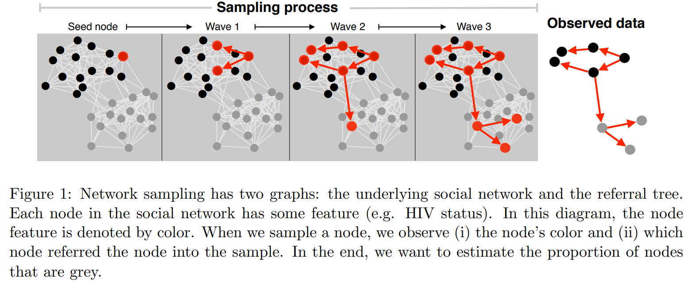
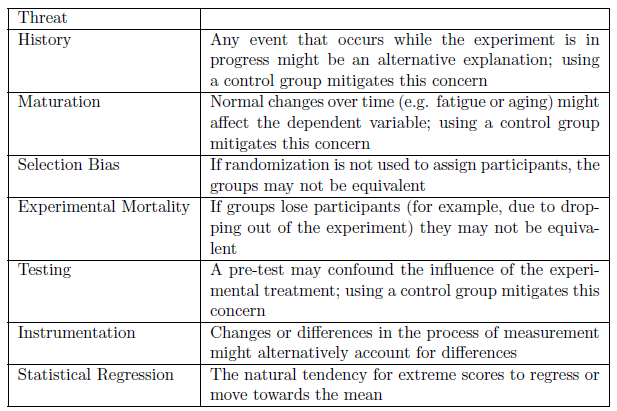
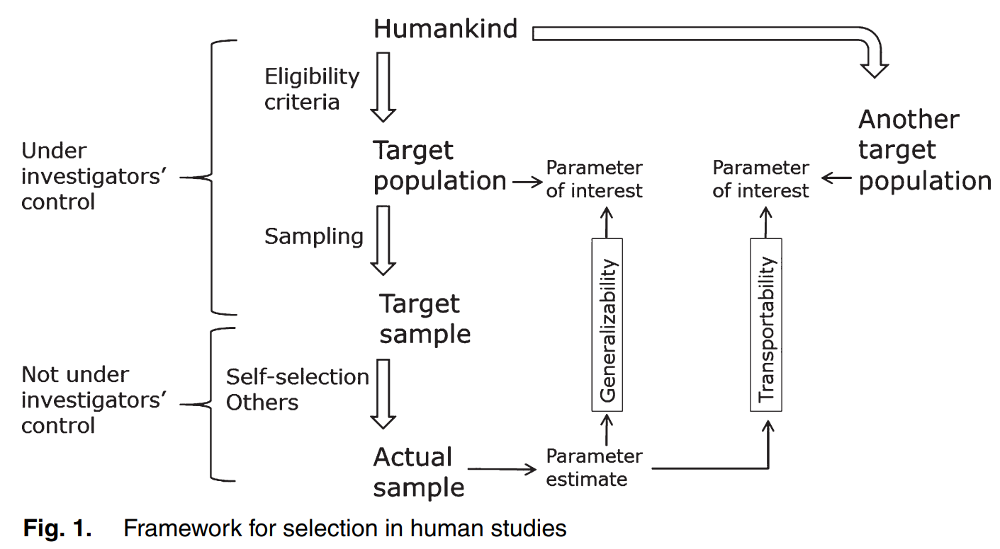
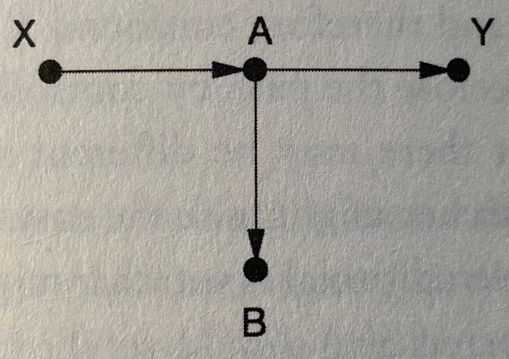
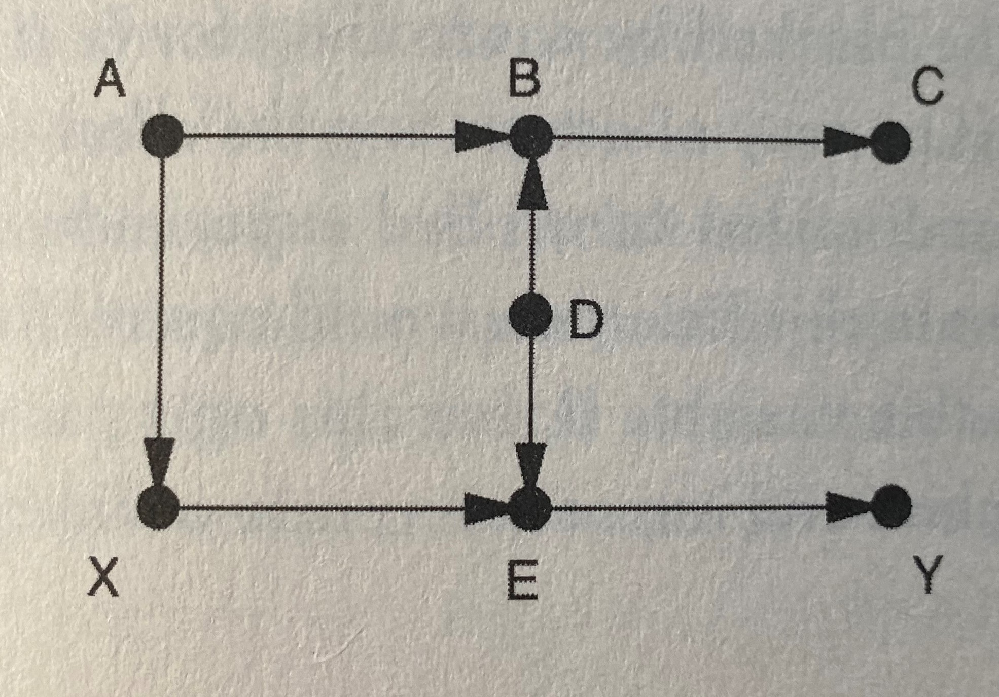
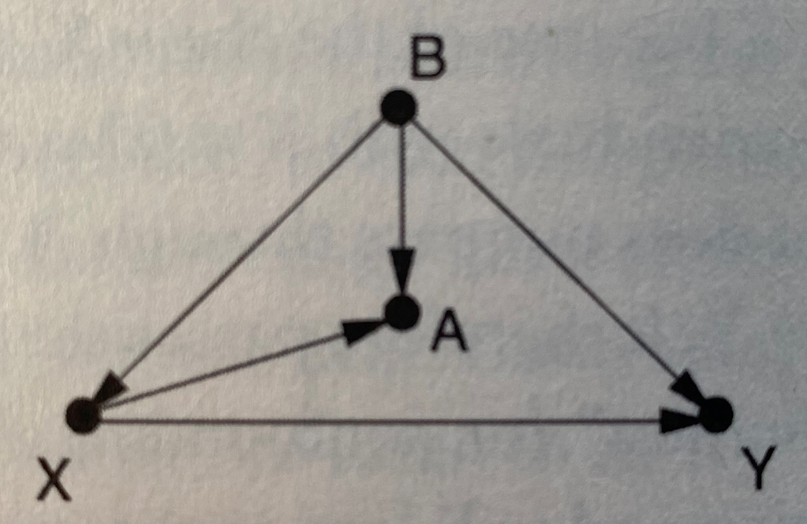
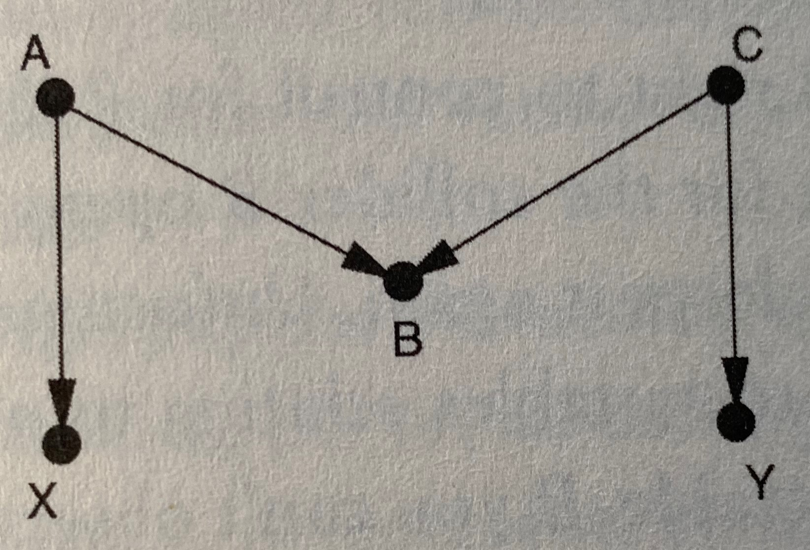
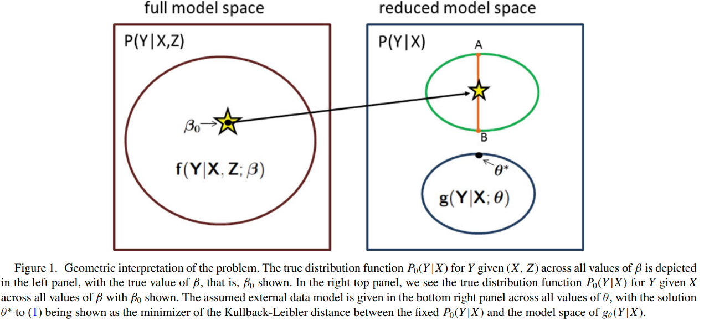

```{r setup, include=FALSE}
knitr::opts_chunk$set(echo = FALSE)
library(knitr)
library(survey)
library(pps)
library(expm)
```

## Announcements:

* HW 6: Due next Monday 
* Final JITT due today
* FINAL structure announcement posted
* TODAY: RDS review and proof + Generalizability
* Next Monday: Review and final practice exam
* HW 6 solutions posted at 9AM Tuesday (need all assignments by Monday at midnight!)

## Final announcement details

* Exam date and time: Thursday April 23, 1:30-3:30pm
* Exam will be posted to Canvas under ``Assignments'' at 1:15pm
* Exam needs to be __uploaded__ (like standard HW) by 3:45pm.
* I will have my OH [Bluejeans](https://bluejeans.com/863940440) open
* Please stop in for questions while taking exam
* E-mail with `BIOS 617` if necessary

## RDS: Quick review

```{r, out.width = "300px", fig.align='center'}
 # place holder
```


## Point estimation

Point estimation from RDS sample for means uses a Hajeck-type estimator

$$
\bar y = \frac{ \sum_{i \in s} y_i / d_i }{\sum_{i \in s} 1/d_i}
$$

## Variance estimation

* Sampled elements are not independent, but not traditionally clustered either.
* A variety of variance estimators have been proposed for RDS samples. Two most popular:
  + Volz-Heckathorn
  + Salganik bootstrap
* Both are designed to provide estimates of proportions.

## Volz-Heckathorn:

$$
v(p_A) = \frac{1}{n(n-1)} \sum_{i=1}^n (z_i - p_A)^2 + \frac{p_A^2}{n} \left( (1-n) + \frac{2}{n_A} \sum_{i=2}^n \sum_{j=1}^{n-1} (\sigma^{i-j})_{AA} \right)
$$
where 
$$p_A = \frac{\sum_{i=1}^n I_i (A)/d_i}{\sum_{i=1}^n 1/d_i} = \frac{1}{n} \sum_{i=1}^n z_i= \frac{n_A}{n} \left( \frac{\hat \delta_U}{\hat \delta_A} \right)$$ 
for $z_i = \hat \delta_{U} I_i (A) / d_i$, $\hat \delta_U = \frac{n}{\sum_{i=1}^n d_i^{-1}}$, $\hat \delta_{A} = \frac{n_A}{\sum_{i=1}^n I_i (A)/d_i}$, and $\sigma_{XY}$ is the $XY$th element of the transition probability matrix from Type X to Type Y, and $(\sigma^k)_{XY}$ is that element raised to the power $k$.

## Proof

$$
\begin{aligned}
p_A &= \frac{1}{n} \sum_{i=1}^n z_i = \frac{1}{n} \sum_{i=1}^n \frac{n}{\sum_i d_i^{-1}} \frac{I_i(A)}{d_i} = \frac{\sum_{i=1} I_i(A)/d_i}{\sum_{i=1}^n d_i^{-1}}\\
V(p_A) &= \frac{1}{n^2} V\left( \sum_{i=1}^n z_i \right) \\
&= \frac{1}{n^2} \left[ \sum_{i=1}^n V(z_i) + 2 \sum_{i=1}^{j-1} \sum_{j=1}^n C(z_i, z_j) \right] \\
\sum_{i=1}^n V(z_i) &= \frac{n}{n-1} \sum_{i=1}^n (z_i - p_A)^2 \\
\end{aligned}
$$

## Proof (ctd)

$$ \footnotesize
\begin{aligned}
C(z_1+\ldots+z_{m-1}, z_m) &= E \left[ \left( z_1+\ldots+z_{m-1} - (m-1) E(z) \right) \times (z_m - E(z) ) \right] \\
&= \sum_{i=1}^{m-1} E(z_i z_m) - 2 (m-1) E(z)^2 + (m-1) E(z)^2 \\
&= \sum_{i=1}^{m-1} E(z_i z_m) - (m-1) E(z)^2 \\
\end{aligned}
$$

## Proof (ctd)

$$ \footnotesize
\begin{aligned}
E(z_i z_m) &= P(i \in A) E [ z_i \mid i \in A ] \times P(m \in A \mid i \in A ) E ( z_m \mid m \in A ) \\
&= \frac{n_A}{n} \times \frac{\sum_{i=1}^n I(i \in A) z_i}{n_A} \times \sigma_{AA}^{m-i} \times \frac{\sum_{i=1}^n I(i \in A) z_i}{n_A}  \\
\frac{\sum_{i=1}^n I(i \in A) z_i}{n_A} &= \frac{1}{n_A} \hat \delta_U \sum_{i=1} I_i (A) / d_i \\
&= \frac{1}{n_A} \frac{n_A \hat \delta_U}{\hat \delta_A} = \frac{\hat \delta_U}{\hat \delta_A} \\
E(z_i z_m) &= \frac{n_A}{n} \times \left( \frac{\hat \delta_U}{\hat \delta_A} \right)^2 \times \sigma_{AA}^{m-i} \\
&= p_A \times \frac{\hat \delta_U}{\hat \delta_A} \times \sigma_{AA}^{m-i}
= p_A^2 \times \frac{n}{n_A} \times \sigma_{AA}^{m-i}.
\end{aligned}
$$

## Salganik bootstrap

* Choose a resampling “seed” at random from the sample.
  + If the selected seed was a member of group X, sample next element at random with replacement from among all elements that were recruited by a group X member.
  + Repeat this process for each sampled element, sampling with replacement the next element based on membership of their recruitment node, until a sample of size n is obtained.
  + Compute $p_A^{(1)}$ using standard weighted RDS estimator
* Repeat B times, to obatin $p_A^{(2)}, \ldots, p_{A}^{(B)}$
* Compute 95\% CI using either
  + Standard error $\sqrt{\frac{1}{B-1} \sum_{b=1}^B ( p_A^{(b)} - \bar p_A )^2 }$
  + The 2.5\% and 97.5\% percentiles of $\{ p_A^{(1)}, \ldots, p_A^{(B)} \}$

## Today's lecture

* [Perils and potentials of self-selected entry to epidemiological studies and surveys](https://rss.onlinelibrary.wiley.com/doi/pdf/10.1111/rssa.12136)
* [Web-Based Enrollment and Other Types of Self-Selection in Surveys and Studies: Consequences for
Generalizability](https://www.annualreviews.org/doi/pdf/10.1146/annurev-statistics-031017-100127)
* Understanding interdiscplinary discussions and the `Whys' of current survey issues.


## Key Terminology

* __Internal validity__ refers to validity of inferences for a given parameter or estimand (such as a sample mean) for the sample at hand. 
* __External validity__ refers to the degree to which within-study inferences generalize or can be generalized to a target population or context.
* Are the findings in the study population also valid in other populations?
  + Pearl and Bareinboim (2014) provide exact criteria for transportability based on causal graphs. 
  + A general empirical observation is that marginal effects are rarely transportable whereas conditional effects more often can be expected to be transportable, provided that all relevant confounders have been accommodated.
  
## Threats to internal validity

```{r, out.width = "300px", fig.align='center'}
 # place holder
```

  
## Study goals

* The focus in many studies is on within-study comparisons, e.g. estimation of an exposure–
response relationship or the association of an attitude with personal characteristics. 
* Even with a sampling frame and valid weights for making inferences to the frame, validity of inferences to other populations is at risk because the conditional effects might not generalize. 
* Unmeasured confounders that are associated with sample inclusion propensities cannot be incorporated in the weights and, even if all confounders are measured, it is challenging to develop appropriate weights. 
* Goal today: compare and contrast the epidemiological and survey cultures
* __Principal distinction__: epidemiological focus on internal and the survey focus on external validity.
  
## Epidemiological context

Participation rates in epidemiologic studies have been declining for the past 30 years, and the decline is accelerating (see the literature review by Galea and Tracy (2007)). This situation has stimulated two questions.

  + How much does this matter for study validity?
  + As the Internet approaches universal coverage, are competitive Web-based study designs emerging?

Key issues include external validity, representation and transportability.


## Web-based pregnancy planning study (`SnartGravid')

* Purpose of time-to-pregnancy (TTP) surveys is to estimate fecundability in an attempt to approach biological fecundity (the ability to obtain a pregnancy) 
* Ideal prospective TTP survey: recruit couples at time that they decide to try to become pregnant and follow them prospectively until pregnancy happens, the couple gives up, or the study ends. 
* Rare, very costly, and have low participation rates and usually rather uncertain representativity status, 
* Made sense to attempt a new way of creating a prospective sample of pregnancy seekers, using the Internet not only for follow-up, but also for recruiting
* Recruitment was via on-line advertisements, primarily on non-commercial health sites and social networks, supplemented by press releases, blogs, posters and word of mouth. 

## SnartGravid study

* By June 1st, 2014, more than 8500 women had been recruited. Women were recruited shortly after initiation and followed until whatever comes first of pregnancy, giving up trying or 12 cycles after initiation. 
* Follow-up rates were satisfactory, with more than 85% responding to each questionnaire and more than 80% of the cohort still included in the follow-up after 1 year (Huybrechts et al., 2010). 
* Relevant exposures which could all be measured before the end of the attempt of conception were collected. 
* Using appropriate delayed entry survival analysis, this study should deliver directly interpretable estimates of the (prospective) distribution of TTP for given premeasured exposures, all within the sample of study participants. 
* Participants were censored at the start of fertility treatment
  
## Representativity in self-selected studies

Huybrechts et al. (2010) gave a detailed discussion of the representativity issue in self-selected
Internet-based studies like this. They acknowledged that

_Internet-based recruitment of volunteers has raised concerns among critics because the demographics (e.g., age, socio-economic status) of those with ready internet access differ from those without it.
Furthermore, among those with internet access, those who choose to volunteer for studies may differ
considerably in lifestyle and health from those who decline._

## Representativity in self-selected studies

_Volunteering to be studied via the Internet does not, however, introduce concerns about validity beyond
those already present in other studies using volunteers. Differences between study participants and non-is the main concern. Given internal validity, the only problems with studying Internet users would occur
if the biologic relations that we are studying differed between Internet users and non-users, a possibility that seems unlikely. The primary concern should therefore be to select study groups for homogeneity with respect to important confounders, for highly cooperative behavior, and for availability of accurate information, rather than attempt to be representative of a natural population._

## Representativity in self-selected studies

_Scientific generalization of valid estimates of effect (i.e., external validity) does not require representativeness of the __study population__ in a survey-sampling sense either. Despite differences between
volunteers and non-participants, volunteer cohorts are often as satisfactory for scientific generalization
as demographically representative cohorts, because of the nature of the questions that epidemiologists study. The relevant issue is whether the factors that distinguish studied groups from other groups
somehow modify the effect in question_

## What does this mean?

* Results from analysis of sample should be directly used to generalize to population
* The only exception is if sampling leads to the sample contains effect modifiers: in other
words, if the creation of the sample has generated selection bias. 
* Here, the statement that it is unlikely that Internet users would not have similar biologic relations to those of nonusers is imprecise: the question is rather whether volunteers (who here must be Internet users but are not necessarily a representative subset of these) have different such relations from those
of non-volunteers

## Hernan's Framework for Selection

```{r, out.width = "300px", fig.align='center'}
 # place holder
```

## External validity

* Non-participation bias does not alone indicate a high level of bias in the estimates of effects of exposures, since

_It is the difference between participants and non-participants that determines the amount of bias
present. Reassuringly, most studies have found little evidence for substantial bias as a result of nonparticipation._

* There will be bias only if the participation rate and effect interact
* Meng's analysis $E[ \rho_{I, Y} ] \neq 0$ in order for bias to exist

## What's the point of randomization?

* In clinical trials, randomization negates impact of unobserved confounders
* In surveys, representative sampling negates the impact of unobserved effect modifiers
  + Being representative for one population in no way ensures 
  + Transporting even an excellent probability sample is challenging
  
## Simple transportability 

* Two populations: $Y_1^{(i)},\ldots, Y_n^{(i)}$ for $i=1,2$
* Different population averages, $\bar Y^{(1)} \neq \bar Y^{(2)}$
* __IDEA__: stratify population
  + Maybe we have $\bar Y^{(1)}_h \approx \bar Y^{(2)}_h$ for $h=1,\ldots, H$
  + And controlling for strata, selection is independent of 
  + Auxiliary information: $N_h^{(2)}$ for 
* Then apply poststratification with weights given by other population

$$
\bar y^{(2)} = \sum_{h=1}^H \frac{N_h^{(2)}}{N^{(2)}} \bar y^{(1)}_h
$$
* Similar to poststratification but different purpose!
* Requires equivalence of strata (i.e., conditional) effects!!!

## Pearl and Bareinboim's Formal Theory of Transportability

* Back-door criterion (DAG language)
  + No directed path leading from $X$ to any element of $Z$
  + Elements of $Z$ block all back-door paths from $X$ to $Y$
* Gives sufficient conditions for stratification (or regression) adjustment for confounders $Z$ via the adjustment formula

$$
P(Y = y \mid do(X=x)) = \sum_{z} P(Y = y \mid x, Z=z) P(Z=z) 
$$

## How does this connect to sample selection bias?

* The issue of selection bias is handled by including a special node (often termed S) in the DAG, with edges denoting which of the variables are related to the selection. 
* The resulting augmented graph allows the formulation of a selection back-door criterion, which indicates whether a set Z of variables is sufficient for identification of causal effects through the formula
$$
P(Y = y \mid do(X=x)) = \sum_{z} P(Y = y \mid x, Z=z, S=1) P(Z=z)
$$

* Gives theoretical justification to the post-stratification idea where $Z$ is the strata and $X$ is some covariate level (or pop lvl)
* This is different from $P(Z=z \mid X=x)$!

## Game 1

```{r, out.width = "250px", fig.align='center'}
 # place holder
```

## Game 2

```{r, out.width = "250px", fig.align='center'}
 # place holder
```

## Game 3

```{r, out.width = "250px", fig.align='center'}
 # place holder
```

## Game 4

```{r, out.width = "250px", fig.align='center'}
 # place holder
```


## Miettinen declarative position

An alternative view on external validity:

_In science the generalization from the actual study experience is not made to a population of which the
study experience is a sample in a technical sense of probability sampling. In science the generalization
is from the actual study experience to the abstract, with no referent in place or time._

* This position stipulates that epidemiology is a science that is much elevated above statistics and more specifically survey design and analysis.
* Rigid support of this position implies that measurement systems are stable and accurate, that
responses or outcomes are recorded accurately and reliably, and that the measurement error
process is constant across clinical, demographic, chronological and technological contexts. 

## Miettinen declarative position

* Appear to equate ‘representative’ with ‘self-weighting’ (i.e. summaries computed by using equal weights for each unit produce unbiased estimates of population values).
* The more general and more generally accepted definition requires only that appropriate weights are available to produce valid population estimates. 
* Very few surveys could be conducted if they needed to be self-weighting, and most well-designed and well-executed surveys have a sampling frame and sampling plan that support weighting results so that they apply to a reference population. 

## Miettinen declarative position 

* Availability of the relevant weights qualifies the sample as representative. Such representation is a worthy goal for surveys and epidemiological, clinical and other studies that intend to produce findings that are generalizable (henceforth we use ‘epidemiological’ as a shorthand for all explanatory studies).
* Miettinen apparently equated targets of most epidemiological research with physical laws, for which the generalizability issue is not a question of representativity of the sender population (e.g. from which relationships are to be exported) and receiver population (e.g. into which relationships are to be imported). 

## Confusing epidemiological (and social science!) research with physical laws

* _In our view, however, many epidemiological efforts have rather more modest and practical concrete targets, which are expressed not as new general physical laws, but as properties of some but not all human populations_
* There is therefore a genuine generalizability problem in most epidemiological studies.

## Elliott's example: causal inference and generalizability

* Randomization negates the influence of unobserved confounders, whereas representative sampling negates
the influence of unobserved effect modifiers
* Suppose we haven an outcome $Y$, an exposure $A$, an unobserved $U$ that is both a common cause of $A$ and $Y$ and modifies the effect of $A$ on $Y$
* $E(Y \mid U, A) = \beta_0 + \beta_1 A + \beta_2 U + \beta_3 A U$
* In specific population

$$
\left( \begin{array}{c} U \\ A \end{array} \right) \sim N \left( \left( \begin{array}{c} U \\ A \end{array} \right), \left( \begin{array}{c c} \sigma_U^2 & \sigma_{UA} \\ \sigma_{UA} & \sigma_A^2 \end{array} \right) \right)
$$

## Elliott's example 

* If we correctly estimate $E(Y \mid A)$ using SRS we find $Y$ is actually non-linear in $A$:
$$
E(Y \mid A) = \beta_0 + \alpha_0 \beta_2 + \left( \beta_1 + (\alpha_0 + \alpha_1) \beta_3) \right) A + \alpha_1 \beta_3 A^2
$$
where $\alpha_0 = \mu_U - (\sigma_{UA}/\sigma_A^2) \mu_A$ and $\alpha_1 = (\sigma_{UA}/\sigma_A^2) A$.
* If we are interested in causal effect of $A$ on $Y$, then
$$
\begin{aligned}
&E ( Y(A=a_2) - Y(A=a_1) ) \\
= &E( E ( Y(A=a_2) - Y(A=a_1) \mid U = u) ) \\
= &(\beta_1 + \beta_3 E(U)) (a_2 - a_1)
\end{aligned}
$$

* Suppose $U$ and $A$ are independent given observed $X$
* Then we still need to figure out the correct value of $E(U)$
* Most likely interested in a causal effect across a well-defined population, so using probability sampling to obtain a consistent estimator of effect seems more appropriate

## Generalizing Predictions: 

* Prediction: we care more about MSE than low variance, unbiased estimates
* Chatterjee (2016a) is a generalized version of stabilizing interior estimates by benchmarking to marginal distributions

```{r, out.width = "300px", fig.align='center'}
 # place holder
```

## Basic math

* $Y$ outcome and $X$ covariates in a ``big dataset''
* ``Internal study'' where we observe a new variable in addition $Z$
* We know that $E[ U(Y \mid X, \theta^\star) ] = 0$ is what is solved using big dataset
$$
E[ U(Y \mid X, \theta^\star) ] = \int U(y \mid x, \theta^\star) p(y \mid x) p(x) dy dx = 0
$$

* Then express $p(y \mid x )  = \int f(y \mid z,x) p(z \mid x) dz$, and we see that

$$
\int_{Z,X} \left[  \int_{y} U(Y \mid X, \theta^\star) f_{\beta_0} (Y \mid X, Z ) dY \right] dF(X,Z) = 0
$$

## Generalizing predictions

* There is the view that too much clinical research is conducted only with males and then generalized to females, without sufficient attention to validity. 
* It is unlikely that collecting large survey data for both males and females would support valid application of the SCML approach because there needs to be consideration of interactions between risk factors and gender, and these are obviously not contained in the original all-male detailed studies.
* Although using external information to stabilize internal estimates is important, of at least equal importance is using external information to transport internal estimates to a broader context, a
reference population different from that studied. 
* That is, systematic approaches are needed to embed the detailed information in small focused studies with specific hypotheses into a population distribution of background and other variables. 
* There are several benefits, among them better confounder control and possibilities for supplementing conditional effect measures with the less easily available absolute effects. 
* Big data (including administrative data) and surveys have the potential to estimate dependencies and improve transportation of internal findings to a broader context

## Self-selection (in longitudinal data)

* When selection effects bias prevalences and other cross-sectional population attributes, it may
still be that in follow-up studies changes over time are less vulnerable to selection effects. 
* Strictly, this protection requires that level and change are only weakly related, possibly after adjusting for baseline attributes. 
* However, there are many examples of strong association, e.g. the ‘horseracing’ effect wherein the pace of change for an individual at the front of the pack is greater than the typical change. 
* More generally, if a longitudinal relationship depends on individual attributes that either are not used in the assessment or are inadequately modelled, the estimated slope will not align with the population value, sample selection will be ‘informative’ and even within-study assessments can be compromised. 
* Of course, as important, dropout effects are prima facie associated with change. 
* Interplay between representativity, cross-sectional classification and longitudinal effects 

## Randomization's role

* A principal role of randomization in clinical and field studies is to eliminate or to reduce confounding substantially, especially with respect to unmeasured attributes. 
* Similarly, survey data collected by using a predetermined sampling plan confer this benefit in that weights are available to eliminate confounding and lack of representation via either a design-based or model-based analysis. 
* Randomization negates the influence of unobserved confounders, whereas representative sampling negates the influence of effect modifiers 

## Definition and history of representative sampling

Nine different meanings in the statistical literature:

* general acclaim for data (the term representative essentially used in a positive rhetorical
fashion);
* absence of selective forces (in the sampling process);
*  the sample as a miniature of the population;
* representative as typical;
* coverage of the population’s heterogeneity;
* representative sampling as a vague term that is to be made precise;
* representative sampling as a specific sampling method;
* representative sampling as permitting good estimation;
* representative sampling as sufficiently good for a particular purpose.

## What is the real representation issue?

_The real representativity issue is whether the conditional effects that we wish to transport
are actually transportable_

- Need well-defined populations for the `to` and `from` parts

## Role of big data

- ‘The benefits of using Big Data to improve public sector services have been recognized but the costs
and risks of realizing these benefits are non-trivial.’
- ‘Big Data offers entirely new ways to measure behaviors, in near real-time. Though behavioral measures are often lean in variables.’
- ‘Big Data offers the possibility to study tails of distributions.’


## Research agenda

* What is the role of large databases with moderate individual information and less than perfect correspondence with the study issues?
* an nonstandard weighting rules validly generalize to other populations?
* How large a sample size is needed for calibration information?
* What weighting strategies for external information have the potential to improve estimation
(i.e., improve MSE)?
* What types of sensitivity analyses will be revealing?


## FINAL JITT (NOT DUE)

Read the discussion!!!  Featuring both Rod Little and Mike Elliot.