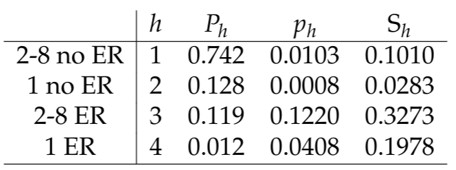

```{r setup, include=FALSE}
knitr::opts_chunk$set(echo = FALSE)
```

## Optimal allocation (i.e., today's topic)

* While proportionate allocation usually reduces variances over simple random sampling if there are differences in means, it is not
the most efficient method possible if there are also differing variances by stratum
* **Goal**: Minimize the variance subject to cost constraints
* Mathematically,
$$
(n_1,\ldots,n_H) = \arg \min V(\bar y_{st}) = \arg \min \sum_h P_h^{2} (1-f_h) \frac{S_h^2}{n_h}
$$
* Subject to a fixed total cost $C$. 
* We will assume a general setting where the average cost per interview is equal to $c_h$ and thus, subtracting out any fixed
costs, the budget available is $C = \sum_h c_h n_h$.

## Optimal allocation

Since
$$ \small
\begin{aligned}
V(\bar y_{st}) &= \sum_h P_h^{2} (1-f_h)  \frac{S_h^2}{n_h} \\
&= \sum_h P_h^2 \frac{S_h^2}{n_h} - \sum_h \frac{N_h^2}{N^2} \frac{n_h}{N_h} \frac{S_h^2}{n_h} \\
&= \sum_h P_h^2 \frac{S_h^2}{n_h} - N^{-1} \sum_h P_h S_h^2 \\
\end{aligned}
$$

* Second term does not include $n_h$ so we can simply optimize the first term (+ a Langrange multiplier):
$$
\phi(n_1, \ldots, n_H) = \sum_h P_h^2 S_h^2/n_h + \lambda \left( \underbrace{\sum_h c_h n_h - C}_{=0} \right)
$$

## Optimal allocation

* Differentiate with respect to $n_h$:
$$
\frac{\partial \phi(n_1, \ldots, n_H)}{\partial n_h} = - \frac{P_h^2 S_h^2}{n_h^2} + \lambda c_h = 0
$$
* So $n_h \propto \frac{P_h S_h}{\sqrt{\lambda \cdot c_h}}$. Next, differentiate with respect $\lambda$ yields
$$
C = \sum_h c_h n_h = \sum_h c_h \frac{P_h S_h}{\sqrt{\lambda \cdot c_h}} \Rightarrow \sqrt{\lambda} = \frac{\sum_h P_h S_h^2 \sqrt{c_h}}{C}  
$$
* This leads to 
$$
n_h = \frac{C}{\sum_{\tilde h} \sqrt{c_{\tilde h}} P_{\tilde h} S_{\tilde h} } \times \frac{P_h S_h}{\sqrt{c_h}}
$$
* This is consistent with intuition: (a) larger samples in strata with larger variances, and (b) smaller samples in strata with higher costs.


## Neyman allocation

* In the (common) setting where per-stratum costs are constant ($c_h = c$ for all $h=1,\ldots,H$ so $C = n \cdot c$), the optimal allocation results simplify and we have
$$
n_h = \frac{C}{\sum_{\tilde h} \sqrt{c_{\tilde h}} P_{\tilde h} S_{\tilde h} } \times \frac{P_h S_h}{\sqrt{c_h}} = n \frac{P_h S_h}{\sum_{\tilde h} P_{\tilde h} S_{\tilde h}}
$$
so $n_h \propto P_h S_h$
* Termed Neyman allocation because these optimation issues were first considered by Jerzey Neyman in his work developing the fundamentals of probability sampling 
* Less familiar, but arguably as important, as his work in the foundations of statistical inference

## Variance of neyman allocation

$$ \small
\begin{aligned}
V(\bar y_N) &= \sum_h P_h^2 (1-f_h) S_h^2 / n_h \\
&= \sum_h P_h^2 S_h^2 / n_h - N^{-1} \sum_h P_h S_h^2\\ 
&= \sum_h \frac{P_h^2 S_h^2}{n \frac{P_h S_h}{\sum_{\tilde h} P_{\tilde h} S_{\tilde h}}} - N^{-1} \sum_h P_h S_h^2 \\ 
&= \frac{\left( \sum_h P_h S_h \right)^2}{n} - N^{-1} \sum_h P_h S_h^2\\
&\approx \frac{\left( \sum_h P_h S_h \right)^2}{n}\\ 
\end{aligned}
$$
where the last line holds when $N$ is big and $N \gg n$.

## Optimal allocation

* When $N_h$ is small, optimal allocation may suggest $n_h > N_H$
* Set $f_h = 1$ and re-run the optimal allocation with
$$
\tilde C = C- \sum_h I(f_h=1) N_h c_h
$$
in the case of optimal allocation __or__
$$
\tilde n = n - \sum_h I(f_h = 1) N_h
$$
in the case of Neyman allocation
* We drop those strata in which a census is taken. Why can we drop those strata?

## The gains from Neyman Allocation

* What do we gain by considering Neyman allocation in design?
$$
\begin{aligned}
V(\bar y_{prop}) - V(\bar y_N ) 
&= \left[ \frac{\sum_h P_h S_h^2}{n}- N^{-1} \sum_h P_h S_h^2 \right] \\
&- \left[ \frac{\left( \sum_h P_h S_h \right)^2}{n} - N^{-1} \sum_h P_h S_h^2 \right] \\
&= n^{-1} \left( \sum_h P_h S_h^2 - \left( \sum_h P_h S_h \right)^2 \right) \\
&= n^{-1} \sum_h P_h (S_h - \bar S)^2
\end{aligned}
$$
So
$$
\frac{V(\bar y_{prop}) - V(\bar y_N )}{V(\bar y_N )} \approx \frac{\sum_h P_h (S_h - \bar S)^2}{\sum_h P_h S_h^2}
$$

```{r gamma, echo = FALSE, include = FALSE}
# install packages
if(!require('dslabs')){install.packages('dslabs')}
if(!require('tidyverse')){install.packages('tidyverse', dependencies = TRUE)}
if(!require('ggrepel')){install.packages('ggrepel')}
if(!require('matrixStats')){install.packages('matrixStats')}

# load libraries
library(dslabs)
library(tidyverse)
library(ggrepel)
library(matrixStats)

set.seed(145616516)
S.sq = rgamma(n = 10, 10,2)
df = data.frame(S.sq)
denom = sum(S.sq^2)
numer = sum((S.sq - mean(S.sq))^2)
```

## A toy example
- Generate 10 strata each with stratum variance from $\Gamma(10,2)$
- $S^2 = (`r round(S.sq,3)` )$ 
- $P_h = 1/`r length(S.sq)`$
- Then 
$$
\frac{\sum_h P_h (S_h - \bar S)^2}{\sum_h P_h S_h^2} = \frac{`r round(numer,3)`}{`r round(denom,3)`} = `r round(numer/denom,3)`
$$

## A toy example

```{r pew, echo = FALSE}
df %>%  ggplot(aes(S.sq)) +
  geom_histogram(bins = 7, fill = "blue") +
  xlab("Stratum variance") +
  ylab("Frequency") +
  ggtitle("Histogram of stratum variance")
```

## Optimal allocation 
- Small departures from optimal allocation have modest impact on variance
- Neyman allocation: $n_h^\prime = n P_h S_h / \sum_{\tilde h} P_{\tilde h} S_{\tilde h}$
- So $P_h S_h = n_h^\prime \sum_{\tilde h} P_{\tilde h} S_{\tilde h} / n = n^\prime_h \bar S / n$
- Then for general allocation, we have
$$
\begin{aligned}
V(\bar y_{st}) - V(\bar y_N) &= \sum_h P_h^2 S_h^2/n_h - \bar S^2/n \\
&= \sum_h \left( \frac{n_h^\prime \bar S}{n} \right)^2 \frac{1}{n_h} - \bar S^2/n \\
&= \frac{\bar S^2}{n^2}  \left[ \sum_h \frac{(n_h^\prime)^2}{n_h} - n \right] \\
\end{aligned}
$$

## Optimal allocation 
* Using the identity
$$
\sum_h \frac{(n_h^\prime-n_h)^2}{n_h} = \sum_h \frac{(n_h^\prime)^2}{n_h} - 2 \sum_h n_h^\prime + \sum_h n_h = \sum_h \frac{(n_h^\prime)^2}{n_h} - n
$$
* Ignoring the finite population correction, we have
$$
\frac{V(\bar y_{st}) - V(\bar y_N)}{V(\bar y_N)} \approx \frac{1}{n} \sum_h \frac{(n_h^\prime-n_h)^2}{n_h} = \frac{1}{n} \sum_h n_h g_h^2 = \sum_h p_h g_h^2
$$
for $g_h = (n_h^\prime - n_h)/n_h$

* Proportionate increase in variance = weighted average of the squared change in the percentage change in allocation from the optimum.
  + A 10% deviation in the allocation from the optimum yields a 1% increase in the variance for any one stratum.

## Optimal allocation

* Note that optimal allocation is statistic specific: it is with respect to the mean of a given variable.
  + The resulting allocation might not be optimal for a different variable, or even a different statistic associated with the
same variable (e.g., a percentile rather than a mean). 
* One also has to be able to estimate $S_h^2$ and $c_h$ to use optimal allocation.
  + Similar to power calculation – one must have some source of external information about variability. (Binary, binomial,
Possion (count) data – variances are a function of the means, which are often easier to estimate/speculate about.)

## Stratified Sampling and Proportions

For binary variables,
$$
S_h = \frac{N_h p_h q_h}{N_h -1}\approx \sqrt{p_h q_h} \Rightarrow n_h \propto P_h \sqrt{p_h q_h} 
$$
For $0.2 \leq p_h \leq 0.8$, $\sqrt{p_h q_h}$ is fairly stable:
```{r pq, echo = FALSE, fig.width=3,fig.height=2, fig.align='center'}
x1 = seq(0.2,0.8,0.01)
y1 = sqrt(x1*(1-x1))
tdf2 = data.frame(x1=x1,y1=y1)
ggplot(tdf2) + aes(x=x1, y=y1) + geom_line() + xlab("") + ylab("")
```

## Neyman vs proportionate allocation

* This suggests that Neyman allocation will results in little gain in efficiency over proportionate allocation unless there are strata with rare outcomes.
* It also suggests that proportionate allocation will have little gain over SRS in most settings, since
$$
\text{deff} = \frac{\sum_h P_h p_h q_h}{p \cdot q} \approx 1 \text{ if } p_h q_h \approx p \times q \text{ for all } h
$$
* Example: $H=3$ and $P_h \equiv 1/3$ with $p_1 = 0.3$, $p_2 = 0.4$, and $p_3 = 0.5$, then
$$
\text{deff} = \frac{1}{3} (0.3 \times 0.7 + 0.4 \times 0.6 + 0.5 \times 0.5) / (0.4 \times 0.6)=0.97
$$

## Neyman vs proportionate allocation

* However, in setting where an binary outcome is rare, stratification can results in substantial gains, if strata can be found where the outcome is more common.
* Ex: (simplified version of a collaboration that used this sort of analysis for the design):
  * To assess prevalence and predictors of injury risk, a study is planned of children aged 1-8 in passenger vehicle crashes using an insurance company claims database of 100,000 children in crashes.
  * Will sample from reported claims with children in vehicle, then contact for further information about crash, including determination of presence or absence of serious injury at the time of crash.
  * At the time of sampling, the only information available is the age of the child and whether or not s/he was transported to an emergency room.
  
## Example

Preliminary data is available from the National Automotive
Sampling System - Crashworthiness Data System (NASS-CDS), a
survey of towaway passenger vehicle crashes in the US. (This
study has relatively few children in its sample, with limited
covariates available for modeling injury risk. The goal is to design
a study that will provide much larger sample sizes and a richer set
of outcomes and covariates though the survey data collection, but
for the purposes of design it will do.)

## Example (ctd)

* The overall rate of serious injury for children 1-8 is p=2.3%.
* Preliminary analysis suggests that children aged 1 vs. 2 and older have significant differences in injury risk, children admitted to the ER have significant differences in injury risk, and that there is an interaction between these two factors. This suggests four strata (name, $h$, $P_h$, $p_h$, $S_h$:
```{r, out.width = "250px", fig.align='center'}
library(knitr)

```

  
## Example (ctd)

* To complete the design, we need a target variance
* Assume the goal is to reduce the standard error of the estimator of the mean by a factor of $2$ over NASS-CDS
* Our preliminary analysis shows the SE of the overall estimate is $3.272 \times 10^{-3}$; hence we want a target variance of $0.003272^2/4 = 2.6765 \times 10^{-6}$

## Proposed sample design

```{r, out.width = "250px", fig.align='center'}
library(knitr)
include_graphics("./figs/l4_table2.png")
```
* An SRS sample would require a sample of size of $pq/(2.6765 \times 10^{-6}) = 8791$, so use of stratified sampling with optimal allocation decreased the number of interviewers need by almost $40\%$ relative to SRS
* Proportionate sampling yields a sample size of $\sum_h P_h S_h^2 / (2.6765 \times 10^{-6}) = 7805$, so optimal allocation decreased the number of interviewers need by more than $30\%$ relative proportionate allocation

## Optimal allocation for contrasts

Consider two strata with means $\bar y_1$ and $\bar y_2$. The variance of the contrast $\bar y_1 - \bar y_2$ is
$$
V(\bar y_1 - \bar y_2) = V(\bar y_1) + V(\bar y_2) = \frac{S_1^2}{n_1^2} + \frac{S_2^2}{n_2^2}
$$
Above, we ignore FPC because it will be irrelevant in the optimizing equation again.

Our optimizing equation is now
$$
\phi (n_h) = \sum_{h=1}^2 S_h^2/n_h + \lambda \left( \sum_{h=1}^2 c_h n_h - C \right)
$$
where again $C = c_1 n_1 + c_2 n_2$ is the marginal cost of the interviews in the two strata.

## Optimal allocation for contrasts

$$
\frac{\partial \phi}{n_h} = - \frac{S_h^2}{n_h^2} + \lambda c_h \Rightarrow n_h = \frac{S_h}{\sqrt{\lambda c_h}}
$$

* If $c_1 = c_2$ then $n_h \propto S_h$.  If $S_1=S_2$ as well, then $n_1 = n_2$.
* This result motivates, at least informally, designs in which unequal probability of selection is used to under/oversample larger/small groups to yield more equally sized groups for analysis.
  + If $P_1 \gg P_2$ or vice-versa, this leads to conflict between optimizing estimation $\bar Y$ and $\bar Y_1 - \bar Y_2$
  + Typically a compromise is made
  
## Optimal allocation for contrasts

* If there are 3 or more strata with contrasts of interest, it becomes necessary to specify the precision required for different comparisons. One approach is to minimize the average variance of the differences:
$$
\bar V = \frac{2}{H} \sum_h \frac{S_h^2}{n_h}
$$
* Optimization yields $n_h \propto S_h / \sqrt{c_h}$
