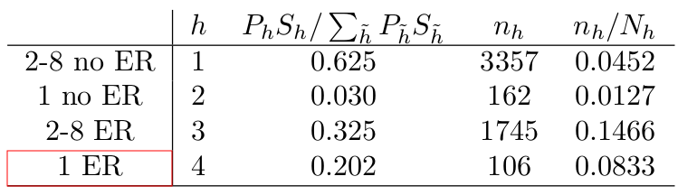

```{r, include=FALSE}
options(tinytex.verbose = TRUE)
```

```{r setup, include=FALSE}
knitr::opts_chunk$set(echo = FALSE)
```

## Recap on sampling designs

* Simple random sampling
  + Subdomain estimation ($n_j = \sum_{i=1}^n D_{ij}$ is random)
* Stratified sampling ($(n_1,\ldots, n_H)$ fixed)
  + SRS within strata
  + Proportional allocation
  + Optimal allocation
  + Neyman allocation (Optimal with equal costs)

## Neyman vs proportionate allocation

* In setting where an binary outcome is rare, stratification can results in substantial gains, if strata can be found where the outcome is more common.
* Ex: (simplified version of a collaboration that used this sort of analysis for the design):
  * To assess prevalence and predictors of injury risk, a study is planned of children aged 1-8 in passenger vehicle crashes using an insurance company claims database of 100,000 children in crashes.
  * Will sample from reported claims with children in vehicle, then contact for further information about crash, including determination of presence or absence of serious injury at the time of crash.
  * At the time of sampling, the only information available is the age of the child and whether or not s/he was transported to an emergency room.
  
## Example

Preliminary data is available from the National Automotive
Sampling System - Crashworthiness Data System (NASS-CDS), a
survey of towaway passenger vehicle crashes in the US. (This
study has relatively few children in its sample, with limited
covariates available for modeling injury risk. The goal is to design
a study that will provide much larger sample sizes and a richer set
of outcomes and covariates though the survey data collection, but
for the purposes of design it will do.)

## Example (ctd)

* The overall rate of serious injury for children 1-8 is p=2.3%.
* Preliminary analysis suggests that children aged 1 vs. 2 and older have significant differences in injury risk, children admitted to the ER have significant differences in injury risk, and that there is an interaction between these two factors. This suggests four strata (name, $h$, $P_h$, $p_h$, $S_h$:
```{r, out.width = "250px", fig.align='center'}
library(knitr)
include_graphics("./figs/l4_table1.pdf")
```

  
## Example (ctd)

* To complete the design, we need a target variance
* Assume the goal is to reduce the standard error of the estimator of the mean by a factor of $2$ over NASS-CDS
* Our preliminary analysis shows the SE of the overall estimate is $3.272 \times 10^{-3}$; hence we want a target variance of $0.003272^2/4 = 2.6765 \times 10^{-6}$

## Proposed sample design

```{r, out.width = "250px", fig.align='center'}
library(knitr)

```
* An SRS sample would require a sample of size of $pq/(2.6765 \times 10^{-6}) = 8791$, so use of stratified sampling with optimal allocation decreased the number of interviewers need by almost $40\%$ relative to SRS
* Proportionate sampling yields a sample size of $\sum_h P_h S_h^2 / (2.6765 \times 10^{-6}) = 7805$, so optimal allocation decreased the number of interviewers need by more than $30\%$ relative proportionate allocation

## Optimal allocation for contrasts

Consider two strata with means $\bar y_1$ and $\bar y_2$. The variance of the contrast $\bar y_1 - \bar y_2$ is
$$
V(\bar y_1 - \bar y_2) = V(\bar y_1) + V(\bar y_2) = \frac{S_1^2}{n_1^2} + \frac{S_1^2}{n_1^2}
$$
Above, we ignore FPC because it will be irrelevant in the optimizing equation again.

Our optimizing equation is now
$$
\phi (n_h) = \sum_{h=1}^2 S_h^2/n_h + \lambda \left( \sum_{h=1}^2 c_h n_h - C \right)
$$
where again $C = c_1 n_1 + c_2 n_2$ is the marginal cost of the interviews in the two strata.

## Optimal allocation for contrasts

$$
\frac{\partial \phi}{n_h} = - \frac{S_h^2}{n_h^2} + \lambda c_h \Rightarrow n_h = \frac{S_h}{\sqrt{\lambda c_h}}
$$

* If $c_1 = c_2$ then $n_h \propto S_h$.  If $S_1=S_2$ as well, then $n_1 = n_2$.
* This result motivates, at least informally, designs in which unequal probability of selection is used to under/oversample larger/small groups to yield more equally sized groups for analysis.
  + If $P_1 \gg P_2$ or vice-versa, this leads to conflict between optimizing estimation $\bar Y$ and $\bar Y_1 - \bar Y_2$
  + Typically a compromise is made
  
## Optimal allocation for contrasts

* If there are 3 or more strata with contrasts of interest, it becomes necessary to specify the precision required for different comparisons. One approach is to minimize the average variance of the differences:
$$
\bar V = \frac{2}{H} \sum_h \frac{S_h^2}{n_h}
$$
* Optimization yields $n_h \propto S_h / \sqrt{c_h}$

## Poststratification

- Often, there may be available information about certain characteristics in a population that cannot be accessed in a sampling frame.
  + A sampling frame of telephone numbers may not have information about the age and gender of the respondents, but age and gender distribution in the population is available from the Census.
* Or there may be some variables that are known in the frame, but set aside as less important for stratification.
* Similar to proportional allocation in estimation, except now the sample size $n_h$ in each poststratum is no longer fixed, but random.

## Poststratification

$$
y_{ps}  = \sum_{h=1}^H P_h \bar y = N^{-1} \sum_{h=1}^H N_h \bar y_h 
\quad \text{ for } \quad
\bar y_h = n_h^{-1} \sum_{i=1}^{n_h} y_{hi}
$$

* Example: We have a sample of 70 women and 30 men obtained from a survey of 50 households (we’ll ignore the clustering for the moment). Of the women, 5 indicated they did not have health insurance, versus 6 of the men.
* The Census indicated that 52% of the adult population is female. 
* Thus $\bar y_{ps} = .52 \times (5 / 70) + .48 \times (6 / 30) = .133$, versus $\bar y = .110$.

## Unbiasedness and variance

$$
\begin{aligned}
E[\bar y_{ps}] &= E [ E [ \bar y_{ps} \, | \, (n_1, \ldots, n_H) ] ] \\
&= E \left[ \sum_h P_h E \left [ \bar y_{h} \, | \, (n_1, \ldots, n_H) \right] \right] \\
&= E \left [ \sum_h P_h \bar Y_{h} \right] = E[\bar Y] = \bar Y
\end{aligned}
$$

## Variance

$$
\begin{aligned}
V(\bar y_{ps}) &= E ( V( \bar y_{ps} \, | \, (n_1, \ldots, n_H) ) ) + V( E ( \bar y_{ps} \mid (n_1,\ldots, n_H) )) \\
&= E \left[ \sum_h P_h^2 (1-f_h) \frac{S_h^2}{n_h} \right] + V(\bar Y) \\
&= E \left[ \sum_h P_h^2 \frac{S_h^2}{n_h} \right] - E \left[ \sum_h P_h \frac{S_h^2}{N} \right] \\
&= E \left[ \sum_h P_h^2 \frac{S_h^2}{n_h} \right] - E \left[ \sum_h P_h \frac{S_h^2}{N} \right] 
\end{aligned}
$$

* For large $n_h$, 

$$
\begin{aligned}
E \left( \frac{1}{n_h} \right) &\approx \frac{1}{n_h} \\
\Rightarrow V( \bar y_{ps} ) &\approx \sum_h P_h \frac{S_h^2}{n_h} - \sum_h P_h \frac{S_h^2}{N} = V(\bar y_{st})
\end{aligned}
$$

## More accurate variance approximation

* Taylor series approximations:

$$
\begin{aligned}
E [ f(X) ] &= E \left[ f(\mu) + f^\prime (\mu) (X-\mu) + \frac{f^{(2)}(\mu)}{2!} (X-\mu)^2 + \ldots \right] \\
&= f(\mu) + \sum_{k=2}^\infty \frac{f^{(k)}(\mu)}{k!} E[ (X - \mu)^k ]  \\
&\approx
f(\mu) + \frac{f^{(2)} (\mu)}{2!} V(X)
\end{aligned}
$$


## Application of Taylor series to current problem
Then for $f(x) = 1/x$ we have 

$$
\begin{aligned}
E [ \frac{1}{n_h} ] &\approx \frac{1}{n P_h} + \frac{1}{2!} \times \frac{2}{(nP_h)^3} \times (1-f) \times n P_h (1-P_h) \\
&= \frac{1}{nP_h} \left[ 1 +\frac{(1-f)(1-P_h)}{nP_h} \right]
\end{aligned}
$$

which implies

$$ \begin{aligned}
V(\bar y_{ps} ) &\approx \sum_h \frac{P_h^2 S_h^2}{nP_h} \left[ 1 +\frac{(1-f)(1-P_h)}{nP_h} \right] - \sum_h P_h S_h^2 / N \\
&= V(\bar y_{st}) + (1-f) \sum_h \frac{S_h^2(1-P_h)}{n^2} 
\end{aligned}
$$


## Proportionate versus Poststratification

* We have $V(\bar y_{ps}) > V(\bar y_{st})$ if the strata are available in the sampling frame for proportionate allocatoin, but $V (\bar y_{ps}) \leq V(\bar y)$ asymptotically for SRS
  +  Poststratification is also used for non-response adjustments,
under the assumption that non-response within the strata is
random.
  + Suppose in example we had approached 100 women and 100 men, and 70 women and 30 men had agreed to participate.
  + Since women appear to have a higher rate of insurance coverage than men, male non-response downwardly biases the SRS of the uninsured proportion.
  + Will discuss more later...
* Note that, unlike stratification, post-stratification adjustment is “optional”. Hence different measures can be used for poststratification adjustment for different variables.

## Subdomain estimation 

* Again, we might be interested in a subdomain analysis using a stratified sample.
* If $M_h$, the number of subdomain elements in stratum $h$, is known, this is equivalent to poststratification if proportionately allocated.
* Otherwise, if $M_h$ is unknown, we need to estimate

$$
\bar Y = M^{-1} \sum_h M_h \bar Y_h \quad \text{ using } \quad \frac{\sum_h \hat M_h \bar y_h}{\sum_h \hat M_h}
$$

## How to estimate $M_h$?

* Within a stratum, $E \left[ \frac{M_h}{m_h} \right] = \frac{N_h}{n_h}$ if SRS within stratum. So

$$
\bar y = \frac{ \sum_h (N_h/n_h) m_h \bar y_h}{\sum_h (N_h / n_h) m_h }
= \frac{ \sum_h (N_h/n_h) \sum_{i=1}^{m_h} y_{hi}}{\sum_h (N_h / n_h) m_h }
$$
is an unbiased estimator of $\bar Y$.

* If design is proportionate, then $n_h / N_h \equiv f$, and 

$$
\bar y_s = \frac{f^{-1}\sum_h \sum_i y_{hi} }{f^{-1} \sum_h m_h } = \frac{1}{m} \sum_h \sum_i y_{hi}
$$
the simple subdomain mean.

## What is the variance?

* Let $z_{hi} = \delta_{hi} (y_{hi} - \bar Y)$ where $\delta_{hi}$ is 1 if the ith element is in the subdomain and $0$ otherwise
* Then

$$
\bar y_s - \bar Y = \frac{1}{m} \sum_{h} \sum_i z_hi
$$

* Replace $m$ with its expectation $n M / N$ yields

$$
\bar y_s - \bar Y = \frac{N}{nM} \sum_h \sum_i z_{hi} = \frac{N \bar z}{M}
$$

## Variance calculation (ctd)

* Subtracting constant makes computation simple:
$$
\begin{aligned}
V(\bar y_s) &= V(\bar y_s - \bar Y) = \frac{N^2}{M^2} \sum_h P_h S_{h(z)}^2 / n
\end{aligned}
$$
where
$$
\begin{aligned}
S_{h(z)}^2 &= \left( \sum_{i} Z_{hi}^2 - \left( \sum_i Z_{hi} \right)^2 / N_h \right) / (N_h - 1) \\
&\approx N_h^{-1} \left( \sum_i Z_{hi}^2 - \left( \sum_i Z_{hi} \right)^2 / N_h \right)
\end{aligned}
$$

## Variance calculation (ctd)

$$
\begin{aligned}
V(\bar y_s) &\approx \frac{N^2}{nM^2} (1-f) \sum_h \frac{N_h}{N} \frac{1}{N_h} \left( \sum_i Z_{hi}^2 - \left( \sum_i Z_{hi} \right)^2 / N_h \right)  \\
&= \frac{N}{nM^2} (1-f) \left( \sum_i Z_{hi}^2 - \left( \sum_i Z_{hi} \right)^2 / N_h \right)
\end{aligned}
$$


$$
\begin{aligned}
\sum_h \sum_i Z_{hi}^2 &= \sum_h \sum_i (Y_{hi} - \bar Y )^2 =  \sum_h \sum_i (Y_{hi} - \bar Y_h + \bar Y_h - \bar Y )^2 \\
&= \sum_h \sum_i (Y_{hi} - \bar Y_h )^2  + \sum_h M_h (\bar Y_h - \bar Y)^2 \\
&+ 2 \underbrace{\sum_i \sum_h (Y_{hi} - \bar Y_h) (\bar Y_h - \bar Y)}_{=0}
\end{aligned}
$$

## Variance calculation (ctd)

$$
\begin{aligned}
V(\bar y_s) &= \frac{N}{nM^2} \frac{N-n}{N} \bigg ( \sum_h \sum_i (Y_{hi} - \bar Y_h)^2 \\
&+ \sum_h M_h \left( 1 - \frac{M_h}{N_h} \right) ( \bar Y_h - \bar Y )^2 \bigg) \\
&= \frac{1}{M^2} \left[ \frac{N}{n} - 1 \right] \bigg( \sum_h \sum_i (Y_{hi} - \bar Y_h)^2 \\
&+ \sum_h M_h \left( 1 - \frac{M_h}{N_h} \right) ( \bar Y_h - \bar Y )^2 \bigg) 
\end{aligned}
$$


## Variance under proportionate allocation

Under proportionate allocation, $\frac{m}{M} \approx \frac{n}{N}$ and 

$$
\begin{aligned}
V(\bar y_s ) &\approx \frac{1}{M^2} \left[ \frac{M}{m} - 1 \right] \bigg( \sum_h \sum_i (Y_{hi} - \bar Y_h)^2 \\
&+ \sum_h M_h \left( 1 - \frac{M_h}{N_h} \right) ( \bar Y_h - \bar Y )^2 \bigg) \\
&\approx (1-f) \frac{1}{mM} \bigg( \sum_h \sum_i (Y_{hi} - \bar Y_h)^2 \\
&+ \sum_h M_h \left( 1 - \frac{M_h}{N_h} \right) ( \bar Y_h - \bar Y )^2 \bigg) 
\end{aligned}
$$


## Discussion of variance

* The first term is approximately the variance of a proportionate stratified design with $m_h$ elements sampled
* The second term is the loss from the subclass analysis
* If $M_h/N_h \to 1$ the second term approaches $0$ so the variance approximates that of proportionate stratification
* If $M_h/N_h \to 0$ then 

$$
\begin{aligned}
&\sum_h \sum_i (Y_{hi} - \bar Y)^2 + \sum_h M_h \left( 1 - \frac{M_h}{N_h} \right) (\bar Y_h - \bar Y)^2 \\
&\to
\sum_h \sum_i (Y_{hi} - \bar Y)^2 + \sum_h M_h (\bar Y_h - \bar Y)^2 \\
&\sum_h \sum_i (Y_{hi} - \bar Y)^2 + \sum_h M_h (\bar Y_h - \bar Y)^2 =
\sum_i \sum_h (Y_{hi} - \bar Y)^2 = M S^2
\end{aligned}
$$
and thus $V(\bar y_s) \to (1-f) S^2 /m$ which is the SRS variance.

## Equal-size cluster sampling

* Often obtaining a sampling frame containing the individual units of interest may be difficult.
  + There are no listings of US adults; there are, however, listings of household addresses that are approximately complete (and can be made moreso by review, either “on foot” or, where possible, using Google Earth).
  + Similarly, it might be more convenient to list classes in a school rather
than students; nursing homes rather than patients; etc.
* For ease of exposition, we are going to assume for the moment
that
  + Once a cluster is sampled, all of the elements in that clusters are also
sampled (may or may not be practical or efficient).
  + All clusters are of equal size.
  + Clusters are sampled via SRS without replacement.

## Notation

* $i=1,\ldots, K$ clusters in the population
* $i=1,\ldots, k$ clusters in the sample
* $j=1,\ldots, M$ units in each cluster $(M \geq 2$)
* Total number of units in the population: $N=KM$
* Total number of units in the sample: $n=kM$
* $Y_{ij}$ is the observation associated with the $j$th unit in the $i$th cluster
* $\bar Y_i = M^{-1} \sum_j Y_{ij}$ is the mean of the $i$th cluster
* $\bar Y = K^{-1} \sum_i \bar Y_i = (KM)^{-1} \sum_{i=1}^K \sum_{j=1}^M Y_{ij}$

## Example

```{r, out.width = "250px", fig.align='center'}
library(knitr)
include_graphics("./figs/l5_table2.png")
```

## Example

```{r, out.width = "250px", fig.align='center'}
library(knitr)
include_graphics("./figs/l5_table3.png")
```

## Estimator and variance

* Since all elements in the cluster are observed if a cluster is sampled, $\bar y_i = \bar Y_i$
* I.e., the observed cluster mean is the population mean
* Hence $(\bar y_1, \ldots, \bar y_k)$ can be viewed as an SRS sample from $(\bar Y_1, \ldots, \bar Y_K)$
* So that $\bar y_c = k^{-1} \sum_{i=1}^k \bar y_i = n^{-1} \sum_i \sum_j y_{ij}$ is unbiased for $\bar Y$
with variance 

$$
\frac{(1-f_K) S_K^2}{k}  = \frac{K-k}{K} \times \frac{1}{k} \times \frac{1}{K-1} \sum_i (\bar Y_i - \bar Y)^2
$$

* And $s_k^2 = (k-1)^{-1} \sum_i (\bar y_i - \bar y)^2$ is an unbiased estimator for $S_K^2$

## Design effect and intraclass correlation $\rho$

$$
\begin{aligned}
\sum_i (\bar Y_i - \bar Y)^2 &= \sum_i \left[ \frac{1}{M} \sum_j ( Y_{ij} - \bar Y ) \right]^2 \\
&= \frac{1}{M^2} \left [ \sum_i \sum_j ( Y_{ij} - \bar Y )^2 + \sum_i \sum_{j \neq l} \sum_l (Y_{ij} - \bar Y) (Y_{il} - \bar Y) \right] \\
&= \frac{1}{M^2} \left [ (KM-1) S^2 + \sum_i \sum_{j \neq l} \sum_l (Y_{ij} - \bar Y) (Y_{il} - \bar Y) \right] \\
\end{aligned}
$$


## Intraclass correlation

The finite population between-cluster covariance is given by
$$
E[ (Y_{ij} - \bar Y) (Y_{il} - \bar Y) ] = \frac{1}{KM(M-1)} \sum_i \sum_{j \neq l} \sum_l (Y_{ij} - \bar Y) ( Y_{il} - \bar Y )
$$
and the _intraclass correlation_ $\rho$ by
$$
\rho = \frac{E(Y_{ij} - \bar Y)(Y_{il} - \bar Y)}{E (Y_{ij} - \bar Y)^2} = \frac{}{}
$$


## JITT

* Poststratification analysis of the ideology
* Define strata by 
  + Gender
  + Marriage status
  + Joint
* Estimate mean ideology and variance under poststratification and the SRS