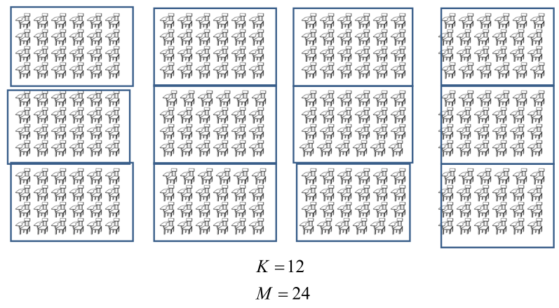
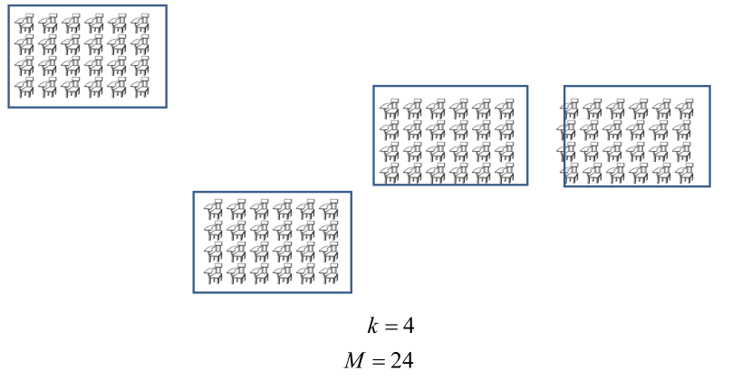

```{r setup, include=FALSE}
knitr::opts_chunk$set(echo = FALSE)
```

```{r brexit, echo = FALSE, include = FALSE}
# install packages
if(!require('dslabs')){install.packages('dslabs')}
if(!require('tidyverse')){install.packages('tidyverse', dependencies = TRUE)}
if(!require('ggrepel')){install.packages('ggrepel')}
if(!require('matrixStats')){install.packages('matrixStats')}

# load libraries
library(dslabs)
library(tidyverse)
library(ggrepel)
library(matrixStats)
```

## JITT: Pew 2008 opinion poll 

```{r pew, echo = FALSE}
library(foreign)
data <- read.dta("../pew_research_center_june_elect_wknd_data.dta")
data <- data[!is.na(data$ideo ),]
data <- data[!is.element(data$ideo, c("missing/not asked", "dk/refused")),]
data$ideo_numeric = (data$ideo == 'very conservative')*2 + (data$ideo == 'conservative')*1 + (data$ideo == 'moderate')*0 + (data$ideo == 'liberal')*(-1) + (data$ideo == 'very liberal')*(-2)

data %>%  ggplot(aes(ideo_numeric)) +
  geom_bar(aes(y = (..count..)/sum(..count..)), data=subset(data,survey == 'sept08forpoli'), fill = "blue", alpha = 0.2) +
  geom_bar(aes(y = (..count..)/sum(..count..)), data=subset(data,survey == 'electwkend08'), fill = "red", alpha = 0.2) +
  geom_bar(aes(y = (..count..)/sum(..count..)), data=subset(data,survey == 'june08voter'), fill = "green", alpha = 0.2) +
  xlab("Ideological buckets") +
  ylab("Frequency") +
  labs(color = "Ideology type") +
  ggtitle("Ideology response from 3 Pew 2008 surveys")
```

## JITT: SRS estimator

```{r srspew, echo = FALSE}

total_USpop = 329450000
frac_eighteenplus = 0.77
N = total_USpop * frac_eighteenplus
bary = mean(data$ideo_numeric)
n = length(data$ideo_numeric)
f = n/N
s.sq = var(data$ideo_numeric)
var.srs = (1-f)*s.sq/n

datafracs = summary(data$sex)/length(data$sex)

census_female = 0.52

bary_male=mean(data$ideo_numeric[data$sex == 'male'])
s.sq_male=var(data$ideo_numeric[data$sex == 'male'])
bary_female=mean(data$ideo_numeric[data$sex == 'female'])
s.sq_female=var(data$ideo_numeric[data$sex == 'female'])

psbary = bary_male * (1-census_female) + bary_female*census_female

strvar = (census_female * s.sq_female) / n + ((1-census_female) * s.sq_male) / n  
adjfac = (1-f)* (s.sq_female*(1-census_female)/n^2+s.sq_male*(census_female)/n^2)
ps_var = strvar+adjfac
deff = (var.srs-ps_var)/ps_var
```

* Mean under SRS: `r round(bary,3)`
* Variance under SRS: `r round(var.srs,7)`
* US Census: 52\% female
* Mean under PS: $0.52 \cdot `r round(bary_female,3)` + 0.48 \cdot `r round(bary_male,3)` = `r round(psbary,3)`$
* Variance under PS: $`r round(strvar,7)` + `r round(adjfac,11)` = `r round(ps_var,7)`$

$$
V(\bar y_{ps} ) \approx \sum_h \frac{P_h^2 S_h^2}{nP_h} \left[ 1 +\frac{(1-f)(1-P_h)}{nP_h} \right] - \sum_h P_h S_h^2 / N
$$

* deff: `r deff`
* Benefit is quite small!

## Subdomain estimation 

* Stratified sample: know $N$, $N_h$ for $h=1,\ldots, H$
* We are interested in a subdomain analysis using the stratified sample.
* $M_h$: number of subdomain elements in stratum $h$
* $M = \sum_h M_h$
* If known, then estimator is similar estimator to population average
$$
\bar Y = \sum_h \left( \frac{N_h}{N} \right) \bar Y_h \to \bar Y = \sum_h \left( \frac{M_h}{M} \right) \bar Y_h
$$
where $\bar Y_h$ is the subdomain estimator from previous lecture.
* If unknown, then need to estimate $\hat M_h$

## How to estimate $M_h$?

* $m_h \leq n_h$: number of observed individuals in subdomain
* Stratified sampling: $N_h$, $N$, $n_h$, $n$ all __known__ and __fixed__; $M_h$ __unknown__ and __fixed__
* Stratified sampling: We __observe__ $m_h$ in subdomain in the sample $n_h$ but it is __random__
* Key idea: 
$$E \left[ m_h \right] = \frac{M_h}{N_h} \cdot n_h,$$  
so then an unbiased estimator is given by
$$\hat M_h = \frac{N_h}{n_h} m_h$$
* Easily extend to estimator for $M$: $\hat M = \sum_h \hat M_h$

## How to esimate $\bar y$?

* Estimator is given by
$$
\bar y = \frac{ \sum_h \hat M_h \bar y_h}{\sum_h \hat M_h } = \frac{ \sum_h (N_h/n_h) m_h \bar y_h}{\sum_h (N_h / n_h) m_h }
= \frac{ \sum_h (N_h/n_h) \sum_{i=1}^{m_h} y_{hi}}{\sum_h (N_h / n_h) m_h }
$$
is an unbiased estimator of $\bar Y$.

* If design is proportionate, then $n_h / N_h \equiv f$, and 

$$
\bar y_s = \frac{f^{-1}\sum_{h=1}^H \sum_{i=1}^{m_h} y_{hi} }{f^{-1} \sum_h m_h } = \frac{1}{m} \sum_{h=1}^H \sum_{i=1}^{m_h} y_{hi}
$$
the simple subdomain mean.

## What is the variance?

* Let $z_{hi} = \delta_{hi} (y_{hi} - \bar Y)$ where $\delta_{hi}$ is 1 if the ith element is in the subdomain and $0$ otherwise 
* By definition, $m_h = \sum_i \delta_{hi}$ and $m = \sum_h \sum_i \delta_{hi}$; then

$$
\bar y_s - \bar Y = \frac{1}{m} \sum_{h=1}^H \sum_{i=1}^{{\bf n_h}} z_{hi}
$$

* Simple approach: replace $m$ with its expectation $n M / N$ yields

$$
\bar y_s - \bar Y = \frac{N}{nM} \sum_{h=1}^H \sum_{i=1}^{n_h} z_{hi} = \frac{N \bar z}{M}
$$

## Variance calculation (ctd)

* Subtracting constant makes computation simple:
$$
\begin{aligned}
V(\bar y_s) &= V(\bar y_s - \bar Y) = \frac{N^2}{M^2} (1-f) \sum_h P_h S_{h(z)}^2 / n
\end{aligned}
$$
where
$$
\begin{aligned}
S_{h(z)}^2 &= \left( \sum_{i=1}^{N_h} Z_{hi}^2 - \left( \sum_{i=1}^{N_h} Z_{hi} \right)^2 / N_h \right) / (N_h - 1) \\
&\approx N_h^{-1} \left( \sum_i Z_{hi}^2 - \left( \sum_i Z_{hi} \right)^2 / N_h \right)
\end{aligned}
$$

## Variance calculation (ctd)

$$
\begin{aligned}
V(\bar y_s) &\approx \frac{N^2}{nM^2} (1-f) \sum_h \frac{N_h}{N} \frac{1}{N_h} \left( \sum_i Z_{hi}^2 - \left( \sum_i Z_{hi} \right)^2 / N_h \right)  \\
&= \frac{N}{nM^2} (1-f) \sum_h \left( \sum_i Z_{hi}^2 - \left( \sum_i Z_{hi} \right)^2 / N_h \right)
\end{aligned}
$$

## Variance calculation (ctd)

$$
\begin{aligned}
\sum_h \sum_i Z_{hi}^2 &= \sum_h \sum_i (Y_{hi} - \bar Y )^2 =  \sum_h \sum_i (Y_{hi} - \bar Y_h + \bar Y_h - \bar Y )^2 \\
&= \sum_h \sum_i (Y_{hi} - \bar Y_h )^2  + \sum_h M_h (\bar Y_h - \bar Y)^2 \\
&+ 2 \underbrace{\sum_i \sum_h (Y_{hi} - \bar Y_h) (\bar Y_h - \bar Y)}_{=0}
\end{aligned}
$$

$$
\sum_h \left( \sum_i Z_{hi} \right)^2 / N_h = \sum_h \left( \sum_i (Y_{hi} - \bar Y ) \right)^2 / N_h = 
\sum_h M_h (\bar Y_h - \bar Y)^2 / N_h
$$

## Variance calculation (ctd)

$$
\begin{aligned}
V(\bar y_s) &= \frac{N}{nM^2} \frac{N-n}{N} \bigg ( \sum_h \sum_i (Y_{hi} - \bar Y_h)^2 \\
&+ \sum_h M_h \left( 1 - \frac{M_h}{N_h} \right) ( \bar Y_h - \bar Y )^2 \bigg) \\
&= \frac{1}{M^2} \left[ \frac{N}{n} - 1 \right] \bigg( \sum_h \sum_i (Y_{hi} - \bar Y_h)^2 \\
&+ \sum_h M_h \left( 1 - \frac{M_h}{N_h} \right) ( \bar Y_h - \bar Y )^2 \bigg) 
\end{aligned}
$$


## Variance under proportionate allocation

Under proportionate allocation, $\frac{m}{M} \approx \frac{n}{N}$ and 

$$
\begin{aligned}
V(\bar y_s ) &\approx \frac{1}{M^2} \left[ \frac{M}{m} - 1 \right] \bigg( \sum_h \sum_i (Y_{hi} - \bar Y_h)^2 \\
&+ \sum_h M_h \left( 1 - \frac{M_h}{N_h} \right) ( \bar Y_h - \bar Y )^2 \bigg) \\
&\approx (1-f) \frac{1}{mM} \bigg( \sum_h \sum_i (Y_{hi} - \bar Y_h)^2 \\
&+ \sum_h M_h \left( 1 - \frac{M_h}{N_h} \right) ( \bar Y_h - \bar Y )^2 \bigg) 
\end{aligned}
$$


## Discussion of variance

* The first term is approximately the variance of a proportionate stratified design with $m_h$ elements sampled
* The second term is the loss from the subclass analysis
* If $M_h/N_h \to 1$ the second term approaches $0$ so the variance approximates that of proportionate stratification
* If $M_h/N_h \to 0$ then 

$$
\begin{aligned}
&\sum_h \sum_i (Y_{hi} - \bar Y)^2 + \sum_h M_h \left( 1 - \frac{M_h}{N_h} \right) (\bar Y_h - \bar Y)^2 \\
&\to
\sum_h \sum_i (Y_{hi} - \bar Y)^2 + \sum_h M_h (\bar Y_h - \bar Y)^2 \\
&\sum_h \sum_i (Y_{hi} - \bar Y)^2 + \sum_h M_h (\bar Y_h - \bar Y)^2 =
\sum_i \sum_h (Y_{hi} - \bar Y)^2 = M S^2
\end{aligned}
$$
and thus $V(\bar y_s) \to (1-f) S^2 /m$ which is the SRS variance.

## Equal-size cluster sampling

* Often obtaining a sampling frame containing the individual units of interest may be difficult.
  + There are no listings of US adults; there are, however, listings of household addresses that are approximately complete (and can be made moreso by review, either “on foot” or, where possible, using Google Earth).
  + Similarly, it might be more convenient to list classes in a school rather
than students; nursing homes rather than patients; etc.
* For ease of exposition, we are going to assume for the moment
that
  + Once a cluster is sampled, all of the elements in that clusters are also
sampled (may or may not be practical or efficient).
  + All clusters are of equal size.
  + Clusters are sampled via SRS without replacement.

## Notation

* $i=1,\ldots, K$ clusters in the population
* $i=1,\ldots, k$ clusters in the sample
* $j=1,\ldots, M$ units in each cluster $(M \geq 2$)
* Total number of units in the population: $N=KM$
* Total number of units in the sample: $n=kM$
* $Y_{ij}$ is the observation associated with the $j$th unit in the $i$th cluster
* $\bar Y_i = M^{-1} \sum_j Y_{ij}$ is the mean of the $i$th cluster
* $\bar Y = K^{-1} \sum_i \bar Y_i = (KM)^{-1} \sum_{i=1}^K \sum_{j=1}^M Y_{ij}$

## Example

```{r, out.width = "250px", fig.align='center'}
library(knitr)
 # place holder
```

## Example

```{r, out.width = "250px", fig.align='center'}
library(knitr)
 # place holder
```

## Estimator and variance

* Since all elements in the cluster are observed if a cluster is sampled, $\bar y_i = \bar Y_i$
* I.e., the observed cluster mean is the population mean
* Hence $(\bar y_1, \ldots, \bar y_k)$ can be viewed as an SRS sample from $(\bar Y_1, \ldots, \bar Y_K)$
* So that $\bar y_c = k^{-1} \sum_{i=1}^k \bar y_i = n^{-1} \sum_i \sum_j y_{ij}$ is unbiased for $\bar Y$
with variance 

$$
\frac{(1-f_K) S_K^2}{k}  = \frac{K-k}{K} \times \frac{1}{k} \times \frac{1}{K-1} \sum_i (\bar Y_i - \bar Y)^2
$$

* And $s_k^2 = (k-1)^{-1} \sum_i (\bar y_i - \bar y)^2$ is an unbiased estimator for $S_K^2$

## Design effect and intraclass correlation $\rho$

$$
\begin{aligned}
\sum_i (\bar Y_i - \bar Y)^2 &= \sum_i \left[ \frac{1}{M} \sum_j ( Y_{ij} - \bar Y ) \right]^2 \\
&= \frac{1}{M^2} \left [ \sum_i \sum_j ( Y_{ij} - \bar Y )^2 + \sum_i \sum_{j \neq l} (Y_{ij} - \bar Y) (Y_{il} - \bar Y) \right] \\
&= \frac{1}{M^2} \left [ \underbrace{(KM-1)}_{N-1} S^2 + \sum_i \sum_{j \neq l} (Y_{ij} - \bar Y) (Y_{il} - \bar Y) \right] \\
\end{aligned}
$$


## Intraclass correlation

The finite population between-cluster covariance is given by
$$
E[ (Y_{ij} - \bar Y) (Y_{il} - \bar Y) ] = \frac{1}{KM(M-1)} \sum_i \sum_{j \neq l} (Y_{ij} - \bar Y) ( Y_{il} - \bar Y )
$$
and the _intraclass correlation_ $\rho$ by
$$
\begin{aligned}
\rho &= \frac{E(Y_{ij} - \bar Y)(Y_{il} - \bar Y)}{E (Y_{ij} - \bar Y)^2} \\
&= \frac{\frac{1}{KM(M-1)} \sum_i \sum_{j \neq l} \sum_l (Y_{ij} - \bar Y) (Y_{il} - \bar Y)}{\frac{1}{KM} \sum_i \sum_l (Y_{ij} - \bar Y)^2} \\
&= \frac{\sum_i \sum_{j \neq l} \sum_l (Y_{ij} - \bar Y) (Y_{il} - \bar Y)}{(KM-1)(M-1) S^2} \\
\end{aligned}
$$

## Design effect and intraclass correlation $\rho$

* Re-writing in terms of $\rho$:

$$
\sum_{i=1}^{K} (\bar Y_i - \bar Y)^2 = \frac{1}{M^2} \left[ (KM-1) S^2 + (KM-1)(M-1)S^2 \rho \right]
$$
and 
$$
S_k^2 = \frac{1}{K-1} \sum_{i=1}^K \left( \bar Y_i  - \bar Y \right)^2 = \frac{KM-1}{(K-1)M^2} S^2 \left[ 1 + (M-1) \rho \right]
$$

* Therefore
$$
\begin{aligned}
V(\bar y_c) &= \left(1 - \frac{k}{K} \right) \frac{S_k^2}{k} \\
&=\left(1 - \frac{k}{K} \right) \frac{S^2}{k} \frac{KM-1}{(K-1)M^2} \left[ 1 + (M-1) \rho \right]
\end{aligned}
$$

## Overall variance

$$
\begin{aligned}
V(\bar y_c) &=\left(1 - \frac{k}{K} \right) \frac{S^2}{k} \frac{KM-1}{(K-1)M^2} \left[ 1 + (M-1) \rho \right] \\
&=\left(1 - \frac{k}{K} \right) \frac{S^2}{kM} \frac{KM-1}{(KM-M} \left[ 1 + (M-1) \rho \right] \\
&=\left(1 - \frac{n}{N} \right) \frac{S^2}{n} \frac{KM-1}{KM-M} \left[ 1 + (M-1) \rho \right] \\
&\approx\left(1 - \frac{n}{N} \right) \frac{S^2}{n} \left[ 1 + (M-1) \rho \right] \\
&= V(\bar y_{SRS}) \left[ 1 + (M-1) \rho \right]
\end{aligned}
$$

## Population anova table

* Between clusters:
  + SS: $M \sum_i (\bar Y_i - \bar Y)^2$
  + df: $K-1$
  + MS: $M S_k^2$
* Within clusters
  + SS: $\sum_i \sum_j (Y_{ij} - \bar Y_i)^2$
  + df: $KM-K$
  + MS: $S_w^2$
* Total
  + SS: $\sum_i \sum_j (Y_{ij} - \bar Y)^2$
  + df: $KM-K+K-1 = KM-1$
  + MS: $S^2$
 
## Connection between $S^2$ and $S_w^2$

$$ 
\begin{aligned}
&(KM-1) S^2 = (K-1) M S_k^2 + K(M-1) S_w^2 \\
= &\frac{(K-1)M(KM-1)}{(K-1)M^2} S^2 \left[ 1+ (M-1) \rho \right] + K(M-1) S_w^2 \\
= &\frac{(KM-1)}{M} S^2 \left[ 1+ (M-1) \rho \right] + K(M-1) S_w^2 \\
\Rightarrow  &(KM-1) \left[ 1 - \frac{1 + (M-1)\rho}{M} \right] = K(M-1) S_w^2 \\
\Rightarrow  &\frac{(KM-1)(M-1)}{M} S^2 (1-\rho) = K(M-1) S_w^2 \\
\Rightarrow  &\frac{KM-1}{KM} S^2 (1-\rho) = S_w^2 \\
\Rightarrow  &S^2 (1-\rho) \approx S_w^2
\end{aligned}
$$

## Design effects in equal-size cluster sampling

The deff for equal-size cluster sampling is given by

$$
deff = \frac{V(\bar y_c)}{ V(\bar y_{SRS})} \approx \frac{V(\bar y_{SRS})(1+(M-1)\rho)}{V(\bar y_{SRS})} = [1+(M-1)\rho]
$$

* $deff < 1$ when $\rho < 0$ (ex: gender in a household)
* $deff > 1$ when $\rho > 0$ (ex: race in a household)
* Minimized when $1+ (M-1) \rho = 0$ which is equivalent to $\rho = - \frac{1}{M-1}$
* Maximized when $\rho = 1$: $deff = M$

## Intercorrelation discussion

* The large majority of the time $\rho > 0$, so that cluster sampling is statistically inefficient relative to SRS
  +   Compare this with stratified sampling. Both approaches have units sampled within a larger grouping. Why is cluster sampling less efficient and stratified sampling more efficient than SRS when there is within-group homogeneity?
* Also, even small values of $\rho$ can lead to large design effects if $M$ is large
* If $\rho$ is small but $M$ is large, take smaller within-cluster samples $(m<M)$ and more clusers $k^\prime = \frac{n}{m} > \frac{n}{M} = k$ (will discuss soon).

## Estimating intraclass correlation

* Direct computation of $\rho$ gets difficult in most practical settings, where there are unequal clusters sizes and or three or more stages of sampling.
* However, a synthetic $\rho$ can still be computed as 
$$ \rho = \frac{deff -1}{\bar M - 1}$$
where  $\bar M$ is the mean number of units per the (highest-level) cluster.

## Intraclass correlation and confidence intervals, sample size

* Using $\rho$ a quick confidence interval for a mean can be computed from any cluster:
$$
\bar y_c \pm t_{(0.975, k-1)} \sqrt{[1+(M-1)\rho]s^2/n}
$$

* Using an estimate of $\rho$, sample sizes computed under SRS can be adjusted:
$$
n = [1+(M-1)\rho] n_{SRS}
$$


## JITT

* Take a look at latest polls 2 Iowa polls
* Try and understand the methodology. Discuss in diary
* If $f$ is small, the proportions variance is bounded above by $0.5/\sqrt{n}$
* Emerson sample size $n= 207 \to 0.5/\sqrt{207} = 3.5\%$ but report is $\pm 6.2 \%$, why?
```{r, out.width = "250px", fig.align='center'}
library(knitr)
 # place holder
```

