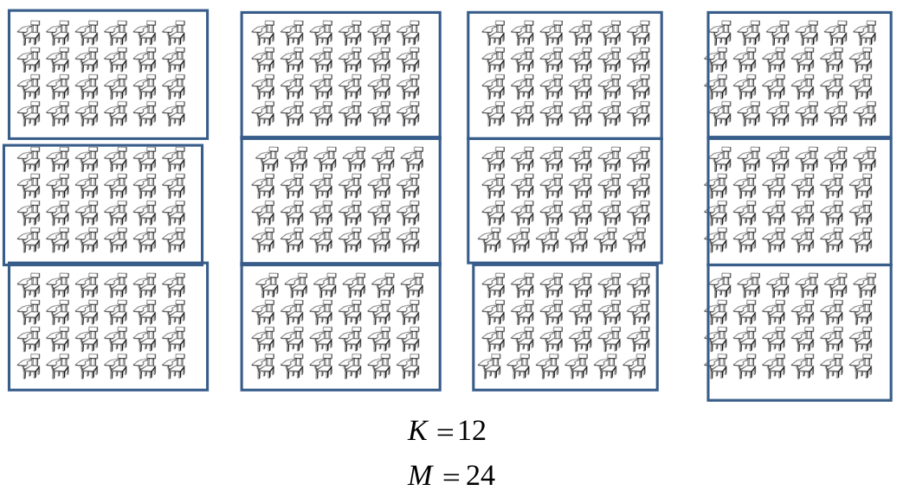
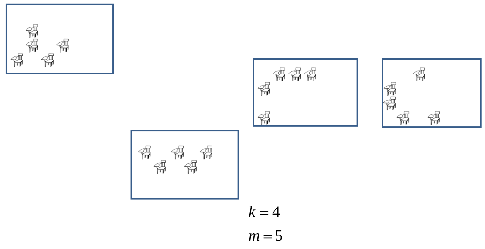

```{r setup, include=FALSE}
knitr::opts_chunk$set(echo = FALSE)
```

```{r brexit, echo = FALSE, include = FALSE}
# install packages
if(!require('dslabs')){install.packages('dslabs')}
if(!require('tidyverse')){install.packages('tidyverse', dependencies = TRUE)}
if(!require('ggrepel')){install.packages('ggrepel')}
if(!require('matrixStats')){install.packages('matrixStats')}

# load libraries
library(dslabs)
library(tidyverse)
library(ggrepel)
library(matrixStats)
```

## JITT:

* How would you use poststratification on age to adjust for phone type (landline or cell) in polling?
* Try and apply proposal to Pew using ideology as the outcome.

## Systematic sampling

* Always starting at the first element means that only a single sample can be obtained from the population – no sampling variability.
* Choose a random start $r$ between $1$ and $k$: select elements $Y_r, Y_{r+k}, \ldots, Y_{r+(n-1)k}$
  + $k$ possible samples, all with equal probability of selection $1/k$

## Expectation of $\bar y_{sys}$

The mean is unbiased:
$$
\bar y_{sys} = \sum_{i=1}^k I(i \in s) \bar y_i = \sum_{i=1}^k I(i \in s) \left[ \frac{1}{n} \sum_{j=1}^n Y_{i+(j-1)k}] \right]
$$
so
$$
E[\bar y_{sys}] = \sum_{i=1}^k E[I(i \in s)] \bar y_i = \sum_{i=1}^k \frac{1}{k} \left[ \frac{1}{n} \sum_{j=1}^n Y_{i+(j-1)k}] \right] = \bar Y.
$$

## Variance of $\bar y_{sys}$

* Systematic sampling is cluster sampling with one cluster.
* Reverting to the notation of the systematic sampling slides, we have
$$
\begin{aligned}
V(\bar y_c) &= \left ( 1 - \frac{1}{k} \right) \frac{S^2}{n} \frac{nk-1}{n(k-1)} \left[ 1 + (n-1) \rho \right] \\
&=\frac{S^2}{n} \frac{nk-1}{nk} \left[ 1 + (n-1) \rho \right]
\end{aligned}
$$

* PROBLEM!
* With only a single cluster, we have no information to estimate $\rho$.
* Have to make some (modeling) assumptions.

## Assuming a random order

* If we assume that there is no within-cluster correlation, systematic sample is equivalent to SRS:
$$
\begin{aligned}
V(\bar y_{sys}) &= \frac{S^2}{n} \frac{nk-1}{nk} \\
&= \left( 1 - \frac{1}{k} \right) \frac{S^2}{n} \left( \frac{k}{k-1} \right) \left(  \frac{nk-1}{nk} \right) \\
&= V(\bar y_{srs} ) \left( \frac{k}{k-1} \right) \left(  \frac{nk-1}{nk} \right) \\
&= V(\bar y_{srs} ) \left(  \frac{nk-1}{n(k-1)} \right) \\
\end{aligned}
$$
So as $nk= N \to \infty$ for fixed $n$, $V(\bar y_{sys}) \to V(\bar y_{srs})$

## Assuming a stratified order: paired selections model

* Very often, the list is ordered in some fashion.
  + Date of birth (approx. random)
  + Alphabetical by last name (might be some stratification by ethnicity)
  + Categorization (NAICS codes for business)
  + Size measure: population of county, number of employees in a business
* Treat as one selection per stratum and collapse together using collapsed strata variance estimator:
* $y_1,y_2 \to y_{11}, y_{21}$ and so on
* Variance is $v(\bar y_{str}) = \frac{1-f}{n^2} \sum_{j=1}^{n/2} \frac{(y_{j1}-y_{j2})^2}{2}$

## Assuming a stratified order: paired selections model

$$
\begin{aligned}
E[ (\bar y_{j1} - \bar y_{j2})^2] &= E \left[  (\bar Y_{j1} - \bar Y_{j2})^2 +  (\bar y_{j1} - \bar Y_{j1})^2 +  (\bar Y_{j2} - \bar y_{j2})^2 \right] \\
&= (\bar Y_{j1} - \bar Y_{j2})^2 +  E \left [ (\bar y_{j1} - \bar Y_{j1})^2 \right] + E \left[ (\bar Y_{j2} - \bar y_{j2})^2 \right] \\
&= (\bar Y_{j1} - \bar Y_{j2})^2 +  \frac{N_{j1}-1}{N_{j1}} S_{j1}^2  + \frac{N_{j2}-1}{N_{j2}} S_{j2}^2\\
\end{aligned}
$$
So
$$
E[ v(\bar y_{sys})] = \frac{1-f}{n^2} \left( \sum_{j=1}^{n/2} \left( \bar Y_{j1} - \bar Y_{j2} \right)^2 + \sum_{h=1}^2 \frac{N_{jh} - 1}{N_{jh}} S_{jh}^2  \right)
$$

## Assuming a stratified order: successive differences model

* Now pair off successive elements: $\underbrace{(y_1, y_2), \ldots, (y_{n-1}, y_n)}_{n-1 \text{ pairs}}$
* Then 
$$
v(\bar y_{sys}) = \frac{1-f}{2 n (n-1)}  = \sum_{j=1}^{n-1} (y_j - y_{j+1})^2
$$
* For collapsed strata:
$$
\frac{1-f}{n^2} \sum_{j=1}^{n/2} \sum_{j=1}^{n/2} (y_{j1} - y_{j2})^2 = 
\frac{1-f}{2n} \left[ (n/2)^{-1} \sum_{j=1}^{n/2} \sum_{j=1}^{n/2} (y_{j1} - y_{j2})^2 \right] 
$$
* The final term is the mean of stratum variances
* If we replace with mean of the larger number of pairs then $n-1$ replaces $n/2$
  + Potentially more stable estimate.
  
## List periodicity

A practical issue of concern is _list periodicity_.
* Avoid sampling intervals that coincide with periodicity in the list.
  + Suppose there is a pairing of (heterosexual) spouses: HWHWHW. Even sampling interval will yield only men or only women, but an odd interval would work well.
  + Apartment block with 8 apartments per floor. Sampling interval of 8 gives same apartment on each floor, but an interval of 7 will work well.
  
## Non-integer intervals

* Our derivations have assumed that $N = kn$, that is $N/n$ is an integer.
* If $N/n$ is not an integer, then the sample size is random, equal to either $n$ or $n+1$, depending on the random start.
* Might ignore if $n$ is large, but there are methods to retain _epsem_ sampling for a fixed sample size $n$.

##  Option 1: Treat list as circular

* Rather than choose a random start $r$ in the interval $[1,k]$, choose random start across entire sampling frame
* Let $F = \left \lfloor \frac{N}{n} \right \rfloor$ and select observations $r+ Fj-l_j N$, $j=0,\ldots, n-1$ where $l_j = \left \lfloor \frac{r+Fj}{N} \right \rfloor$

##  Option 2

Use the correct fractional interval $F = N/n$ and round down: select observations $\left \lfloor \frac{r}{\lfloor F \rfloor + Fj} \right \rfloor$ for $j=0,\ldots,n-1$.

## NEW MATERIAL: Multi-stage sampling

* In many settings, it might be expensive/highly inefficient to take all elements in a sampled cluster.
* US area probability sample: a sample of counties (avg $\approx$ 40,000 households) or US Census blocks (avg. $\approx$ 1600 households) might be taken as the first stage of sampling.
* Sampling of clinics: review of all patients clinical records for a sampled clinic might be prohibitively expensive.
* Recall $deff$ for clustered samples: $1+(M-1)\rho$
  + As M increases, sample becomes less efficient for a fixed $\rho > 0$.
* Take sample of elements in a sampled cluster. 
* First stage of sample (cluster) is Primary Sampling Unit (PSU).

## Example

```{r, out.width = "250px", fig.align='center'}
library(knitr)
 # place holder
```

## Example

```{r, out.width = "250px", fig.align='center'}
library(knitr)
 # place holder
```

## Assumptions

* Equal number of elements per cluster
* SRS without replacement at second stage

## Unbiasedness

* Population mean
$$
\bar Y = \frac{1}{N} \sum_{i=1}^K \sum_{j=1}^M Y_{ij} = \frac{M}{N} \sum_{i=1}^K \frac{1}{M} \sum_{j=1}^M Y_{ij} = \frac{1}{K} \sum_{i=1}^K \bar Y_{i}
$$
* Sample mean:
$$
\bar y_c = \frac{1}{k} \sum_{i=1}^k \bar y_i =  \frac{1}{k} \sum_{i=1}^k \frac{1}{m} \sum_{j=1}^m y_{ij} = 
\frac{1}{n} \sum_{i=1}^k \sum_{j=1}^m y_{ij}
$$

* Sampling fraction $P(i \in s) P(j \in s \mid i \in s) = \frac{k}{K} \times \frac{m}{M} = \frac{n}{N} = f$
* SRS mean estimator still unbiased, since design is _epsem_.
$$
E[ \bar y_c ] = \frac{1}{n} \sum_{i=1}^K E \left[ I_{i} \sum_{j=1}^M I_{ij} Y_{ij} \right]
\frac{1}{n} \sum_{i=1}^K \sum_{j=1}^M E \left[ I_{i} I_{ij} \right] Y_{ij} =
\frac{1}{N} \sum_{i=1}^K \sum_{j=1}^M Y_{ij}
$$

## Sampling variance of mean from two-stage cluster sample

$$
\begin{aligned}
V(\bar y_c) = \left( 1 - \frac{k}{K} \right) \frac{S_1^2}{k} + \left( 1 - \frac{m}{M} \right) \frac{S_2^2}{n}
\end{aligned}
$$
where
$$
S_1^2 = \frac{\sum_{i=1}^{K} (\bar Y_i - \bar Y)^2}{K-1} 
\quad \text{ and } \quad
S_2^2 = \frac{\sum_{i=1}^{K} \sum_{j=1}^M (Y_{ij} - \bar Y_i)^2}{K(M-1)} 
$$

* This should be intuitive, but needs to be proven. 
* Key idea: treat as proportionately stratified sample and use
$$
V(\bar y_c) = E \left[ V(\bar y_c \mid i \in s ) \right] + V \left( E[ \bar y_c \mid i \in s ] \right)
$$
where treat chosen clusters as strata since we are fixing the clusters through conditioning.

## Proof begins

$$
V (\bar y_c \mid i \in s) = \frac{1-f}{n} \sum_{i=1}^K P_i S_i^2 = \left( 1 - \frac{m}{M} \right) \frac{1}{n} \sum_{i=1}^k \frac{1}{k} S_i^2
$$
where $S_i^2 = (M-1)^{-1} \sum_{j=1}^M (Y_{ij} - \bar Y_i)^2$. Then
$$
\begin{aligned}
E [ V(\bar y_c \mid i \in s) ] &= \left( 1 - \frac{m}{M} \right) \frac{1}{n} E \left( \sum_{i=1}^k \frac{1}{k} S_i^2 \right) \\
&= \left( 1 - \frac{m}{M} \right) \frac{1}{n} \frac{1}{K} \left( \sum_{i=1}^K S_i^2 \right) \\
&= \left( 1 - \frac{m}{M} \right) \frac{1}{n} \frac{1}{K(M-1)} \sum_{i=1}^K \sum_{j=1}^M (Y_{ij} - \bar Y_i)^2 \\
&= \left( 1 - \frac{m}{M} \right) \frac{S_2^2}{n}
\end{aligned}
$$

## Proof continues

$$
E[ \bar y_c \mid i \in s ] = \frac{1}{k} \sum_{i=1}^k \bar Y_i,
$$
then
$$
V( E [ \bar y_c \mid i \in s ] ) = \left( 1 - \frac{k}{K} \right) \frac{1}{k} \frac{1}{K-1} \sum_{i=1}^K (\bar Y_i - \bar Y_i )^2 = \left(1-\frac{k}{K} \right) \frac{S_1^2}{k}.
$$
Thus
$$
V(\bar y_c) = \underbrace{\left( 1 - \frac{k}{K} \right) \frac{S_1^2}{k}}_{\text{first stage variance}} + \underbrace{\left( 1 - \frac{m}{M} \right) \frac{S_2^2}{n}}_{\text{second stage variance}} 
$$

## Estimating sampling variance of mean from two-stage cluster sample

* Need to estimate $S_1^2$ and $S_2^2$

$$
s_2^2 = \frac{1}{k(m-1)} \sum_{i=1}^k \sum_{j=1}^m (y_{ij} - \bar y_i)^2
$$
and 
$$
\begin{aligned}
E [ s_2^2 ] &= E[ E [ s_2^2 \mid i \in s]] =
E \left[ \frac{1}{k} \sum_{i=1}^k E(s_i^2) \right] \\
&= E \left[ \frac{1}{k} \sum_{i=1}^k S_i^2 \right] = \frac{1}{K} \sum_{i=1}^K S_i^2 = S_2^2
\end{aligned}
$$

## ISSUE: Biased estimator

* $s_1^2 = \frac{1}{k-1} \sum_{i=1}^k (\bar y_i - \bar y)^2$ is a biased estimator of $S_1^2$ when second stage sampling is performed!

$$
\begin{aligned}
E [ s_1^2 ] = S_1^2 + \left( 1-\frac{m}{M} \right) \frac{S_2^2}{m}
\end{aligned}
$$

## Proof of bias

$$
\begin{aligned}
E [ \sum_{i=1}^l (\bar y_i - \bar y )^2 ] &= E \left[ E \left[ \sum_{i=1}^k (\bar y_i - \bar y)^2 \mid i \in s \right] \right] \\
&= E \left[ E \left[ \sum_{i=1}^k \bar y_i^2 \mid i \in s \right] \right] + k E \left[ E \left[ \bar y^2 \mid i \in s \right] \right] \\
\end{aligned}
$$

$$
\begin{aligned}
E \left[ E \left[ \sum_{i=1}^k \bar y_i^2 \mid i \in s \right] \right] 
&= E \left[ E \left[ \sum_{i=1}^k (\bar y_i - \bar Y_i + \bar Y_i)^2 \mid i \in s \right] \right] \\
&= E \left[ \sum_{i=1}^k E \left[ (\bar y_i - \bar Y_i)^2 \mid i \in s \right] + \sum_{i=1}^k \bar Y_i^2 \right] \\
&= E \left[ \sum_{i=1}^k V (\bar y_i \mid i \in s) \right] + \frac{k}{K} \sum_{i=1}^K \bar Y_i^2 \\
\end{aligned}
$$


## Unbiased estimators

* Replace $S_2^2$ with $s_2^2$ and replace $S_1^2$ with $s_1^2 - \left( 1- \frac{m}{M} \right) \frac{s_2^2}{m}$
yields an unbiased estimator of $V(\bar y_c)$.

$$
\begin{aligned}
v(\bar y_c ) &= \left( 1 - \frac{k}{K} \right) \frac{1}{k} \left(s_1^2 - \left( 1- \frac{m}{M} \right) \frac{s_2^2}{m} \right) + \left( 1 - \frac{m}{M} \right) \frac{s_2^2}{km} \\
&= \left( 1 - \frac{k}{K} \right) \frac{s_1^2}{k} + \left( 1 - \frac{m}{M} \right) \frac{s_2^2}{km} \left( 1 - \left( 1 - \frac{k}{K} \right) \right) \\
&= \left( 1 - \frac{k}{K} \right) \frac{s_1^2}{k} + \frac{k}{K} \left( 1 - \frac{m}{M} \right) \frac{s_2^2}{km}  \\
&= (1-f_1) \frac{s_1^2}{k} + f_1 (1-f_2) \frac{s_2^2}{n}
\end{aligned}
$$

## Design effect for 2-stage sampling

From previous results we have
$$
\frac{N-1}{N} S^2 = \frac{K-1}{K} S_1^2 + \frac{M-1}{M} S_2^2
$$
and
$$
\rho = \frac{\sum_{i=1}^K \sum_{j \neq l} (Y_{ij} - \bar Y) (Y_{il} - \bar Y) }{(N-1)(M-1)S^2}
$$

## Re-writing cross term 

$$
\begin{aligned}
\sum_{j \neq l} (Y_{ij} - \bar Y) (Y_{il} - \bar Y) &= \sum_{j,l=1}^M (Y_{ij} - \bar Y) (Y_{il} - \bar Y) - \sum_{j=1}^M (Y_{ij} - \bar Y)^2 \\
&= \left[ \sum_{j=1}^M (Y_{ij} - \bar Y) \right]^2 - \sum_{j=1}^M (Y_{ij} - \bar Y)^2 \\
&= \left[ M ( \bar Y_{i} - \bar Y) \right]^2 - \sum_{j=1}^M (Y_{ij} - \bar Y)^2 \\
\end{aligned}
$$
and thus
$$
\begin{aligned}
\sum_{i=1}^K \sum_{j \neq l} (Y_{ij} - \bar Y) (Y_{il} - \bar Y) &= M^2 \sum_{i=1}^K (\bar Y_i - \bar Y)^2 - \sum_{i=1}^K \sum_{j=1}^M (Y_{ij} - \bar Y)^2 \\
&= M (K-1) S_1^2 - (N-1) S^2 = M (K-1) S_1^2 - [M(K-1)S_1^2 + K(M-1) S_2^2] \\
&= M(K-1)(M-1) S_1^2 - K(M-1)S_2^2
\end{aligned}
$$

## Plug and play

$$
\rho = \frac{\sum_{i=1}^K \sum_{j \neq l} (Y_{ij} - \bar Y) (Y_{il} - \bar Y) }{(N-1)(M-1)S^2}
= \frac{\frac{K-1}{K}S_1^2 - \frac{S_2^2}{M}}{\frac{N-1}{N} S^2} \to \frac{S_1^2 - \frac{S_2^2}{M}}{S^2}
$$
As $K,N \to \infty$. Using the previous result that $S_w^2 = S_2^2 \approx (1-\rho) S^2$, we have
$$
S_1^2 = \rho S^2 + \frac{(1-\rho) S^2}{M} = S^2 \left[ \frac{1}{M} + \rho \left( 1 - \frac{1}{M} \right) \right]
= S^2 [1+(M-1)\rho]/M
$$

## Plugging this back into $V(\bar y_c)$

$$
\begin{aligned}
V(\bar y_c) &= \left( 1  - \frac{k}{K} \right) \frac{S_1^2}{k} + \left( 1  - \frac{m}{M} \right) \frac{S_2^2}{k}  \\
&\approx \left( 1  - \frac{k}{K} \right) \frac{1}{k} \left( \frac{S^2}{M} (1+(M-1)\rho) \right) + \left( 1  - \frac{m}{M} \right) \frac{(1-\rho) S^2}{k}  \\
&= \frac{S^2}{n} \left[ \left( 1 - \frac{k}{K} \right) \left( \frac{m}{M} ((1-\rho)+M\rho) + (1-\rho) - \frac{m}{M} (1-\rho) \right) \right] \\
&= \frac{S^2}{n} \left[ \left( 1 - \frac{k}{K} \right) m \rho - \frac{n}{N} (1-\rho) + (1-\rho) \right] \\
&= \frac{S^2}{n} \left[ \left( 1 - \frac{n}{N} \right) + \left( m - 1 - \frac{n}{N} (M-1) \right) \rho \right] \\
&= \frac{S^2}{n} \left[ \left( 1 - \frac{n}{N} \right) + \left( 1 - \frac{n}{N} \right)(m-1)\rho + \frac{n}{N} \left( m - 1 - (M-1) \right) \rho \right] \\
&= (1-f)\frac{S^2}{n} [1+(m-1)\rho] - \frac{M-m}{N} S^2 \rho.
\end{aligned}
$$

##  Design effect

* The design effect associated with a mean from two-stage cluster sample of equal cluster size is given by 
$$
deff = [1+(m-1)\rho] - (M-m) \frac{f}{1-f} \rho
$$
or just $1+(m-1)\rho$ as $K$ and thus $N \to \infty$ for a fixed $M$.
* Note that $m$ (unlike $\rho$) can be manipulated by the design, so the design effect can be controlled.