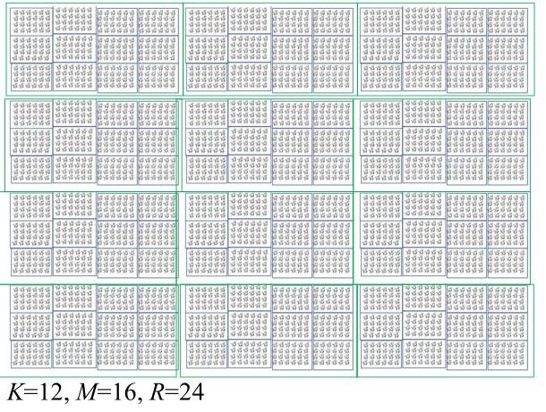
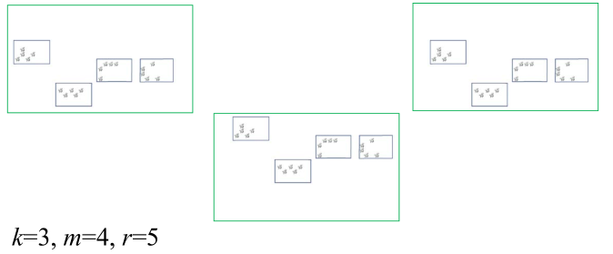

```{r setup, include=FALSE}
knitr::opts_chunk$set(echo = FALSE)
```

## Multi-stage sampling

* In many settings, it might be expensive/highly inefficient to take all elements in a sampled cluster.
* US area probability sample: a sample of counties (avg $\approx$ 40,000 households) or US Census blocks (avg. $\approx$ 1600 households) might be taken as the first stage of sampling.
* Sampling of clinics: review of all patients clinical records for a sampled clinic might be prohibitively expensive.
* Recall $deff$ for clustered samples: $1+(M-1)\rho$
  + As M increases, sample becomes less efficient for a fixed $\rho > 0$.
* Take sample of elements in a sampled cluster. 
* First stage of sample (cluster) is Primary Sampling Unit (PSU).

## Example

```{r, out.width = "250px", fig.align='center'}
library(knitr)
include_graphics("./figs/l8_fig1.png") # place holder
```

## Example

```{r, out.width = "250px", fig.align='center'}
library(knitr)
include_graphics("./figs/l8_fig2.png") # place holder
```

## Sampling variance of mean from two-stage cluster sample

$$
\begin{aligned}
V(\bar y_c) = \left( 1 - \frac{k}{K} \right) \frac{S_1^2}{k} + \left( 1 - \frac{m}{M} \right) \frac{S_2^2}{n}
\end{aligned}
$$
where
$$
S_1^2 = \frac{\sum_{i=1}^{K} (\bar Y_i - \bar Y)^2}{K-1} 
\quad \text{ and } \quad
S_2^2 = \frac{\sum_{i=1}^{K} \sum_{j=1}^M (Y_{ij} - \bar Y_i)^2}{K(M-1)} 
$$

* This should be intuitive, but needs to be proven. 
* Key idea: treat as proportionately stratified sample and use
$$
V(\bar y_c) = E \left[ V(\bar y_c \mid i \in s ) \right] + V \left( E[ \bar y_c \mid i \in s ] \right)
$$
where treat chosen clusters as strata since we are fixing the clusters through conditioning.

## Estimating sampling variance of mean from two-stage cluster sample

* Need to estimate $S_1^2$ and $S_2^2$

$$
s_2^2 = \frac{1}{k(m-1)} \sum_{i=1}^k \sum_{j=1}^m (y_{ij} - \bar y_i)^2
$$
and 
$$
\begin{aligned}
E [ s_2^2 ] &= E[ E [ s_2^2 \mid i \in s]] =
E \left[ \frac{1}{k} \sum_{i=1}^k E(s_i^2) \right] \\
&= E \left[ \frac{1}{k} \sum_{i=1}^k S_i^2 \right] = \frac{1}{K} \sum_{i=1}^K S_i^2 = S_2^2
\end{aligned}
$$

## ISSUE: Biased estimator

* $s_1^2 = \frac{1}{k-1} \sum_{i=1}^k (\bar y_i - \bar y)^2$ is a biased estimator of $S_1^2$ when second stage sampling is performed!

$$
\begin{aligned}
E [ s_1^2 ] = S_1^2 + \left( 1-\frac{m}{M} \right) \frac{S_2^2}{m}
\end{aligned}
$$

## Proof of bias

$$
\begin{aligned}
E [ \sum_{i=1}^l (\bar y_i - \bar y )^2 ] &= E \left[ E \left[ \sum_{i=1}^k (\bar y_i - \bar y)^2 \mid i \in s \right] \right] \\
&= E \left[ E \left[ \sum_{i=1}^k \bar y_i^2 \mid i \in s \right] \right] - k E \left[ E \left[ \bar y^2 \mid i \in s \right] \right] \\
\end{aligned}
$$

$$
\begin{aligned}
E \left[ E \left[ \sum_{i=1}^k \bar y_i^2 \mid i \in s \right] \right] 
&= E \left[ E \left[ \sum_{i=1}^k (\bar y_i - \bar Y_i + \bar Y_i)^2 \mid i \in s \right] \right] \\
&= E \left[ \sum_{i=1}^k E \left[ (\bar y_i - \bar Y_i)^2 \mid i \in s \right] + \sum_{i=1}^k \bar Y_i^2 \right] \\
&= E ( \sum_{i=1}^k V (\bar y_i))  + \frac{k}{K} \sum_{i=1}^K \bar Y_i^2 \\
\end{aligned}
$$

## Proof continues

$$
\begin{aligned}
&E ( \sum_{i=1}^k V (\bar y_i) )  + \frac{k}{K} \sum_{i=1}^K \bar Y_i^2 \\
=& E \left [\sum_{i=1}^k \left( 1 - \frac{m}{M} \right) \frac{E(S_i^2)}{m}\right]  + \frac{k}{K} \sum_{i=1}^K \bar Y_i^2 \\
=& \left( 1 - \frac{m}{M} \right) \frac{k S_2^2}{m}  + \frac{k}{K} \sum_{i=1}^K \bar Y_i^2 \\
\end{aligned}
$$

## Proof of bias

$$
\begin{aligned}
E[ \bar y^2 ] &= V(\bar y) + E[\bar y]^2 \\
&= \left( 1 - \frac{k}{K} \right) \frac{S_1^2}{k} + \left( 1 - \frac{m}{M} \right) \frac{S_2^2}{n} + \bar Y^2
\end{aligned}
$$
Combining these two terms we have 
$$
\begin{aligned}
& k \left( 1 - \frac{m}{M} \right) \frac{S_2^2}{m}  + \frac{k}{K} \sum_{i=1}^K \bar Y_i^2 \\
&-k \times \left( \left( 1 - \frac{k}{K} \right) \frac{S_1^2)}{k} + \left( 1 - \frac{m}{M} \right) \frac{S_2^2}{n} + \bar Y^2 \right) \\
&= (k-1) \left[ (1-m/M) S_2^2/m + S_1^2\right]
\end{aligned}
$$

## Unbiased estimators

* Replace $S_2^2$ with $s_2^2$ and replace $S_1^2$ with $s_1^2 - \left( 1- \frac{m}{M} \right) \frac{s_2^2}{m}$
yields an unbiased estimator of $V(\bar y_c)$.

$$
\begin{aligned}
v(\bar y_c ) &= \left( 1 - \frac{k}{K} \right) \frac{1}{k} \left(s_1^2 - \left( 1- \frac{m}{M} \right) \frac{s_2^2}{m} \right) + \left( 1 - \frac{m}{M} \right) \frac{s_2^2}{km} \\
&= \left( 1 - \frac{k}{K} \right) \frac{s_1^2}{k} + \left( 1 - \frac{m}{M} \right) \frac{s_2^2}{km} \left( 1 - \left( 1 - \frac{k}{K} \right) \right) \\
&= \left( 1 - \frac{k}{K} \right) \frac{s_1^2}{k} + \frac{k}{K} \left( 1 - \frac{m}{M} \right) \frac{s_2^2}{km}  \\
&= (1-f_1) \frac{s_1^2}{k} + f_1 (1-f_2) \frac{s_2^2}{n}
\end{aligned}
$$

## Design effect for 2-stage sampling

From previous results we have
$$
\frac{N-1}{N} S^2 = \frac{K-1}{K} S_1^2 + \frac{M-1}{M} S_2^2
$$
and
$$
\rho = \frac{\sum_{i=1}^K \sum_{j \neq l} (Y_{ij} - \bar Y) (Y_{il} - \bar Y) }{(N-1)(M-1)S^2}
$$

## Re-writing cross term 

$$
\begin{aligned}
\sum_{j \neq l} (Y_{ij} - \bar Y) (Y_{il} - \bar Y) &= \sum_{j,l=1}^M (Y_{ij} - \bar Y) (Y_{il} - \bar Y) - \sum_{j=1}^M (Y_{ij} - \bar Y)^2 \\
&= \left[ \sum_{j=1}^M (Y_{ij} - \bar Y) \right]^2 - \sum_{j=1}^M (Y_{ij} - \bar Y)^2 \\
&= \left[ M ( \bar Y_{i} - \bar Y) \right]^2 - \sum_{j=1}^M (Y_{ij} - \bar Y)^2 \\
\end{aligned}
$$

## And thus

$$
\begin{aligned}
&\sum_{i=1}^K \sum_{j \neq l} (Y_{ij} - \bar Y) (Y_{il} - \bar Y) \\
=& M^2 \sum_{i=1}^K (\bar Y_i - \bar Y)^2 - \sum_{i=1}^K \sum_{j=1}^M (Y_{ij} - \bar Y)^2 \\
=& M^2 (K-1) S_1^2 - (N-1) S^2 \\
=& M^2 (K-1) S_1^2 - [M(K-1)S_1^2 + K(M-1) S_2^2] \\
=& M(K-1)(M-1) S_1^2 - K(M-1)S_2^2
\end{aligned}
$$

## Plug and play

$$
\rho = \frac{\sum_{i=1}^K \sum_{j \neq l} (Y_{ij} - \bar Y) (Y_{il} - \bar Y) }{(N-1)(M-1)S^2}
= \frac{\frac{K-1}{K}S_1^2 - \frac{S_2^2}{M}}{\frac{N-1}{N} S^2} \to \frac{S_1^2 - \frac{S_2^2}{M}}{S^2}
$$
As $K,N \to \infty$. Using the previous result that $S_w^2 = S_2^2 \approx (1-\rho) S^2$, we have
$$
S_1^2 = \rho S^2 + \frac{(1-\rho) S^2}{M} = S^2 \left[ \frac{1}{M} + \rho \left( 1 - \frac{1}{M} \right) \right]
= S^2 [1+(M-1)\rho]/M
$$

## Plugging this back into $V(\bar y_c)$

$$
\begin{aligned}
V(\bar y_c) &= \left( 1  - \frac{k}{K} \right) \frac{S_1^2}{k} + \left( 1  - \frac{m}{M} \right) \frac{S_2^2}{k}  \\
&\approx \left( 1  - \frac{k}{K} \right) \frac{1}{k} \left( \frac{S^2}{M} (1+(M-1)\rho) \right) + \left( 1  - \frac{m}{M} \right) \frac{(1-\rho) S^2}{k}  \\
&= \frac{S^2}{n} \left[ \left( 1 - \frac{k}{K} \right) \left( \frac{m}{M} ((1-\rho)+M\rho) + (1-\rho) - \frac{m}{M} (1-\rho) \right) \right] \\
&= \frac{S^2}{n} \left[ \left( 1 - \frac{k}{K} \right) m \rho - \frac{n}{N} (1-\rho) + (1-\rho) \right] \\
&= \frac{S^2}{n} \left[ \left( 1 - \frac{n}{N} \right) + \left( m - 1 - \frac{n}{N} (M-1) \right) \rho \right] \\
&= \frac{S^2}{n} \left[ \left( 1 - \frac{n}{N} \right) + \left( 1 - \frac{n}{N} \right)(m-1)\rho + \frac{n}{N} \left( m - 1 - (M-1) \right) \rho \right] \\
&= (1-f)\frac{S^2}{n} [1+(m-1)\rho] - \frac{M-m}{N} S^2 \rho.
\end{aligned}
$$

##  Design effect

* The design effect associated with a mean from two-stage cluster sample of equal cluster size is given by 
$$
deff = [1+(m-1)\rho] - (M-m) \frac{f}{1-f} \rho
$$
or just $1+(m-1)\rho$ as $K$ and thus $N \to \infty$ for a fixed $M$.
* Note that $m$ (unlike $\rho$) can be manipulated by the design, so the design effect can be controlled.


## NEW MATERIAL: 3-stage sampling

```{r, out.width = "250px", fig.align='center'}
library(knitr)
 # place holder
```


## 3-stage sampling

```{r, out.width = "250px", fig.align='center'}
library(knitr)
 # place holder
```

## Notation

* Select equal elements at second ($m$) __and__ at third stage ($r$)
* Population mean: 
$$
\bar Y = \frac{1}{N} \sum_{i=1}^K \sum_{j=1}^M \sum_{l=1}^R Y_{ijl} = \frac{1}{KM} \sum_{i=1}^K \sum_{j=1}^M \bar Y_{ij} = \frac{1}{K} \sum_{i=1}^K \bar Y_i
$$
* Sample mean
$$
\bar y = \frac{1}{n} \sum_{i=1}^k \sum_{j=1}^m \sum_{l=1}^r y_{ijl} = \frac{1}{km} \sum_{i=1}^k \sum_{j=1}^m \bar y_{ij} = \frac{1}{k} \sum_{i=1}^k \bar y_i
$$
* Sampling fraction
$$\
\begin{aligned}
P(i \in s ) P(j \in s \mid i \in s ) P(l \in s \mid j \in s, i \in s ) &= \frac{k}{K} \times \frac{m}{M} \times \frac{r}{R} \\
&= \frac{n}{N} = f
\end{aligned}
$$

## Variance $V(\bar y_c)$

$$
\left( 1- \frac{k}{K} \right) \frac{S_1^2}{k} + 
\left( 1- \frac{m}{M} \right) \frac{S_2^2}{km} +
\left( 1- \frac{r}{R} \right) \frac{S_3^2}{kmr}
$$
where
$$
\begin{aligned}
S_1^2 &= \frac{\sum_{i=1}^K (\bar Y_i - \bar Y)^2}{K-1}, \\
S_2^2 &= \frac{\sum_{i=1}^K \sum_{j=1}^M (\bar Y_{ij} - \bar Y_i)^2}{K(M-1)}, \\
S_3^2 &= \frac{\sum_{i=1}^K \sum_{j=1}^M \sum_{l=1}^R (Y_{ijl} - \bar Y_{ij})^2}{KM(R-1)},
\end{aligned}
$$

## Variance proof

$$
\begin{aligned}
V( \bar y_c ) &= E ( V(\bar y_c \mid i \in s) ) + V( E (\bar y_c \mid i \in s)) \\
&= \underbrace{E ( E ( V ( \bar y_c  \mid i \in s, j \in s) \mid i \in s ))}_{(1)}  \\
&+ \underbrace{E(V ( E ( \bar y_c \mid i \in s, j \in s) \mid i \in s ) )}_{(2)} \\
&+ \underbrace{V( E ( E (\bar y_c) \mid i \in s, j \in s) \mid i \in s)}_{(3)} \\
\end{aligned}
$$

## Term 3

$$
E( E ( \bar y_c \mid i \in s, j \in s) \mid i \in s ) = E (\bar y_c \mid i \in s ) = \frac{1}{k} \sum_{i=1}^k \bar Y_i
$$
so we can directly apply previous results
$$
V( E ( E ( \bar y_c \mid i \in s, j \in s) \mid i \in s)) = \left( 1 - \frac{k}{K}\right) \frac{S_1^2}{k}
$$

## Term 2

$$
E ( V ( E ( \bar y_c \mid i \in s, j \in s ) \mid i \in s) ) = E \left( v \left( \frac{1}{km} \sum_{i=1}^k \sum_{j=1}^m \bar Y_{ij} \right ) \mid i \in s \right)
$$
so from two-stage work, we know this is equal to 
$$ 
E \left( v \left( \frac{1}{km} \sum_{i=1}^k \sum_{j=1}^m \bar Y_{ij} \right ) \mid i \in s \right) =
\left( 1 - \frac{m}{M} \right) \frac{S_2^2}{km}
$$

## Term 1

Using results from proportionally stratified sampling design
$$
V( \bar y_c \mid i \in s, j \in s) = \left( 1 - \frac{r}{R} \right) \frac{1}{km} \sum_{i=1}^k \sum_{j=1}^m \sum_{l=1}^r \frac{\left( Y_{ijl} - \bar Y_{ij} \right)^2}{r-1}
$$
so 
$$
E( E ( V(\bar y_c \mid i \in s, j \in s) \mid i \in s)) = \left( 1- \frac{r}{R} \right) \frac{S_3^2}{n}
$$
where
$$
S_3^2 = \frac{\sum_{i=1}^K \sum_{j=1}^M \sum_{l=1}^R (Y_{ijl} - \bar Y_{il})^2}{KM(R-1)},
$$

## Estimating sampling variance

* Need to estimate $S_1^2, S_2^2, S_3^2$
* Using similar work, we have
  + $s_3^2 = \frac{\sum_{i=1}^k \sum_{j=1}^m \sum_{l=1}^r (y_{ijl} - \bar y_{ij})^2}{km(r-1)}$ is unbiased estimator of $S_3^2$
  + $s_2^2 - \left( 1- \frac{r}{R} \right) \frac{s_3^2}{r}$ is unbiased estimator of $S_2^2$
* Then what is the bias for
$$
s_1^2 = \frac{\sum_{i=1}^k (\bar y_i - \bar y)^2}{k-1}
$$
* Suffices to study 
$$
\sum_{i=1}^k (\bar y_i - \bar y)^2 = \sum_{i=1}^k \bar y_i^2 - k \bar y^2
$$
  
## What about $S_1^2$?

$$
\begin{aligned}
E \left(\sum_{i=1}^k \bar y_i^2 \right) &= E \left( E \left( E \left ( \sum_{i=1}^k \bar y_i^2 \mid i \in s, j \in s \right) \mid i \in s \right) \right) \\
&= E \left( \sum_{i=1}^k V(\bar y_i) \right) + E \left( \sum_{i=1}^k \bar Y_i^2 \right) \\
&= \underbrace{E \left( \sum_{i=1}^k \left[ \left( 1- \frac{m}{M} \right) \frac{S_{2i}^2}{km} + \left( 1 - \frac{r}{R} \right) \frac{S_{3i}^2}{n} \right] \right)}_{\text{from 2-stage results}} + \frac{k}{K} \sum_{i=1}^K \bar Y_i^2  \\
&= k \left[ \left( 1 - \frac{m}{M} \right) \frac{S_2^2}{m} + \left( 1 - \frac{r}{R} \right) \frac{S_3^2}{mr} \right] + \frac{k}{K} \sum_{i=1}^K \bar Y_i^2.
\end{aligned}
$$

## What about $S_1^2$?

$$
\begin{aligned}
E(\bar y^2) &= V(\bar y) + E(\bar y)^2 \\
&=\left( 1- \frac{k}{K} \right) \frac{S_1^2}{k} + 
\left( 1- \frac{m}{M} \right) \frac{S_2^2}{km} +
\left( 1- \frac{r}{R} \right) \frac{S_3^2}{kmr} + \bar Y^2
\end{aligned}
$$

## Combine and conquer

$$
\begin{aligned}
E(\sum_{i=1}^k \bar y_i^2 - k \bar y^2) =&  k \left[ \left( 1 - \frac{m}{M} \right) \frac{S_2^2}{m} + \left( 1 - \frac{r}{R} \right) \frac{S_3^2}{mr} \right] + \frac{k}{K} \sum_{i=1}^K \bar Y_i^2 \\
&-k \bigg[ \left( 1- \frac{k}{K} \right) \frac{S_1^2}{k} + 
\left( 1- \frac{m}{M} \right) \frac{S_2^2}{km} \\
&+ \left( 1- \frac{r}{R} \right) \frac{S_3^2}{kmr} + \bar Y^2 \bigg] \\
&= (k-1) \left[ S_1^2 + \left(  1- \frac{m}{M} \right) \frac{S_2^2}{m} + \left( 1 - \frac{r}{R} \right) \frac{S_3^2}{mr}  \right]
\end{aligned}
$$

## Estimator of $S_1^2$

$$
\hat s_1^2 - \left(  1- \frac{m}{M} \right) \frac{ \hat S_2^2}{m} - \left( 1 - \frac{r}{R} \right) \frac{\hat S_3^2}{mr}  
$$
which is equal to 
$$
\hat s_1^2 - \left(  1- \frac{m}{M} \right) \left( \frac{ \hat s_2^2}{m} - \left( 1 - \frac{r}{R} \right) \frac{ \hat s_3^2}{mr} \right) - \left( 1 - \frac{r}{R} \right) \frac{\hat s_3^2}{mr}  
$$

## Put it all together and what do you get

$$ 
v(\bar y_c) = (1-f_1) \frac{s_1^2}{k} + f_1 ( 1-f_2) \frac{s_2^2}{km} + f_1 f_2 \left ( 1 - f_3 \right) \frac{s_3^2}{n}
$$

* Note that when the PSU sampling fraction $f_1 = \frac{k}{K}$ is small enough, the additional terms due to the uncertainty in the later stage estimation become trivial compared to the first term, so that $v(\bar y_c) \approx s_1^2/k$ regardless of how many stages there are!
* Sometimes termed ultimate cluster design, since all of the lower levels are
aggregated into the highest level (“ultimate”) cluster and treated as if they
came from a one-stage design with a census in each cluster.
